<div align="center">


# ToolSDK MCP Registry

**The Enterprise MCP Registry & Gateway.** A unified infrastructure to discover, secure, and execute Model Context Protocol (MCP) tools. Exposes local processes (STDIO) and remote servers (StreamableHTTP) via a unified HTTP API with built-in Sandbox and OAuth 2.1 support.

<a href="https://www.npmjs.com/package/@toolsdk.ai/registry">
  
</a>
<a href="https://github.com/toolsdk-ai/toolsdk-mcp-registry/actions/workflows/test.yaml">
  
</a>


<a href="https://www.producthunt.com/products/toolsdk-ai">
  
</a>

<a href="#mcp-servers">🔍 <b>Browse 4110+ Tools</b></a>
&nbsp;&nbsp;•&nbsp;&nbsp;
<a href="#quick-start">🐳 <b>Self-hosted</b></a>
&nbsp;&nbsp;•&nbsp;&nbsp;
<a href="#install-via-package-manager">📦 <b>Use as SDK</b></a>
&nbsp;&nbsp;•&nbsp;&nbsp;
<a href="#submit-new-mcp-servers">➕ <b>Add Server</b></a>
&nbsp;&nbsp;•&nbsp;&nbsp;
<a href="https://www.youtube.com/watch?v=J_oaDtCoVVo" target="_blank">🎥 <b>Video Tutorial</b></a>

<a href="https://toolsdk.ai" target="_blank">
  
</a>

---

</div>

## Getting Started

<a id="docker-self-hosting"></a>

### Deploy Enterprise Gateway (Recommended)

Deploy your own **private MCP Gateway & Registry** in minutes. This provides the full feature set: Federated Search, Remote Execution, Sandbox, and OAuth.

#### ⚡ Quick Deploy (One-Liner)

Start the registry immediately with default settings:

```bash
docker compose up -d
```

> 💡 **Did this save you time?** Give us a [**Star on GitHub**](https://github.com/toolsdk-ai/toolsdk-mcp-registry) — it helps others discover this registry!

**Configuration:**
- Set `MCP_SANDBOX_PROVIDER=LOCAL` in `.env` file if you want to disable the sandbox (not recommended for production).
- *See [Configuration Guide](./docs/DEVELOPMENT.md) for full details.*

> 💡 **Tip for Private Deployment**:
> This registry contains 4110+ public MCP servers. If you only need a specific subset for your private environment, you can prune the `packages/` directory.
> 📖 See [Package Management Guide](./docs/DEVELOPMENT.md#5--package-management-for-private-deployment) for details.

That's it! Your self-hosted MCP registry is now running with:
- 🌐 **HTTP API** with OpenAPI documentation
- 🛡️ **Secure Sandbox execution** for AI agent tools
- 🔍 **Full-text search** (Meilisearch)

#### 🎉 Access Your Private MCP Registry

- 🌐 **Local Web Interface**: http://localhost:3003
- 📚 **Swagger API Docs**: http://localhost:3003/swagger  
- 🔍 **Search & Execute** 4110+ MCP Servers remotely
- 🤖 **Integrate** with your AI agents, chatbots, and LLM applications

#### 🌐 Remote Tool Execution Example

Execute any MCP tool via HTTP API - perfect for AI automation, chatbot integrations, and serverless deployments:

```bash
curl -X POST http://localhost:3003/api/v1/packages/run \
  -H "Content-Type: application/json" \
  -d '{
    "packageName": "@modelcontextprotocol/server-everything",
    "toolKey": "echo",
    "inputData": {
      "message": "Hello from ToolSDK MCP Registry!"
    },
    "envs": {}
  }'
```

<details>
<summary><strong>Alternative: Use as Registry SDK (Data Only)</strong></summary>

<a id="use-as-sdk"></a>

### Alternative: Use as Registry SDK (Data Only)

If you only need to access the **list of MCP servers** programmatically (without execution or gateway features), you can use the NPM package.

```bash
npm install @toolsdk.ai/registry
```

#### Usage

Perfect for building your own directory or analysis tools:

```ts
import mcpServerLists from '@toolsdk.ai/registry/indexes/packages-list.json';
```

#### Access via Public API (No Installation Required)

Fetch the complete MCP server registry programmatically:

```bash
curl https://toolsdk-ai.github.io/toolsdk-mcp-registry/indexes/packages-list.json
```

```ts
// JavaScript/TypeScript - Fetch API
const mcpServers = await (
  await fetch('https://toolsdk-ai.github.io/toolsdk-mcp-registry/indexes/packages-list.json')
).json();

// Use for AI agent tool discovery, LLM integrations, etc.
console.log(mcpServers);
```

```python
# Python - For AI/ML projects
import requests

mcp_servers = requests.get(
    'https://toolsdk-ai.github.io/toolsdk-mcp-registry/indexes/packages-list.json'
).json()

# Perfect for LangChain, CrewAI, AutoGen integrations
```

</details>

## Why ToolSDK MCP Registry?

**ToolSDK MCP Registry** is an enterprise-grade gateway for Model Context Protocol (MCP) servers. It solves the challenge of securely discovering and executing AI tools in production environments.

### Key Features

- **Federated Registry** - Unified search across local private servers and the official `@modelcontextprotocol/registry`.
- **Unified Interface** - Access local STDIO tools and remote StreamableHTTP servers via a single, standardized HTTP API.
- **Secure Sandbox** - Execute untrusted tools in isolated environments (supports E2B, Daytona, Sandock).
- **OAuth 2.1 Proxy** - Built-in OAuth 2.1 implementation to handle complex authentication flows for your agents.
- **Private & Self-Hosted** - Full control over your data and infrastructure with Docker deployment.
- **Developer-Friendly** - OpenAPI/Swagger documentation and structured JSON configs.

### Use Cases

- **Enterprise AI Gateway** - Centralize tool access for all your internal LLM applications.
- **Secure Tool Execution** - Run community MCP servers without risking your local environment.
- **Protocol Adaptation** - Connect remote agents (via HTTP API) to local CLI tools (via STDIO).
- **Unified Discovery** - One API to search and manage thousands of tools.

### Architecture

```mermaid
graph TD
    subgraph ClientSide ["Client Side"]
        LLM["🤖 AI Agent / LLM"]
        User["👤 User / Developer"]
    end

    subgraph DockerEnv ["🐳 Self-Hosted Infrastructure"]
        
        subgraph RegistryCore ["Registry Core"]
            API["🌐 Registry API"]
            Search["🔍 Meilisearch"]
            DB["📚 Registry Data"]
            OAuth["🔐 OAuth Proxy"]
        end

        subgraph RuntimeEnv ["Runtime Environment"]
            Local["💻 Local Exec"]
            Sandbox["🛡️ Secure Sandbox"]
            MCPServer["⚙️ MCP Server"]
        end
    end

    User -->|Search Tools| API
    LLM -->|Execute Tool| API
    LLM -->|Auth Flow| OAuth
    API <-->|Query Index| Search
    API -->|Read Metadata| DB
    API -->|Run Tool| Local
    API -->|Run Tool| Sandbox
    Local -->|Execute| MCPServer
    Sandbox -->|Execute| MCPServer
```



---

## What You Get

This open-source project provides:

- **Structured Registry** - 4110+ MCP servers with metadata
- **Unified Gateway** - HTTP API to query and execute tools remotely
- **Auto-Generated Docs** - Always up-to-date README and API documentation

**Available as:**

- **Docker Image** - Full-featured Gateway & Registry
- **NPM Package** - TypeScript/JavaScript SDK for data access
- **Raw Data** - JSON endpoints for direct integration

---

<a id="getting-started"></a>

<a id="submit-new-mcp-servers"></a>

## Contribute Your MCP Server

Help grow the ecosystem! Share your AI tools, plugins, and integrations with the community.

### How to Submit

**1. Create JSON Config** - Simple, structured format:

```json
{
  "type": "mcp-server",
  "name": "Github",
  "packageName": "@modelcontextprotocol/server-github",
  "description": "MCP server for using the GitHub API",
  "url": "https://github.com/modelcontextprotocol/servers/blob/main/src/github",
  "runtime": "node",
  "license": "MIT",
  "env": {
    "GITHUB_PERSONAL_ACCESS_TOKEN": {
      "description": "Personal access token for GitHub API access",
      "required": true
    }
  }
}
```

**2. Submit via Pull Request**

- [Fork this repository](https://github.com/toolsdk-ai/toolsdk-mcp-registry/fork)
- Create `your-mcp-server.json` in [packages/uncategorized](./packages/uncategorized)
- Submit a PR

**3. Get Discovered**

Your MCP server will be:
- ✅ Listed in the registry
- 🔍 Searchable via REST API
- 📦 Available in npm package
- 🌐 Featured on [ToolSDK.ai](https://toolsdk.ai)

📖 **Detailed Guide**: [Contributing Documentation](./docs/guide.md)

---

<a id="mcp-servers"></a>

## MCP Servers Directory

**4110+ AI Agent Tools, LLM Integrations & Automation Servers**

> ⭐ **Featured below**: Hand-picked, production-ready MCP servers verified by our team.
>
> 📚 **Looking for all 4110+ servers?** Check out [**All MCP Servers**](./docs/ALL-MCP-SERVERS.md) for the complete list.

Browse by category: Developer Tools, AI Agents, Databases, Cloud Platforms, APIs, and more!


<a id="uncategorized"></a>
<details>
<summary><strong>Uncategorized</strong></summary>

Tools that haven’t been sorted into a category yet. AI will categorize it later.

- [✅ @bankless/onchain-mcp](https://github.com/bankless/onchain-mcp): Integrates with blockchain networks to enable smart contract interaction, transaction history access, and on-chain data exploration through specialized tools for reading contract state, retrieving ABIs, and filtering event logs.  (10 tools) (node) 
- [✅ @bnb-chain/mcp](https://github.com/bnb-chain/bnbchain-mcp): Enables direct interaction with BNB Chain and other EVM-compatible networks for blockchain operations including block exploration, smart contract interaction, token management, wallet operations, and Greenfield storage functionality.  (40 tools) (node) 
- [✅ @f2c/mcp](https://github.com/f2c-ai/f2c-mcp): Bridges Figma design files to code generation, enabling direct conversion of designs into HTML, CSS, and other assets with customizable output paths and file organization.  (2 tools) (node) 
- [✅ @glifxyz/mymcpspace-mcp-server](https://github.com/glifxyz/mymcpspace-mcp-server): Enables AI interaction with MyMCPSpace social media platform for creating posts, replying to content, toggling likes, retrieving feed data, and updating usernames through authenticated API communication.  (5 tools) (node) 
- [✅ @ivotoby/contentful-management-mcp-server](https://github.com/ivo-toby/contentful-mcp): Integrate with Contentful's Content Management API for CMS management.  (40 tools) (node) 
- [✅ @microsoft/clarity-mcp-server](https://github.com/microsoft/clarity-mcp-server): Enables AI to fetch and analyze Microsoft Clarity website analytics data including metrics like scroll depth, engagement time, and traffic with filtering by browser, device, and country.  (1 tools) (node) 
- [✅ @moralisweb3/api-mcp-server](https://github.com/moralisweb3/moralis-mcp-server): Integrates with Moralis Web3 API to enable blockchain data access, token analysis, and smart contract interactions without requiring deep Web3 development knowledge  (93 tools) (node) 
- [✅ @mzxrai/mcp-openai](https://github.com/mzxrai/mcp-openai): Generate text using OpenAI's language models.  (1 tools) (node) 
- [✅ @noditlabs/nodit-mcp-server](https://github.com/noditlabs/nodit-mcp-server): Provides blockchain context through Nodit's APIs, enabling real-time interaction with multiple protocols including Ethereum, Polygon, and Aptos for token information and on-chain activity analysis.  (9 tools) (node) 
- [✅ @toolsdk.ai/mixpanel-mcp-server](https://github.com/moonbirdai/mixpanel-mcp-server): A Model Context Protocol (MCP) server for integrating Mixpanel analytics into AI workflows. This server allows AI assistants like Claude to track events, page views, user signups, and update user profiles in Mixpanel.  (4 tools) (node) 
- [✅ base-network-mcp-server](https://github.com/fakepixels/base-mcp-server): Provides a bridge to the Base blockchain network for wallet management, balance checking, and transaction execution through natural language commands, eliminating the need to manage technical blockchain details.  (4 tools) (node) 
- [✅ etherscan-mcp](https://github.com/xiaok/etherscan-mcp): Provides a bridge to the Etherscan API for querying Ethereum blockchain data including account balances, transactions, contracts, tokens, gas metrics, and network statistics.  (6 tools) (node) 
- [✅ feuse-mcp](https://github.com/panzer-jack/feuse-mcp): Automates Figma design-to-code workflows by extracting design data, downloading SVG assets, analyzing color variables, and generating API models with design token conversion for CSS frameworks like UnoCSS and TailwindCSS.  (8 tools) (node) 
- [✅ garth-mcp-server](https://github.com/matin/garth-mcp-server): Integrates with Garmin Connect to provide access to fitness and health data including sleep statistics, daily stress, and intensity minutes with customizable date ranges.  (30 tools) (python) 
- [✅ gologin-mcp](https://github.com/gologinapp/gologin-mcp): Manage your GoLogin browser profiles and automation directly through AI conversations. This MCP server connects to the GoLogin API, letting you create, configure, and control browser profiles using natural language.  (59 tools) (node) 
- [✅ inner-monologue-mcp](https://github.com/abhinav-mangla/inner-monologue-mcp): An MCP (Model Context Protocol) server that implements a cognitive reasoning tool inspired by Google DeepMind's Inner Monologue research.  (1 tools) (node) 
- [✅ mcp-cook](https://github.com/disdjj/mcp-cook): Provides access to a collection of over 200 food and cocktail recipes, enabling dish information retrieval and ingredient-based meal suggestions.  (2 tools) (node) 
- [✅ mcp-fathom-analytics](https://github.com/mackenly/mcp-fathom-analytics): Integrates with Fathom Analytics to retrieve account information, manage sites, track events, generate reports, and monitor real-time visitor data using the @mackenly/fathom-api SDK  (5 tools) (node) 
- [✅ mcp-server-ens](https://github.com/justaname-id/ens-mcp-server): Integrates with the Ethereum Name Service to resolve ENS names to addresses, perform lookups, retrieve records, check availability, get prices, and explore name history through configurable Ethereum network providers.  (8 tools) (node) 
- [✅ minimax-mcp-js](https://github.com/minimax-ai/minimax-mcp-js): Official JavaScript implementation that integrates with MiniMax's multimodal capabilities for image generation, video creation, text-to-speech, and voice cloning across multiple transport modes.  (10 tools) (node) 
- [✅ mixpanel-mcp-server](https://github.com/moonbirdai/mixpanel-mcp-server): A Model Context Protocol (MCP) server for integrating Mixpanel analytics into AI workflows. This server allows AI assistants like Claude to track events, page views, user signups, and update user profiles in Mixpanel.  (4 tools) (node) 
- [✅ taskqueue-mcp](https://github.com/chriscarrollsmith/taskqueue-mcp): Structured task management system that breaks down complex projects into manageable tasks with progress tracking, user approval checkpoints, and support for multiple LLM providers.  (14 tools) (node) 
- [✅ todoist-mcp-server](https://github.com/stevengonsalvez/todoist-mcp): Provides a bridge to the Todoist task management platform, enabling advanced project and task management capabilities like creating tasks, organizing projects, managing deadlines, and team collaboration.  (33 tools) (node) 
- [✅ videodb-director-mcp](https://github.com/video-db/agent-toolkit/tree/HEAD/modelcontextprotocol): Bridges to VideoDB's video processing capabilities for searching, indexing, subtitling, and manipulating video content through specialized context resources.  (4 tools) (python) 

</details>


<a id="aggregators"></a>
<details>
<summary><strong>Aggregators</strong></summary>

Servers that let you access multiple apps and tools through one MCP server.

- [✅ @illuminaresolutions/n8n-mcp-server](https://github.com/illuminaresolutions/n8n-mcp-server): Bridges Claude with n8n automation workflows, enabling direct creation, execution, and management of workflows, credentials, and enterprise features without switching contexts.  (33 tools) (node) 
- [✅ @modelcontextprotocol/server-everything](https://github.com/modelcontextprotocol/servers/tree/HEAD/src/everything): Test protocol features and tools for client compatibility.  (8 tools) (node) 
- [✅ @noveum-ai/mcp-server](https://github.com/noveum/api-market-mcp-server): Converts OpenAPI specifications from API.market into tools for accessing over 200 services including image generation, geocoding, and content detection through a unified authentication system  (34 tools) (node) 
- [✅ @pinkpixel/mindbridge](https://github.com/pinkpixel-dev/mindbridge-mcp): Bridges multiple LLM providers including OpenAI, Anthropic, Google, DeepSeek, OpenRouter, and Ollama through a unified interface, enabling comparison of responses and leveraging specialized reasoning capabilities across different models.  (3 tools) (node) 
- [✅ @wopal/mcp-server-hotnews](https://github.com/wopal-cn/mcp-hotnews-server): Aggregates real-time trending topics from major Chinese social platforms and news sites.  (1 tools) (node) 
- [✅ acp-mcp-server](https://github.com/gongrzhe/acp-mcp-server): Bridges Agent Communication Protocol networks with MCP clients, enabling access to complex multi-agent workflows through intelligent agent discovery, routing, and multi-modal message conversion with support for synchronous, asynchronous, and streaming execution patterns.  (16 tools) (python) 
- [✅ hal-mcp](https://github.com/deanward/hal): Transforms OpenAPI/Swagger specifications into dynamic HTTP tools with secret management and URL restrictions, enabling secure API integration through automatic tool generation from API documentation.  (8 tools) (node) 
- [✅ mcp-hub-mcp](https://github.com/warpdev/mcp-hub-mcp): Centralizes multiple MCP servers into a unified hub, enabling seamless tool discovery and routing across specialized servers for complex workflows without managing individual connections.  (7 tools) (node) 

</details>


<a id="art-and-culture"></a>
<details>
<summary><strong>Art & Culture</strong></summary>

Explore art collections, museums, and cultural heritage with AI-friendly tools.

- [✅ @cloudwerxlab/gpt-image-1-mcp](https://github.com/cloudwerx-dev/gpt-image-1-mcp): Enables direct image generation and editing through OpenAI's gpt-image-1 model with support for text prompts, file paths, and base64 encoded inputs for creative workflows and visual content creation.  (2 tools) (node) 
- [✅ @jayarrowz/mcp-figma](https://github.com/thirdstrandstudio/mcp-figma): Integrates with Figma's API to enable viewing, manipulating, and collaborating on design files through comprehensive access to file operations, comments, components, and team resources.  (31 tools) (node) 
- [✅ @kailashg101/mcp-figma-to-code](https://github.com/kailashappdev/figma-mcp-toolkit): Extracts and analyzes components from Figma design files, enabling seamless integration between Figma designs and React Native development through component hierarchy processing and metadata generation.  (3 tools) (node) 
- [✅ @openmcprouter/mcp-server-ghibli-video](https://github.com/michaelyangjson/mcp-ghibli-video): Transforms static images into animated Ghibli-style videos through the GPT4O Image Generator API with tools for credit balance checking and task monitoring.  (3 tools) (node) 
- [✅ @recraft-ai/mcp-recraft-server](https://github.com/recraft-ai/mcp-recraft-server): Integrates with Recraft's image generation API to create and edit raster and vector images, apply custom styles, manipulate backgrounds, upscale images, and perform vectorization with fine-grained control over artistic properties.  (9 tools) (node) 
- [✅ 4oimage-mcp](https://github.com/antipas/4oimage-mcp): Provides a bridge between AI systems and the 4o-image API for generating and editing high-quality images through text prompts with real-time progress updates.  (1 tools) (node) 
- [✅ ableton-mcp](https://github.com/ahujasid/ableton-mcp): Enables control of Ableton Live music production software through a bidirectional communication system that supports track creation, MIDI editing, playback control, instrument loading, and library browsing for music composition and sound design workflows.  (16 tools) (python) 
- [✅ blender-mcp](https://github.com/ahujasid/blender-mcp): Enables natural language control of Blender for 3D scene creation, manipulation, and rendering without requiring knowledge of Blender's interface or Python API.  (17 tools) (python) 
- [✅ discogs-mcp-server](https://github.com/cswkim/discogs-mcp-server): Provides a bridge to the Discogs API for searching music databases, managing collections, and accessing marketplace listings with comprehensive artist and release information.  (53 tools) (node) 
- [✅ figma-mcp](https://github.com/matthewdailey/figma-mcp): Interact with Figma design files through the Figma REST API for design analysis, feedback, and collaboration.  (5 tools) (node) 
- [✅ grasshopper-mcp](https://github.com/alfredatnycu/grasshopper-mcp): Connects Grasshopper parametric design software with Claude through a bidirectional TCP server and Python bridge, enabling natural language control of architectural and engineering modeling workflows.  (8 tools) (python) 
- [✅ grok2-image-mcp-server](https://github.com/fl0w1nd/grok2-image-mcp-server): Enables AI assistants to generate images through the Grok2 model using stdio transport for seamless integration into existing workflows.  (1 tools) (node) 
- [✅ mcp-openverse](https://github.com/neno-is-ooo/mcp-openverse): Integrates with Openverse's Creative Commons image collection to search and retrieve openly-licensed images with detailed filtering options, attribution information, and specialized essay illustration features for finding relevant academic content.  (5 tools) (node) 
- [✅ mcp-server-stability-ai](https://github.com/tadasant/mcp-server-stability-ai): Integrates Stability AI's image generation and manipulation capabilities for editing, upscaling, and more via Stable Diffusion models.  (13 tools) (node) 
- [✅ mcp-sonic-pi](https://github.com/vinayak-mehta/mcp-sonic-pi): Connects AI systems to the Sonic Pi music programming environment, enabling creation and control of musical compositions through Ruby code with features for playback, pattern access, and live coding.  (4 tools) (python) 
- [✅ midi-file-mcp](https://github.com/xiaolaa2/midi-file-mcp): Parse and manipulate MIDI files based on Tone.js  (11 tools) (node) 
- [✅ minimax-mcp-js](https://github.com/minimax-ai/minimax-mcp-js): Official JavaScript implementation that integrates with MiniMax's multimodal capabilities for image generation, video creation, text-to-speech, and voice cloning across multiple transport modes.  (10 tools) (node) 
- [✅ nasa-mcp-server](https://github.com/programcomputer/nasa-mcp-server): Integrates with NASA and JPL APIs to provide access to astronomy images, satellite data, space weather information, Mars rover photos, and more through a unified interface built with TypeScript.  (13 tools) (node) 
- [✅ penpot-mcp](https://github.com/montevive/penpot-mcp): Integrates with Penpot's API to enable project browsing, file retrieval, object searching, and visual component export with automatic screenshot generation for converting UI designs into functional code.  (10 tools) (python) 
- [✅ replicate-flux-mcp](https://github.com/awkoy/replicate-flux-mcp): Integrates with Replicate's Flux image generation model, enabling image creation capabilities within conversation interfaces through a simple API token setup and TypeScript implementation available as both an npm module and Docker container.  (7 tools) (node) 
- [✅ sketchfab-mcp](https://github.com/eddydpyl/sketchfab_mcp): Provides a streamlined interface to the Sketchfab API for searching and downloading 3D models with filtering options for animated or rigged content.  (1 tools) (python) 
- [✅ sketchfab-mcp-server](https://github.com/gregkop/sketchfab-mcp-server): Integrates with Sketchfab to enable searching, viewing details, and downloading 3D models in various formats using an API key for authentication.  (4 tools) (node) 
- [✅ together-mcp](https://github.com/manascb1344/together-mcp-server): Integrates with Together AI's Flux.1 Schnell model to provide high-quality image generation with customizable dimensions, clear error handling, and optional image saving.  (1 tools) (node) 
- [✅ wikipedia-mcp](https://github.com/timjuenemann/wikipedia-mcp): Provides a structured interface for searching and retrieving Wikipedia articles in clean Markdown format, enabling access to up-to-date encyclopedia information without hallucinating facts.  (2 tools) (node) 

</details>


<a id="browser-automation"></a>
<details>
<summary><strong>Browser Automation</strong></summary>

Tools for browsing, scraping, and automating web content in AI-compatible formats.

- [✅ @agentdeskai/browser-tools-mcp](https://github.com/AgentDeskAI/browser-tools-mcp): A Model Context Protocol (MCP) server that provides AI-powered browser tools integration. This server works in conjunction with the Browser Tools Server to provide AI capabilities for browser debugging and analysis.  (14 tools) (node) 
- [✅ @angiejones/mcp-selenium](https://github.com/angiejones/mcp-selenium): Automates web browser actions with Selenium WebDriver.  (14 tools) (node) 
- [✅ @automatalabs/mcp-server-playwright](https://github.com/automata-labs-team/mcp-server-playwright): Control browsers to perform sophisticated web interactions and visual tasks.  (10 tools) (node) 
- [✅ @browserstack/mcp-server](https://github.com/browserstack/mcp-server): Integrates with BrowserStack's testing infrastructure to enable automated and manual testing across browsers, devices, and platforms for debugging cross-browser issues and verifying mobile app functionality.  (20 tools) (node) 
- [✅ @cmann50/mcp-chrome-google-search](https://github.com/cmann50/mcp-chrome-google-search): Integrates Google search and webpage content extraction via Chrome browser automation, enabling access up-to-date web information for tasks like fact-checking and research.  (2 tools) (node) 
- [✅ @debugg-ai/debugg-ai-mcp](https://github.com/debugg-ai/debugg-ai-mcp): Provides zero-configuration end-to-end testing for web applications by creating secure tunnels to local development servers and spawning testing agents that interact with web interfaces through natural language descriptions, returning detailed test results with execution recordings and screenshots.  (1 tools) (node) 
- [✅ @deventerprisesoftware/scrapi-mcp](https://github.com/deventerprisesoftware/scrapi-mcp): Enables web scraping from sites with bot detection, captchas, or geolocation restrictions through residential proxies and automated captcha solving for content extraction in HTML or Markdown formats.  (2 tools) (node) 
- [✅ @executeautomation/playwright-mcp-server](https://github.com/executeautomation/mcp-playwright): A Model Context Protocol server that provides browser automation capabilities using Playwright. This server enables LLMs to interact with web pages, take screenshots, generate test code, web scraps the page and execute JavaScript in a real browser environment.  (32 tools) (node) 
- [✅ @just-every/mcp-read-website-fast](https://github.com/just-every/mcp-read-website-fast): Extracts web content and converts it to clean Markdown format using Mozilla Readability for intelligent article detection, with disk-based caching, robots.txt compliance, and concurrent crawling capabilities for fast content processing workflows.  (1 tools) (node) 
- [✅ @kazuph/mcp-browser-tabs](https://github.com/kazuph/mcp-browser-tabs): Integrates with Chrome on macOS to retrieve and manage browser tab information using AppleScript.  (4 tools) (node) 
- [✅ @kazuph/mcp-fetch](https://github.com/kazuph/mcp-fetch): Integrates web scraping and image processing capabilities to fetch, extract, and optimize web content.  (1 tools) (node) 
- [✅ @kwp-lab/mcp-fetch](https://github.com/kwp-lab/mcp-fetch): A Model Context Protocol server that provides web content fetching capabilities  (1 tools) (node) 
- [✅ @modelcontextprotocol/server-puppeteer](https://github.com/modelcontextprotocol/servers-archived/tree/HEAD/src/puppeteer): Navigate websites, fill forms, and capture screenshots programmatically.  (7 tools) (node) 
- [✅ @octomind/octomind-mcp](https://github.com/octomind-dev/octomind-mcp): Enables AI-driven test automation through the Octomind platform for creating, executing, and analyzing end-to-end tests without leaving your development environment.  (19 tools) (node) 
- [✅ @peng-shawn/mermaid-mcp-server](https://github.com/peng-shawn/mermaid-mcp-server): Converts Mermaid diagrams to PNG images using Puppeteer for high-quality headless browser rendering, supporting multiple themes and customizable backgrounds.  (1 tools) (node) 
- [✅ @playwright/mcp](https://github.com/microsoft/playwright-mcp): A Model Context Protocol (MCP) server that provides browser automation capabilities using Playwright. This server enables LLMs to interact with web pages through structured accessibility snapshots, bypassing the need for screenshots or visually-tuned models.  (21 tools) (node) 
- [✅ @tokenizin/mcp-npx-fetch](https://github.com/tokenizin-agency/mcp-npx-fetch): Fetches and converts web content to Markdown using JSDOM and Turndown.  (4 tools) (node) 
- [✅ blowback-context](https://github.com/esnark/blowback): Integrates with frontend development environments to provide real-time feedback and debugging capabilities through browser automation, capturing console logs, monitoring HMR events, and enabling DOM interaction without leaving the conversation interface.  (11 tools) (node) 
- [✅ chrome-debug-mcp](https://github.com/rainmen-xia/chrome-debug-mcp): Provides browser automation capabilities through Chrome's debugging protocol with session persistence, enabling web scraping, testing, and automation tasks with tools for screenshots, navigation, element interaction, and content retrieval.  (10 tools) (node) 
- [✅ exa-mcp-server](https://github.com/exa-labs/exa-mcp-server): A Model Context Protocol (MCP) server lets AI assistants like Claude use the Exa AI Search API for web searches. This setup allows AI models to get real-time web information in a safe and controlled way.  (6 tools) (node) 
- [✅ fetch-mcp](https://github.com/egoist/fetch-mcp): Fetches web content and YouTube video transcripts, converting HTML to Markdown and extracting timestamps for reference in conversations.  (2 tools) (node) 
- [✅ fetcher-mcp](https://github.com/jae-jae/fetcher-mcp): Fetches and extracts web content using Playwright's headless browser capabilities, delivering clean, readable content from JavaScript-heavy websites in HTML or Markdown format for research and information gathering.  (2 tools) (node) 
- [✅ firecrawl-mcp](https://github.com/mendableai/firecrawl-mcp-server): Integration with FireCrawl to provide advanced web scraping capabilities for extracting structured data from complex websites.  (8 tools) (node) 
- [✅ gologin-mcp](https://github.com/gologinapp/gologin-mcp): Manage your GoLogin browser profiles and automation directly through AI conversations. This MCP server connects to the GoLogin API, letting you create, configure, and control browser profiles using natural language.  (59 tools) (node) 
- [✅ hyper-mcp-browser](https://github.com/bigsweetpotatostudio/hyper-mcp-browser): Enables web browsing capabilities through Puppeteer and Chrome, allowing navigation, content extraction, and interaction with websites for scraping, analysis, and automated testing workflows.  (2 tools) (node) 
- [✅ hyperbrowser-mcp](https://github.com/hyperbrowserai/mcp): Enables web browsing capabilities through tools for content extraction, link following, and browser automation with customizable parameters for scraping, data collection, and web crawling tasks.  (10 tools) (node) 
- [✅ mcp-cookie-server](https://github.com/bnookala/mcp-cookiejar): Provides cookie management capabilities for web automation and testing workflows, enabling storage, retrieval, and manipulation of session state and authentication cookies across different web services.  (6 tools) (node) 
- [✅ mcp-jinaai-grounding](https://github.com/spences10/mcp-jinaai-grounding): Integrates JinaAI's content extraction and analysis capabilities for web scraping, documentation parsing, and text analysis tasks.  (1 tools) (node) 
- [✅ mcp-jinaai-reader](https://github.com/spences10/mcp-jinaai-reader): Extracts and processes web content for efficient parsing and analysis of online information  (1 tools) (node) 
- [✅ mcp-node-fetch](https://github.com/mcollina/mcp-node-fetch): Enables web content retrieval and processing with tools for fetching URLs, extracting HTML fragments, and checking site availability using Node.js's undici library.  (3 tools) (node) 
- [✅ mcp-playwright-scraper](https://github.com/dennisgl/mcp-playwright-scraper): Leverages Playwright and BeautifulSoup to enable robust web scraping and content extraction, converting complex JavaScript-heavy web pages into high-quality Markdown with browser automation capabilities.  (1 tools) (python) 
- [✅ mcp-rquest](https://github.com/xxxbrian/mcp-rquest): Enables LLMs to make advanced HTTP requests with realistic browser emulation, bypassing anti-bot measures while supporting all HTTP methods, authentication, and automatic response handling for web scraping and API interactions.  (10 tools) (python) 
- [✅ mcp-server-chatgpt-app](https://github.com/cdpath/mcp-server-chatgpt-app): Enables interaction with the ChatGPT macOS app through AppleScript automation, allowing tools to send prompts via keyboard input simulation without switching interfaces.  (1 tools) (python) 
- [✅ mcp-server-fetch](https://github.com/modelcontextprotocol/servers/tree/HEAD/src/fetch): Retrieve and convert web content to markdown for analysis.  (1 tools) (python) 
- [✅ mcp-server-weibo](https://github.com/selenium39/mcp-server-weibo): Enables scraping of Weibo user information, feeds, and search functionality with tools for user discovery, profile retrieval, and feed access  (5 tools) (node) 
- [✅ mcp-web-content-pick](https://github.com/kilicmu/mcp-web-content-pick): Extracts structured content from web pages using customizable selectors for crawling, parsing, and analyzing HTML elements without leaving the assistant interface.  (1 tools) (node) 
- [✅ playwright-mcp](https://github.com/ashish-bansal/playwright-mcp): Playwright MCP enables browser automation and interaction recording by capturing DOM interactions, screenshots, and page navigation events to generate reproducible test scripts through a visual, context-driven workflow.  (5 tools) (node) 
- [✅ scrapling-fetch-mcp](https://github.com/cyberchitta/scrapling-fetch-mcp): Enables AI to access text content from websites protected by bot detection mechanisms through three protection levels (basic, stealth, max-stealth), retrieving complete pages or specific content patterns without manual copying.  (2 tools) (python) 
- [✅ vibe-eyes](https://github.com/monteslu/vibe-eyes): Enables LLMs to visualize and debug browser-based games and applications by capturing canvas content, console logs, and errors, then processing visual data into compact SVG representations for seamless debugging.  (1 tools) (node) 

</details>


<a id="cloud-platforms"></a>
<details>
<summary><strong>Cloud Platforms</strong></summary>

Integrate with cloud services to manage and interact with cloud infrastructure.

- [✅ @cloudbase/cloudbase-mcp](https://github.com/tencentcloudbase/cloudbase-ai-toolkit): Enables AI systems to deploy, monitor, and manage full-stack applications on Tencent CloudBase through tools for cloud environments, databases, functions, hosting services, and storage resources.  (39 tools) (node) 
- [✅ @digitalocean/mcp](https://github.com/digitalocean/digitalocean-mcp): Integrates with DigitalOcean's cloud platform API to enable management of cloud resources, deployment of applications, and monitoring of infrastructure through natural language commands.  (32 tools) (node) 
- [✅ @felixallistar/coolify-mcp](https://github.com/felixallistar/coolify-mcp): Integrates with Coolify's deployment platform to manage self-hosted applications, databases, and infrastructure including 110+ one-click services, 8 database types, server connectivity validation, and environment variable handling.  (10 tools) (node) 
- [✅ @masonator/coolify-mcp](https://github.com/stumason/coolify-mcp): Integrates with Coolify to enable natural language management of servers, projects, applications, and databases through the Coolify API, allowing users to perform DevOps operations without leaving their conversation interface.  (5 tools) (node) 
- [✅ @netlify/mcp](https://github.com/netlify/netlify-mcp): Integrates with Netlify's platform for complete site management including project operations, deployments with zip uploads, team administration, extension configuration, and documentation access across hosting, build, and collaboration workflows.  (6 tools) (node) 
- [✅ @osaas/mcp-server](https://github.com/eyevinnosc/mcp-server): EyevinnOSC's MCP server enables AI assistants to provision and manage vendor-independent cloud infrastructure for databases, storage, and media processing through an open source API.  (3 tools) (node) 
- [✅ @strowk/mcp-k8s](https://github.com/strowk/mcp-k8s-go): Control and monitor K8s clusters for management and debugging.  (8 tools) (node) 
- [✅ akave-mcp-js](https://github.com/akave-ai/akave-mcp): Integrates with Akave's S3-compatible storage platform to manage buckets and objects, upload/download files, generate signed URLs, and handle file operations with automatic text cleaning for common formats.  (13 tools) (node) 
- [✅ alibabacloud-fc-mcp-server](https://github.com/aliyun/alibabacloud-fc-mcp-server): Integrates with Alibaba Cloud Function Compute to deploy and manage serverless functions with multi-language runtime support, custom domain routing, and VPC configuration for automated cloud function lifecycle management.  (12 tools) (node) 
- [✅ alibabacloud-mcp-server](https://github.com/aliyun/alibaba-cloud-ops-mcp-server): Provides a bridge to Alibaba Cloud services for managing ECS instances, viewing resources, monitoring metrics, and configuring VPC networks through natural language commands  (26 tools) (python) 
- [✅ aliyun-mcp-server](https://github.com/nailuogg/aliyun-mcp-server): Integrates with Alibaba Cloud services to query and filter SLS logs, with future support for ECS instance management and serverless function deployment.  (1 tools) (node) 
- [✅ apisix-mcp](https://github.com/api7/apisix-mcp): Bridge LLMs with the APISIX Admin API to manage and analyze API gateway information.  (32 tools) (node) 
- [✅ aws-s3-mcp](https://github.com/samuraikun/aws-s3-mcp): Provides direct access to Amazon S3 storage for listing buckets, browsing objects, and retrieving file contents with automatic text extraction from PDFs and other file types.  (3 tools) (node) 
- [✅ awslabs.cdk-mcp-server](https://github.com/awslabs/mcp/tree/HEAD/src/cdk-mcp-server): Integration for AWS Cloud Development Kit (CDK) best practices, infrastructure as code patterns, and security compliance with CDK Nag.  (7 tools) (python) 
- [✅ cloudinary-mcp-server](https://github.com/yoavniran/cloudinary-mcp-server): Provides direct access to Cloudinary's Upload and Admin APIs for uploading, retrieving, searching, and managing digital media assets in your Cloudinary cloud.  (5 tools) (node) 
- [✅ coolify-mcp-server](https://github.com/wrediam/coolify-mcp-server): Enables comprehensive Coolify infrastructure management by exposing tools for creating, deploying, and tracking servers, applications, and team resources with robust operational capabilities.  (26 tools) (node) 
- [✅ edgeone-pages-mcp](https://github.com/tencentedgeone/edgeone-pages-mcp): Enables rapid deployment of HTML content to Tencent's EdgeOne Pages service with integrated Functions and KV store support for edge hosting  (2 tools) (node) 
- [✅ google-cloud-mcp](https://github.com/krzko/google-cloud-mcp): Integrates with Google Cloud services to provide direct access to Logging, Spanner, and Monitoring resources within conversations through authenticated connections.  (17 tools) (node) 
- [✅ mcp-server-esa](https://github.com/aliyun/mcp-server-esa): Provides a bridge to Alibaba Cloud's Edge Security Acceleration service for managing edge routines, deployments, routes, and sites through authenticated API operations.  (23 tools) (node) 
- [✅ mcp-server-kubernetes](https://github.com/Flux159/mcp-server-kubernetes): MCP server for managing Kubernetes clusters, enabling LLMs to interact with and control Kubernetes resources.  (21 tools) (node) 
- [✅ multicluster-mcp-server](https://github.com/yanmxa/multicluster-mcp-server): Provides a bridge to Kubernetes multi-cluster environments for managing distributed resources through kubectl commands, service account connections, and seamless cross-cluster operations without switching contexts.  (4 tools) (node) 

</details>


<a id="code-execution"></a>
<details>
<summary><strong>Code Execution</strong></summary>

Run code securely, perfect for coding agents and AI-driven programming tasks.

- [✅ @e2b/mcp-server](https://github.com/e2b-dev/mcp-server/tree/HEAD/packages/js): A Model Context Protocol server for running code in a secure sandbox by E2B.  (1 tools) (node) 
- [✅ @riza-io/riza-mcp](https://github.com/riza-io/riza-mcp): Provides a secure bridge between LLMs and Riza's isolated code interpreter API, enabling writing, saving, editing, and executing code safely in a sandboxed environment with persistent tool management across conversations.  (6 tools) (node) 
- [✅ gemini-mcp-tool](https://github.com/jamubc/gemini-mcp-tool): Integrates with Google's Gemini CLI to leverage massive token windows for analyzing large files and codebases, providing general queries, sandbox-mode code execution for safe testing, and structured response handling with behavioral flags for context control.  (6 tools) (node) 
- [✅ js-sandbox-mcp-server](https://github.com/garc33/js-sandbox-mcp-server): Provides a secure JavaScript sandbox for executing code with configurable time and memory limits, enabling safe testing and evaluation of algorithms.  (1 tools) (node) 
- [✅ mcp-llm](https://github.com/sammcj/mcp-llm): Integrates with LlamaIndexTS to provide access to various LLM providers for code generation, documentation writing, and question answering tasks  (4 tools) (node) 
- [✅ mcp-python](https://github.com/hdresearch/mcp-python): Provides a persistent Python execution environment for interactive code development, data analysis, and rapid prototyping.  (3 tools) (python) 
- [✅ mcp-server-code-runner](https://github.com/formulahendry/mcp-server-code-runner): Executes code snippets in over 30 programming languages by creating temporary files and running them with appropriate interpreters, enabling direct testing and demonstration within conversations.  (1 tools) (node) 
- [✅ node-code-sandbox-mcp](https://github.com/ssdeanx/node-code-sandbox-mcp): Provides a secure Docker-based environment for executing Node.js code with npm dependencies, shell commands, and file operations while maintaining proper isolation for testing and web development prototyping.  (7 tools) (node) 
- [✅ nrepl-mcp-server](https://github.com/johancodinha/nrepl-mcp-server): Integrates with Clojure nREPL instances to enable code evaluation, namespace listing, and public var inspection for AI-assisted Clojure development.  (3 tools) (node) 
- [✅ python-local](https://github.com/alec2435/python_mcp): Provides an interactive Python REPL environment for executing code within conversations, maintaining separate state for each session and supporting both expressions and statements.  (1 tools) (python) 
- [✅ sandock-mcp](https://github.com/sandock-ai/sandock): A Model Context Protocol server for running code in a secure sandbox by Sandock.  (6 tools) (node) 

</details>


<a id="coding-agents"></a>
<details>
<summary><strong>Coding Agents</strong></summary>

AI tools that can autonomously read, write, and execute code to solve programming tasks.

- [✅ @steipete/claude-code-mcp](https://github.com/steipete/claude-code-mcp): Provides a streamlined interface for executing complex coding tasks including file operations, Git commands, and web searches without permission interruptions by automatically bypassing constraints.  (1 tools) (node) 
- [✅ mcp-coco](https://github.com/disdjj/mcp-coco): MCP-Coco provides a pair programming tool that guides technical discussions by transforming code snippets into structured frameworks for critical inquiry about performance, security, and maintainability.  (1 tools) (node) 
- [✅ mcp-neovim-server](https://github.com/bigcodegen/mcp-neovim-server): Integrates Claude Desktop with Neovim, enabling AI-enhanced coding assistance within the familiar Vim environment through direct interaction with buffers and commands.  (19 tools) (node) 
- [✅ mcp-server-code-assist](https://github.com/abhishekbhakat/mcp_server_code_assist): Enables code modification and generation tasks through file operations, search-and-replace, and version control integration for automated refactoring and codebase maintenance.  (17 tools) (python) 

</details>


<a id="command-line"></a>
<details>
<summary><strong>Command Line</strong></summary>

Run shell commands and interact with command-line tools easily.

- [✅ @devyhan/xcode-mcp](https://github.com/devyhan/xcode-mcp): Provides Xcode-related command-line tools to enables project inspection, building, testing, archiving, code signing, and Xcode simulator management through natural language commands.  (9 tools) (node) 
- [✅ @kevinwatt/shell-mcp](https://github.com/kevinwatt/shell-mcp): Provides a shell command execution interface for secure and controlled access to local system operations, enabling automation tasks and system management.  (20 tools) (node) 
- [✅ @peakmojo/applescript-mcp](https://github.com/peakmojo/applescript-mcp): Enables AI to execute AppleScript code on macOS systems, providing access to applications and system features like Notes, Calendar, Contacts, Messages, and Finder through a lightweight server implementation.  (1 tools) (node) 
- [✅ @rinardnick/mcp-terminal](https://github.com/rinardnick/mcp-terminal): Provides a secure terminal server for executing whitelisted shell commands with strict resource controls and security boundaries.  (1 tools) (node) 
- [✅ @simonb97/server-win-cli](https://github.com/simonb97/win-cli-mcp-server): Control Windows command-line interfaces securely.  (9 tools) (node) 
- [✅ @steipete/macos-automator-mcp](https://github.com/steipete/macos-automator-mcp): Automates macOS tasks through AppleScript and JavaScript for Automation with a rich library of pre-defined scripts for application control, file operations, and system interactions.  (2 tools) (node) 
- [✅ @steipete/peekaboo-mcp](https://github.com/steipete/peekaboo): Enables macOS screen capture and window management with tools for taking screenshots, analyzing images, and controlling application windows  (3 tools) (node) 
- [✅ apple-notifier-mcp](https://github.com/turlockmike/apple-notifier-mcp): Enables interaction with macOS notifications and system dialogs for desktop alerts, user input, and system operations.  (5 tools) (node) 
- [✅ iterm_mcp_server](https://github.com/rishabkoul/iterm-mcp-server): Enables AI interaction with iTerm2 terminals on macOS through AppleScript and Node.js, allowing command execution, output capture, and terminal management without context switching.  (5 tools) (node) 
- [✅ iterm-mcp](https://github.com/ferrislucas/iterm-mcp): Enables direct execution of shell commands in the active iTerm tab, streamlining terminal-based workflows and automation tasks.  (3 tools) (node) 
- [✅ macos-notification-mcp](https://github.com/devizor/macos-notification-mcp): Enables macOS system notifications, banner alerts, and text-to-speech capabilities with customizable parameters like voice selection and speech rate.  (5 tools) (python) 
- [✅ mcp-apple-calendars](https://github.com/shadowfax92/apple-calendar-mcp): Provides a TypeScript-based server for reading, creating, updating, and deleting macOS calendar events through a local HTTP bridge, enabling seamless scheduling and calendar management for desktop applications.  (7 tools) (node) 
- [✅ mcp-cli-exec](https://github.com/jakenuts/mcp-cli-exec): Provides powerful CLI command execution capabilities, enabling structured output for shell commands with features like timeout handling, ANSI code stripping, and error management for system administration and DevOps workflows.  (2 tools) (node) 
- [✅ mcp-kubernetes-server](https://github.com/feiskyer/mcp-kubernetes-server): Enables direct Kubernetes cluster management through kubectl command execution, providing a bridge for real-time resource administration within conversations.  (1 tools) (python) 
- [✅ mcp-server-commands](https://github.com/g0t4/mcp-server-commands): Execute system commands and scripts on the host machine.  (1 tools) (node) 
- [✅ mcp-server-macos-defaults](https://github.com/g0t4/mcp-server-macos-defaults): Enables interaction with macOS system preferences via the 'defaults' command for querying and modifying configurations.  (4 tools) (python) 
- [✅ mcp-server-siri-shortcuts](https://github.com/dvcrn/mcp-server-siri-shortcuts): Integrates with macOS Shortcuts to dynamically expose and execute user-defined automation workflows through generated tools.  (3 tools) (node) 
- [✅ mcp-shell](https://github.com/hdresearch/mcp-shell): Secure shell command execution server for AI models to interact with local systems while maintaining strict security controls.  (1 tools) (node) 
- [✅ mcp-shell-server](https://github.com/tumf/mcp-shell-server): Execute whitelisted shell commands on the host system via asyncio.  (1 tools) (python) 
- [✅ mcp-wsl-exec](https://github.com/spences10/mcp-wsl-exec): Provides secure command execution in WSL with built-in safety features like path validation, timeouts, and error handling.  (2 tools) (node) 
- [✅ os-info-mcp-server](https://github.com/anurag-dhamala/os-info-mcp-server): Provides real-time system information about the host computer, including CPU, memory, operating system, disk, battery, and process details for monitoring resources and troubleshooting performance issues.  (1 tools) (node) 
- [✅ perm-shell-mcp](https://github.com/mcollina/perm-shell-mcp): Enables secure execution of shell commands through desktop notifications that require explicit user approval for each operation, maintaining strong security boundaries for local system access.  (2 tools) (node) 
- [✅ phone-mcp](https://github.com/hao-cyber/phone-mcp): Enables remote control of Android phones through ADB commands for making calls, sending texts, taking screenshots, managing contacts, launching apps, and retrieving system information.  (21 tools) (python) 
- [✅ server-cmd](https://github.com/phialsbasement/cmd-mcp-server): Cross-platform MCP server for executing command-line operations and SSH connections on Windows and Linux systems through a standardized interface.  (2 tools) (node) 
- [✅ shell-command-mcp](https://github.com/egoist/shell-command-mcp): Secure shell command execution server that allows running system commands in a controlled environment through an allowlist system, returning results in YAML format.  (1 tools) (node) 
- [✅ super-shell-mcp](https://github.com/cfdude/super-shell-mcp): Enables secure execution of shell commands across Windows, macOS, and Linux with a three-tier whitelist security model for controlled system access.  (9 tools) (node) 
- [✅ wcgw](https://github.com/rusiaaman/wcgw/tree/HEAD/src/wcgw/client/mcp_server): Access shell and filesystem in order to automate tasks and run code  (6 tools) (python) 

</details>


<a id="communication"></a>
<details>
<summary><strong>Communication</strong></summary>

Connect with messaging platforms to manage chats and interact with team tools.

- [✅ @abhaybabbar/retellai-mcp-server](https://github.com/abhaybabbar/retellai-mcp-server): Integrates with RetellAI's voice services for creating and managing phone conversations, enabling call initiation, agent configuration, and voice selection for tasks like customer service, appointment scheduling, and information gathering.  (24 tools) (node) 
- [✅ @cristip73/mcp-server-asana](https://github.com/cristip73/mcp-server-asana): Integrates with Asana's API to enable task management, project organization, and collaboration workflows through 30+ tools for searching, creating, and visualizing projects and tasks.  (41 tools) (node) 
- [✅ @enescinar/twitter-mcp](https://github.com/enescinr/twitter-mcp): Interact with X (Twitter) by posting tweets and searching for tweets through the X API.  (2 tools) (node) 
- [✅ @floriscornel/teams-mcp](https://github.com/floriscornel/teams-mcp): Integrates with Microsoft Teams through Graph API to search messages, manage chats and channels, send messages, create group chats, and handle user/team operations with device code authentication for secure access.  (19 tools) (node) 
- [✅ @grec0/mcp-s2s-asterisk](https://github.com/gcorroto/mcp-s2s-asterisk): Integrates with Asterisk phone systems to enable outbound call operations, conversation monitoring, call history retrieval, and telephony system metrics tracking for business automation workflows.  (9 tools) (node) 
- [✅ @greirson/mcp-todoist](https://github.com/greirson/mcp-todoist): Integrates with Todoist API to manage tasks, projects, sections, and comments with support for bulk operations, natural language search, and comprehensive CRUD functionality.  (28 tools) (node) 
- [✅ @horizondatawave/mcp](https://github.com/horizondatawave/hdw-mcp-server): Bridges AI systems with LinkedIn's API for searching users, retrieving profiles, accessing posts, managing connections, and sending messages to support sales prospecting, recruitment, and professional networking workflows.  (23 tools) (node) 
- [✅ @kazuph/mcp-gmail-gas](https://github.com/kazuph/mcp-gmail-gas): Integrates Gmail functionality, enabling email search, message retrieval, and attachment downloads via Google Apps Script.  (3 tools) (node) 
- [✅ @kevinwatt/mcp-webhook](https://github.com/kevinwatt/mcp-webhook): Enables sending customizable messages to external webhook endpoints, facilitating automated notifications and workflow integrations.  (1 tools) (node) 
- [✅ @kydycode/todoist-mcp-server-ext](https://github.com/kydycode/todoist-mcp-server-ext): Integrates with Todoist API to provide enhanced task management capabilities including task creation, updating, completion, project organization, label management, and natural language quick-add functionality with support for subtasks, priorities, due dates, and bulk operations.  (30 tools) (node) 
- [✅ @mbelinky/x-mcp-server](https://github.com/mbelinky/x-mcp-server): Integrates with Twitter/X API using dual OAuth authentication (1.0a and 2.0) to enable tweet posting with media attachments, tweet searching, and tweet deletion with intelligent rate limiting designed for free-tier API usage.  (3 tools) (node) 
- [✅ @modelcontextprotocol/server-slack](https://github.com/modelcontextprotocol/servers-archived/tree/HEAD/src/slack): Send messages, manage channels, and access workspace history.  (8 tools) (node) 
- [✅ @prathamesh0901/zoom-mcp-server](https://github.com/prathamesh0901/zoom-mcp-server): Provides a bridge between Zoom API and virtual meeting management, enabling creation, updating, deletion, and fetching of meetings without navigating the Zoom interface or handling authentication flows.  (4 tools) (node) 
- [✅ @pubnub/mcp](https://github.com/pubnub/pubnub-mcp-server): Enables AI assistants to interact with PubNub's realtime communication platform for retrieving documentation, accessing SDK information, and utilizing messaging APIs without leaving their conversation context.  (11 tools) (node) 
- [✅ @shinzolabs/gmail-mcp](https://github.com/shinzo-labs/gmail-mcp): Manage your emails effortlessly with a standardized interface for drafting, sending, retrieving, and organizing messages. Streamline your email workflow with complete Gmail API coverage, including label and thread management.  (64 tools) (node) 
- [✅ @taazkareem/clickup-mcp-server](https://github.com/taazkareem/clickup-mcp-server): Integrates ClickUp task management with AI systems to enable automated task creation, updates, and retrieval for enhanced project workflow efficiency.  (36 tools) (node) 
- [✅ @toolsdk.ai/aws-ses-mcp](https://github.com/omd01/aws-ses-mcp): Enables direct email sending through Amazon SES with support for HTML content, CC/BCC recipients, and reply-to addressing while maintaining AWS security standards.  (1 tools) (node) 
- [✅ @toolsdk.ai/mcp-send-email](https://github.com/resend/mcp-send-email): Integrates with the Resend API to enable sending plain text emails with scheduling options and configurable reply-to addresses through command-line or environment variable configuration.  (1 tools) (node) 
- [✅ @waystation/mcp](https://github.com/waystation-ai/mcp): Connects productivity tools like Monday, Asana, Notion, and Slack through a secure integration hub, enabling seamless access directly from chat interfaces without switching applications.  (69 tools) (node) 
- [✅ discord-mcp](https://github.com/mastra-ai/discord-mcp-server): A Model Context Protocol (MCP) server that provides Discord integration capabilities, including full file attachment support, rate limiting, and comprehensive Discord API features. Built with the official @modelcontextprotocol/sdk for maximum compatibility with Claude Code and other MCP clients.  (19 tools) (node) 
- [✅ gmail-mcp](https://github.com/vinayak-mehta/gmail-mcp): Integrates with Gmail to enable email search, retrieval, and interaction for natural language-driven email management and analysis tasks.  (6 tools) (python) 
- [✅ mcp-clickup](https://github.com/mikah13/mcp-clickup): Integrates with ClickUp's API to enable task management, team collaboration, and workflow automation for AI-driven project management and reporting.  (4 tools) (node) 
- [✅ mcp-fleur](https://github.com/fleuristes/fleur-mcp): Integrates with the Fleur application to enable direct access to external apps like Gmail, Linear, and Slack without leaving the chat interface through platform-specific launch methods for macOS and Windows.  (2 tools) (python) 
- [✅ mcp-mailtrap](https://github.com/railsware/mailtrap-mcp): Enables sending transactional emails through the Mailtrap Email API.  (1 tools) (node) 
- [✅ mcp-server-email](https://github.com/shy2593666979/mcp-server-email): Enables language models to compose and send emails with attachments through SMTP servers, supporting multiple providers and secure transmission for automated email workflows.  (2 tools) (python) 
- [✅ mcp-server-monday](https://github.com/sakce/mcp-server-monday): Integrates with Monday.com to enable creating items, retrieving board groups, adding comments, listing boards, and managing sub-items for project management and team collaboration workflows.  (21 tools) (python) 
- [✅ mcp-wechat-moments](https://github.com/geminiwen/mcp-wechat-moments): Enables publishing content to WeChat Moments on macOS through AppleScript automation and mouse event emulation, providing a server interface for social media management workflows.  (1 tools) (python) 
- [✅ ntfy-me-mcp](https://github.com/gitmotion/ntfy-me-mcp): Enables sending push notifications through the ntfy service with customizable titles, summaries, priority levels, and tags for alerting users about completed tasks or status updates.  (2 tools) (node) 
- [✅ outlook-calendar-mcp](https://github.com/merajmehrabi/outlook_calendar_mcp): Integrates with Microsoft Outlook Calendar to enable event management, scheduling, and attendee status updates for enhanced productivity workflows.  (7 tools) (node) 
- [✅ outlook-meetings-scheduler](https://github.com/anoopt/outlook-meetings-scheduler-mcp-server): Integrates with Microsoft Outlook to create, read, update, and delete calendar events, find people, and schedule meetings with specific parameters like time, location, and attendees.  (8 tools) (node) 
- [✅ resend-mcp](https://github.com/hawstein/resend-mcp): Enables AI to compose and send emails through the Resend API with customizable sender addresses, reply-to fields, and scheduled delivery options  (1 tools) (node) 
- [✅ trello-mcp-server](https://github.com/yairhaimo/trello-mcp-server): Integrates with Trello's API to enable AI-powered project management tasks like automated workflow optimization and task creation.  (15 tools) (node) 
- [✅ voyp-mcp](https://github.com/paulotaylor/voyp-mcp): Integrates with VOYP API to enable automated call handling, routing, and intelligent voice responses for enhanced call center operations.  (7 tools) (node) 
- [✅ wecom-bot-mcp-server](https://github.com/loonghao/wecom-bot-mcp-server): Integrates WeCom (WeChat Work) bot functionality for enterprise messaging, notifications, and interactive chatbots.  (1 tools) (python) 
- [✅ x-com-mcp-server](https://github.com/tiovikram/x.com-mcp-server): Integrates with X.com's API v2 through OAuth 2.0 authentication to provide complete post management capabilities including creation, deletion, search, timelines, retweets, likes, bookmarks, and engagement tracking for social media automation and content analysis workflows.  (21 tools) (node) 

</details>


<a id="customer-data-platforms"></a>
<details>
<summary><strong>Customer Data Platforms</strong></summary>

Access customer profiles and data from customer data platforms.

- [✅ @clayhq/clay-mcp](https://github.com/clay-inc/clay-mcp): Provides a bridge to Clay's personal CRM platform for searching, retrieving, and managing contact information, interactions, and professional relationships through natural language queries.  (11 tools) (node) 
- [✅ @hubspot/mcp-server](https://github.com/hubspot/mcp-server): Integrates with HubSpot CRM to enable secure access to contact information, company records, deal data, and task management with customizable data access through Private App scopes.  (21 tools) (node) 
- [✅ @tsmztech/mcp-server-salesforce](https://github.com/tsmztech/mcp-server-salesforce): Integrates with Salesforce CRM for natural language-driven data management, querying, and administration tasks.  (15 tools) (node) 
- [✅ attio-mcp-server](https://github.com/hmk/attio-mcp-server): Integrates with Attio's API for reading and writing company records and notes, enabling CRM operations without direct interface navigation.  (4 tools) (node) 

</details>


<a id="databases"></a>
<details>
<summary><strong>Databases</strong></summary>

Securely access and query databases with options for read-only permissions.

- [✅ @f4ww4z/mcp-mysql-server](https://github.com/f4ww4z/mcp-mysql-server): Interact with MySQL databases to execute queries and manage connections.  (5 tools) (node) 
- [✅ @identimoji/mcp-server-emojikey](https://github.com/identimoji/mcp-server-emojikey): Integrates with Supabase to persist and retrieve LLM interaction styles using emojikeys, enabling consistent personalized experiences across conversations.  (4 tools) (node) 
- [✅ @joshuarileydev/supabase-mcp-server](https://github.com/joshuarileydev/supabase-mcp-server): Control Supabase projects and organizations.  (8 tools) (node) 
- [✅ @kevinwatt/mysql-mcp](https://github.com/kevinwatt/mysql-mcp): Provides secure MySQL database access for LLMs, enabling read/write operations with transaction support and security features for AI-assisted data management tasks.  (4 tools) (node) 
- [✅ @malove86/mcp-mysql-server](https://github.com/malove86/mcp-mysql-server): Provides direct interface to MySQL databases for executing SQL queries and retrieving relational data with configurable connection parameters.  (4 tools) (node) 
- [✅ @niledatabase/nile-mcp-server](https://github.com/niledatabase/nile-mcp-server): Integrates with Nile Database services to enable database operations through TypeScript-based server implementation supporting both stdio and HTTP communication modes for seamless database functionality in AI workflows.  (11 tools) (node) 
- [✅ @pinecone-database/mcp](https://github.com/pinecone-io/pinecone-mcp): Develop with Pinecone, the vector database built for knowledgeable AI.  (9 tools) (node) 
- [✅ adb-mysql-mcp-server](https://github.com/aliyun/alibabacloud-adb-mysql-mcp-server): Connects to Alibaba Cloud's Adb MySQL databases for executing SQL queries, analyzing query plans, and retrieving database metadata with minimal configuration requirements  (3 tools) (python) 
- [✅ chroma-mcp](https://github.com/chroma-core/chroma-mcp): Integrates with Chroma vector database to enable collection management, document operations, and vector search capabilities for knowledge bases and context-aware conversations.  (12 tools) (python) 
- [✅ clickhouse-mcp-server](https://github.com/burakdirin/clickhouse-mcp-server): Integrates with ClickHouse databases to execute SQL queries and retrieve results in JSON format, enabling data analysis and exploration directly within conversation interfaces.  (2 tools) (python) 
- [✅ dynamo-readonly-mcp](https://github.com/jjikky/dynamo-readonly-mcp): Provides read-only access to AWS DynamoDB databases, enabling natural language interactions for listing tables, scanning data, querying with conditions, and retrieving table schemas without requiring direct database credentials.  (7 tools) (node) 
- [✅ greptimedb-mcp-server](https://github.com/greptimeteam/greptimedb-mcp-server): Enables AI interaction with GreptimeDB time-series databases through MySQL protocol for data exploration, analysis, and SQL query execution with built-in security protections.  (1 tools) (python) 
- [✅ mcp-firebird](https://github.com/purodelphi/mcpfirebird): Enables secure access to Firebird SQL databases through natural language, supporting table listing, schema descriptions, query execution, and field metadata retrieval with comprehensive security features like data masking and operation restrictions.  (16 tools) (node) 
- [✅ mcp-neo4j-cypher](https://github.com/guanxinyuan/neo4j): Provides natural language interfaces to Neo4j graph databases for executing Cypher queries, storing knowledge graph data, and building persistent memory structures through conversational interactions.  (3 tools) (python) 
- [✅ mcp-postgres-server](https://github.com/antonorlov/mcp-postgres-server/tree/main/src): Provides a bridge to PostgreSQL databases for executing SQL queries, managing tables, and inspecting schemas with support for prepared statements and multiple parameter styles  (6 tools) (node) 
- [✅ mcp-server-sqlite](https://github.com/modelcontextprotocol/servers-archived/tree/HEAD/src/sqlite): Query and analyze SQLite databases directly.  (6 tools) (python) 
- [✅ mcp-server-starrocks](https://github.com/hagsmand/mcp-server-starrocks): Enables AI models to interact with StarRocks databases by providing read and write access to tables, schemas, and data through a Python-based server with configurable modes.  (5 tools) (python) 
- [✅ mcp-timeplus](https://github.com/jovezhong/mcp-timeplus): Integrates with Timeplus to enable SQL query execution and database information retrieval for real-time analytics and data exploration.  (7 tools) (python) 
- [✅ mcp-turso-cloud](https://github.com/spences10/mcp-turso-cloud): Provides a bridge between AI assistants and Turso SQLite databases, enabling organization-level management and database-level queries with persistent context, schema exploration, and vector similarity search capabilities.  (9 tools) (node) 
- [✅ mochow-mcp-server](https://github.com/baidu/mochow-mcp-server-python): Provides direct access to Mochow vector database capabilities for managing databases, tables, and performing vector similarity and full-text searches with filtering options.  (14 tools) (python) 
- [✅ mongodb-mcp-server](https://github.com/mongodb-js/mongodb-mcp-server): Provides a bridge between MongoDB databases and conversational interfaces, enabling comprehensive database operations, collection management, schema inspection, and Atlas cloud service interactions with authentication and telemetry support.  (21 tools) (node) 
- [✅ mysql-mcp-server](https://github.com/dpflucas/mysql-mcp-server): Provides secure, read-only access to MySQL databases for exploring schemas and executing SELECT queries with built-in safeguards against SQL injection, query timeouts, and row limits.  (4 tools) (node) 
- [✅ mysql-query-mcp-server](https://github.com/devakone/mysql-query-mcp-server): Provides a secure, read-only bridge to MySQL databases, enabling natural language querying across multiple environments with strict validation and comprehensive error handling.  (3 tools) (node) 
- [✅ mysqldb-mcp-server](https://github.com/burakdirin/mysqldb-mcp-server): Enables direct SQL query execution and database connections to MySQL databases through a simple interface that returns results in JSON format.  (2 tools) (python) 
- [✅ nostrdb-mcp](https://github.com/damus-io/nostrdb-mcp): Integrates with nostrdb to enable local Nostr data querying and analysis.  (2 tools) (node) 
- [✅ oracle-mcp-server](https://github.com/zhengwanbo/oracle-mcp-server): Connects to Oracle databases with intelligent caching and lazy loading to provide schema exploration, query execution with explain plans, and cross-schema operations for efficient database management without loading entire schemas upfront.  (3 tools) (python) 
- [✅ postgres-mcp](https://github.com/crystaldba/postgres-mcp): Helps you and your AI agents throughout the entire development process—from writing SQL to tuning performance safely.  (9 tools) (python) 
- [✅ ydb-mcp](https://github.com/ydb-platform/ydb-mcp): Provides a bridge between AI and YDB databases, enabling natural language interactions for executing SQL queries, exploring schema information, and retrieving connection status.  (5 tools) (python) 

</details>


<a id="data-platforms"></a>
<details>
<summary><strong>Data Platforms</strong></summary>

Tools for integrating, transforming, and managing data pipelines.

- [✅ @apitable/aitable-mcp-server](https://github.com/apitable/aitable-mcp-server): AITable.ai Model Context Protocol Server enables AI agents to connect and work with AITable datasheets.  (6 tools) (node) 
- [✅ @powerdrillai/powerdrill-mcp](https://github.com/powerdrillai/powerdrill-mcp): Provides tools to interact with Powerdrill datasets to perform data work.  (9 tools) (node) 
- [✅ graphlit-mcp-server](https://github.com/graphlit/graphlit-mcp-server): Graphlit MCP Server for AI, RAG, OpenAI, PDF parsing and preprocessing  (64 tools) (node) 
- [✅ json-mcp-server](https://github.com/vadimnastoyashchy/json-mcp): Provides tools for splitting large JSON files into manageable chunks and merging multiple JSON files into a consolidated output for efficient data processing workflows.  (2 tools) (node) 
- [✅ mcp-google-analytics](https://github.com/surendranb/google-analytics-mcp): A Model Context Protocol (MCP) server for Google Analytics integration. This server provides tools for interacting with Google Analytics, including running reports, querying accounts and properties, and accessing metadata.  (4 tools) (python) 
- [✅ mcp-server-axiom](https://github.com/thetabird/mcp-server-axiom-js): Integrates with Axiom for executing APL queries and listing datasets, enabling log analysis, anomaly detection, and data-driven decision making.  (3 tools) (node) 
- [✅ mcp-server-opendal](https://github.com/xuanwo/mcp-server-opendal): Integrates with OpenDAL to provide unified access to diverse storage backends, enabling LLMs to read from and write to various storage systems for data management tasks.  (3 tools) (python) 
- [✅ opengov-mcp-server](https://github.com/srobbin/opengov-mcp-server): Enables access to public government datasets from Socrata-powered portals through a unified tool for searching, querying, and analyzing data like budgets, crime statistics, and transportation information without requiring an API key.  (1 tools) (node) 
- [✅ powerplatform-mcp](https://github.com/michsob/powerplatform-mcp): Integrates with Microsoft PowerPlatform/Dataverse to enable intelligent access to entity metadata, attributes, relationships, and records with support for OData queries and context-rich prompts for data modeling and exploration.  (8 tools) (node) 

</details>


<a id="developer-tools"></a>
<details>
<summary><strong>Developer Tools</strong></summary>

Enhance your development workflow with tools for coding and environment management.

- [✅ @ahdev/dokploy-mcp](https://github.com/andradehenrique/dokploy-mcp): Integrates with Dokploy platform API for creating, updating, duplicating, and removing deployment projects, enabling teams to automate deployment workflows through AI interactions.  (56 tools) (node) 
- [✅ @auto-browse/unbundle-openapi-mcp](https://github.com/auto-browse/unbundle_openapi_mcp): Splits and extracts portions of OpenAPI specification files into smaller, more focused files while preserving referenced components for improved documentation and maintainability.  (2 tools) (node) 
- [✅ @buouui/supaui-mcp](https://github.com/buoooou/mcp-ui-gen): Enables React UI component generation, fetching, and management through natural language interactions on the buouui.com platform, leveraging TypeScript and developer-focused design workflows.  (3 tools) (node) 
- [✅ @cdugo/docs-fetcher-mcp](https://github.com/cdugo/package-documentation-mcp): Integrates with multiple package registries and documentation sources to provide up-to-date library information for code assistance, dependency analysis, and learning about new libraries.  (4 tools) (node) 
- [✅ @chriswhiterocks/sushimcp](https://github.com/maverickg59/sushimcp): Delivers documentation context from various technology sources to improve code generation by fetching and serving relevant llms.txt documentation on demand.  (4 tools) (node) 
- [✅ @circleci/mcp-server-circleci](https://github.com/circleci-public/mcp-server-circleci): Enables agents to talk to CircleCI. Fetch build failure logs to fix issues.  (14 tools) (node) 
- [✅ @coderide/mcp](https://github.com/pixdataorg/coderide-mcp): Integrates with CodeRide's task management platform to provide project retrieval, task operations, prompt extraction, and project initialization with knowledge graphs and Mermaid diagrams for development workflows.  (9 tools) (node) 
- [✅ @container-inc/mcp](https://github.com/f-inc/containerinc-mcp): Enables seamless deployment of containerized applications directly from code editors through a three-step workflow of GitHub authentication, repository setup, and automated Docker image publishing.  (3 tools) (node) 
- [✅ @currents/mcp](https://github.com/currents-dev/currents-mcp): Provides a bridge to Currents test results platform, enabling AI to analyze failing tests, optimize test suites, and troubleshoot CI/CD pipeline issues through direct access to test execution data.  (3 tools) (node) 
- [✅ @growthbook/mcp](https://github.com/growthbook/growthbook-mcp): Enables AI to manage feature flags, experiments, environments, and SDK connections in GrowthBook, providing tools for searching documentation, creating targeting rules, and generating implementation code for various programming languages.  (18 tools) (node) 
- [✅ @heilgar/shadcn-ui-mcp-server](https://github.com/heilgar/shadcn-ui-mcp-server): Provides tools for managing and installing shadcn/ui components directly through assistants, enabling efficient component discovery, documentation retrieval, and installation command generation with multiple package manager support.  (6 tools) (node) 
- [✅ @hyperdrive-eng/mcp-nodejs-debugger](https://github.com/workbackai/mcp-nodejs-debugger): Connects Claude Code to Node.js's Inspector Protocol for real-time debugging capabilities, enabling breakpoint setting, variable inspection, and code execution stepping without leaving the conversation interface.  (13 tools) (node) 
- [✅ @jpisnice/shadcn-ui-mcp-server](https://github.com/Jpisnice/shadcn-ui-mcp-server): A mcp server to allow LLMS gain context about shadcn ui component structure,usage and installation  (7 tools) (node) 
- [✅ @jsonresume/mcp](https://github.com/jsonresume/mcp): Enhances JSON Resumes with GitHub project information by analyzing codebases, fetching existing resumes, and intelligently updating profiles with relevant project details using OpenAI's API.  (3 tools) (node) 
- [✅ @kailashg101/mcp-figma-to-code](https://github.com/kailashappdev/figma-mcp-toolkit): Extracts and analyzes components from Figma design files, enabling seamless integration between Figma designs and React Native development through component hierarchy processing and metadata generation.  (3 tools) (node) 
- [✅ @magicuidesign/mcp](https://github.com/magicuidesign/mcp): Provides structured access to Magic UI's component library for generating accurate code suggestions with proper installation instructions for implementing visually appealing UI elements in web applications.  (8 tools) (node) 
- [✅ @mcp-get-community/server-llm-txt](https://github.com/mcp-get/community-servers/tree/HEAD/src/server-llm-txt): Access up-to-date API documentation efficiently.  (3 tools) (node) 
- [✅ @mcp-get-community/server-macos](https://github.com/mcp-get/community-servers/blob/main/src/server-macos): MCP server for macOS system operations  (2 tools) (node) 
- [✅ @nextdrive/github-action-trigger-mcp](https://github.com/nextdriveioe/github-action-trigger-mcp): Enables GitHub Actions integration for triggering workflows, fetching action details, and retrieving repository releases through authenticated API interactions  (4 tools) (node) 
- [✅ @opentofu/opentofu-mcp-server](https://github.com/opentofu/opentofu-mcp-server): Enables AI systems to search for and retrieve detailed information about OpenTofu Registry components including providers, modules, resources, and documentation for infrastructure-as-code tasks.  (5 tools) (node) 
- [✅ @pinkpixel/npm-helper-mcp](https://github.com/pinkpixel-dev/npm-helper-mcp): Provides specialized tools for searching npm packages, fetching documentation, checking outdated dependencies, and safely upgrading Node.js packages with version constraint management  (10 tools) (node) 
- [✅ @rtuin/mcp-mermaid-validator](https://github.com/rtuin/mcp-mermaid-validator): Validates and renders Mermaid diagrams as SVG images, providing detailed error messages for invalid syntax to enhance visualization capabilities within conversations.  (1 tools) (node) 
- [✅ @serverless-dna/powertools-mcp](https://github.com/aws-powertools/powertools-mcp): Enables AI to search and retrieve AWS Lambda Powertools documentation across multiple runtimes through a TypeScript server with efficient local search capabilities and content caching.  (2 tools) (node) 
- [✅ @shopify/dev-mcp](https://github.com/shopify/dev-mcp): Integrates with Shopify Dev. Supports various tools to interact with different Shopify APIs.  (4 tools) (node) 
- [✅ @stakpak/mcp](https://github.com/stakpak/mcp): Integrates with Stakpak API to generate infrastructure code for projects, enabling developers to quickly create configurations through a dedicated tool that works with various IDEs.  (1 tools) (node) 
- [✅ @tgomareli/macos-tools-mcp](https://github.com/tornikegomareli/macos-tools-mcp-server): Provides macOS system monitoring with SQLite-based historical data storage and enhanced file search with tagging support, collecting real-time CPU, memory, disk, and network metrics while offering content-based file searching with regex support and macOS file tagging operations through native utilities like Spotlight and extended attributes.  (2 tools) (node) 
- [✅ @wenbopan/things-mcp](https://github.com/wbopan/things-mcp): Integrates with Things.app task management for macOS, enabling task and project creation with full metadata support, update operations including completion status, database export functionality, and summary generation through URL scheme and direct database access.  (6 tools) (node) 
- [✅ @yodakeisuke/mcp-micromanage](https://github.com/yodakeisuke/mcp-micromanage-your-agent): Task management system that visualizes development work as interactive flowcharts, enabling structured breakdown of tickets into minimal PRs and commits with progress tracking capabilities.  (3 tools) (node) 
- [✅ a11y-mcp](https://github.com/priyankark/a11y-mcp): Perform accessibility audits on webpages using axe-core. Use the results in an agentic loop with your favorite AI assistants (Cline/Cursor/GH Copilot) and let them fix a11y issues for you.  (2 tools) (node) 
- [✅ bika-mcp-server](https://github.com/bika-ai/bika-mcp-server): A Model Context Protocol server that provides read and write access to Bika.ai. This server enables LLMs to list spaces, list nodes, list records, create records and upload attachments in Bika.ai.  (6 tools) (node) 
- [✅ cursor-chat-history-mcp](https://github.com/vltansky/cursor-chat-history-mcp): Analyzes local Cursor chat history to extract development patterns, usage insights, and coding best practices with tools for searching conversations, generating analytics, and exporting data in multiple formats for personalized development assistance.  (8 tools) (node) 
- [✅ deepsource-mcp-server](https://github.com/sapientpants/deepsource-mcp-server): Integrates with DeepSource's code quality platform to provide access to project metrics, issues, and analysis results for monitoring and troubleshooting code quality directly in conversations.  (10 tools) (node) 
- [✅ freecad-mcp](https://github.com/neka-nat/freecad-mcp): Enables AI-driven CAD modeling by providing a remote procedure call (RPC) server that allows programmatic control of FreeCAD, supporting operations like creating documents, inserting parts, editing objects, and executing Python code for generative design workflows.  (10 tools) (python) 
- [✅ gistpad-mcp](https://github.com/lostintangent/gistpad-mcp): Transforms GitHub Gists into a personal knowledge management system with specialized handling for daily notes, reusable prompts with frontmatter support, and comprehensive gist operations including creation, updating, archiving, and commenting for version-controlled knowledge storage.  (28 tools) (node) 
- [✅ github-mcp](https://github.com/Seey215/github-mcp): A powerful GitHub automation tool that seamlessly connects AI assistants to your GitHub repositories  (2 tools) (node) 
- [✅ ios-simulator-mcp](https://github.com/joshuayoes/ios-simulator-mcp): Enables Claude to control iOS simulators for testing and debugging applications by providing tools for UI interaction, element inspection, and device information retrieval through Facebook's IDB tool.  (10 tools) (node) 
- [✅ it-tools-mcp](https://github.com/wrenchpilot/it-tools-mcp): Provides 50+ developer utilities including cryptographic operations, text processing, data format conversion, network calculations, and encoding functions through a containerized TypeScript server with security features and rate limiting.  (119 tools) (node) 
- [✅ jnews-mcp-server](https://github.com/juhemcp/jnews-mcp-server): Lightweight Python FastAPI server implementation for streamlined server-side interactions, using modern tooling like uv for dependency management and GitHub Actions for automated testing and deployment.  (2 tools) (python) 
- [✅ mcp-azure-devops](https://github.com/vortiago/mcp-azure-devops): Integrates with Azure DevOps services to enable natural language interactions for querying work items, retrieving project information, and managing team resources without navigating the complex interface directly.  (21 tools) (python) 
- [✅ mcp-chain-of-thought](https://github.com/liorfranko/mcp-chain-of-thought): Task management system that converts natural language into organized development tasks with dependency tracking, implementation guides, and verification criteria through structured reasoning phases.  (15 tools) (node) 
- [✅ mcp-developer-name](https://github.com/seriawei/mcp-developer-name): Provides customizable developer information through a lightweight Node.js server that can be run via npx command or deployed as a Docker container.  (1 tools) (node) 
- [✅ mcp-nixos](https://github.com/utensils/mcp-nixos): Provides a server for accessing NixOS packages, system options, Home Manager, and nix-darwin configurations with multi-level caching and advanced search capabilities  (18 tools) (python) 
- [✅ mcp-package-docs](https://github.com/sammcj/mcp-package-docs): Provides efficient access to NPM/Go/Python package documentation through smart parsing and caching, enabling quick retrieval of up-to-date library information.  (10 tools) (node) 
- [✅ mcp-postman](https://github.com/shannonlal/mcp-postman): Executes Postman collections to run API tests, validate responses, and generate reports for automated testing and documentation workflows.  (1 tools) (node) 
- [✅ mcp-server-restart](https://github.com/non-dirty/mcp-server-restart): Enables automated restarts of Claude Desktop on macOS by leveraging psutil to safely terminate and relaunch the application process.  (1 tools) (python) 
- [✅ mcp-server-taskwarrior](https://github.com/awwaiid/mcp-server-taskwarrior): Integrates with TaskWarrior to enable viewing, adding, and completing tasks, facilitating automated task management for productivity and project workflows.  (3 tools) (node) 
- [✅ mcp-server-tree-sitter](https://github.com/wrale/mcp-server-tree-sitter): Provides code analysis capabilities through tree-sitter parsing, enabling structured understanding and manipulation of source code across multiple programming languages for tasks like code review, refactoring, and documentation generation.  (26 tools) (python) 
- [✅ mcp-svelte-docs](https://github.com/spences10/mcp-svelte-docs): Integrates with Svelte documentation to enable efficient querying and retrieval of framework-specific content for development assistance.  (12 tools) (node) 
- [✅ metatag-genie](https://github.com/terryso/meta_tag_genie): Enables AI to write standardized metadata to various image file formats including HEIC and PNG for automated tagging, photo organization, and copyright embedding without switching contexts.  (1 tools) (node) 
- [✅ qasphere-mcp](https://github.com/hypersequent/qasphere-mcp): Integration with QA Sphere test management system, enabling LLMs to discover, summarize, and interact with test cases directly from AI-powered IDEs.  (6 tools) (node) 
- [✅ sf-mcp](https://github.com/codefriar/sf-mcp): Exposes Salesforce CLI functionality for interacting with Salesforce orgs, enabling developers to query data, deploy code, and manage orgs through dynamically discovered commands.  (5 tools) (node) 
- [✅ shadow-cljs-mcp](https://github.com/bigsy/shadow-cljs-mcp): Monitors ClojureScript builds in real-time, providing detailed status information including compilation status, warnings, errors, and file-specific details for verifying build success after code changes.  (1 tools) (node) 
- [✅ software-planning-tool](https://github.com/nighttrek/software-planning-mcp): Guides developers through a structured, question-based approach to break down software goals into actionable implementation plans with detailed task lists, complexity scores, and code examples.  (6 tools) (node) 
- [✅ source-map-parser-mcp](https://github.com/masonchow/source-map-parser-mcp): Maps minified JavaScript stack traces back to original source code locations for efficient production error debugging.  (2 tools) (node) 
- [✅ terraform-mcp-server](https://github.com/thrashr888/terraform-mcp-server): Integrates with the Terraform Registry API to enable provider lookup, resource usage examples, module recommendations, and schema details retrieval for infrastructure-as-code development.  (10 tools) (node) 
- [✅ tree-hugger-js-mcp](https://github.com/qckfx/tree-hugger-js-mcp): Provides JavaScript and TypeScript code analysis through AST parsing for function extraction, scope analysis, identifier renaming, unused import removal, and code transformation with safety previews and history tracking.  (12 tools) (node) 
- [✅ uiflowchartcreator](https://github.com/umshere/uiflowchartcreator): Generates UI flowcharts based on input specifications, enabling visual representation of user interfaces and interactions for design communication and workflow analysis.  (1 tools) (node) 
- [✅ ultra-mcp](https://github.com/realmikechong/ultra-mcp): Unified server providing access to OpenAI O3, Google Gemini 2.5 Pro, and Azure OpenAI models with automatic usage tracking, cost estimation, and nine specialized development tools for code analysis, debugging, and documentation generation.  (23 tools) (node) 
- [✅ vscode-mcp-server](https://github.com/block/vscode-mcp): Enables direct interaction with VS Code through bidirectional communication, providing tools for file diffing, project navigation, shell command execution, and editor information retrieval for seamless coding assistance.  (9 tools) (node) 
- [✅ xcodebuildmcp](https://github.com/cameroncooke/xcodebuildmcp): Enables building, running, and debugging iOS and macOS applications through Xcode with tools for project discovery, simulator management, app deployment, and UI automation testing.  (83 tools) (node) 

</details>


<a id="data-science-tools"></a>
<details>
<summary><strong>Data Science Tools</strong></summary>

Simplify data analysis and exploration with tools for data science workflows.

- [✅ @antv/mcp-server-chart](https://github.com/antvis/mcp-server-chart): A visualization mcp contains 25+ visual charts using @antvis. Using for chart generation and data analysis.  (25 tools) (node) 
- [✅ @arizeai/phoenix-mcp](https://github.com/arize-ai/phoenix/tree/HEAD/js/packages/phoenix-mcp): Provides a unified interface to Arize Phoenix's capabilities for managing prompts, exploring datasets, and running experiments across different LLM providers  (19 tools) (node) 
- [✅ @gongrzhe/server-json-mcp](https://github.com/gongrzhe/json-mcp-server): Provides a JSON manipulation interface using JSONPath syntax for querying, transforming, and analyzing structured data across diverse datasets.  (2 tools) (node) 
- [✅ code-context-provider-mcp](https://github.com/ab498/code-context-provider-mcp): Analyzes project directories to extract code structure and symbols using Tree-sitter parsers, providing tools for generating directory trees and performing deep code analysis of JavaScript, TypeScript, and Python files.  (1 tools) (node) 
- [✅ kaggle-mcp](https://github.com/54yyyu/kaggle-mcp): Integrates with Kaggle's API to enable competition participation, dataset management, kernel operations, and model submissions for data scientists and machine learning practitioners.  (1 tools) (python) 
- [✅ mcp-excel-server](https://github.com/yzfly/mcp-excel-server): Enables Excel file operations and data analysis with tools for statistical analysis, data filtering, pivot table creation, and visualization through charts and plots.  (8 tools) (python) 
- [✅ optuna-mcp](https://github.com/optuna/optuna-mcp): Provides automated hyperparameter optimization and analysis using Optuna framework with support for multiple samplers, multi-objective optimization, parameter importance analysis, and interactive visualizations including optimization history and Pareto fronts.  (26 tools) (python) 
- [✅ scmcp](https://github.com/huang-sh/scmcp): Provides natural language access to single-cell RNA sequencing analysis through Scanpy, enabling bioinformatics workflows like clustering, dimensionality reduction, and cell type annotation without writing code.  (51 tools) (python) 

</details>


<a id="embedded-system"></a>
<details>
<summary><strong>Embedded System</strong></summary>

Access resources and shortcuts for working with embedded devices.

- [✅ @mobilenext/mobile-mcp](https://github.com/mobile-next/mobile-mcp): Enables remote control of Android and iOS devices through commands for screenshots, app management, screen interactions, and UI navigation, ideal for automated testing and demonstrations.  (17 tools) (node) 
- [✅ @noahlozevski/mcp-idb](https://github.com/noahlozevski/mcp-idb): Integrates with Facebook's iOS Development Bridge (idb) to enable automated iOS device management, test execution, UI interactions, and app installation through a simple npm module.  (1 tools) (node) 
- [✅ @taskjp/server-systemd-coredump](https://github.com/signal-slot/mcp-systemd-coredump): Provides a bridge to systemd-coredump functionality for accessing, managing, and analyzing system core dumps in Linux environments, including listing available coredumps, retrieving information, extracting dumps, and generating stack traces using GDB.  (6 tools) (node) 
- [✅ adb-mcp](https://github.com/srmorete/adb-mcp): Bridges AI with Android devices through ADB, enabling device management, shell commands, app installation, file transfers, and UI inspection without requiring direct ADB knowledge.  (8 tools) (node) 
- [✅ frida-mcp](https://github.com/dnakov/frida-mcp): Enables dynamic instrumentation of mobile and desktop applications through Frida toolkit, providing capabilities for process management, device enumeration, and script injection for application analysis and debugging workflows.  (13 tools) (python) 
- [✅ mcp-3d-printer-server](https://github.com/dmontgomery40/mcp-3d-printer-server): Integrates with multiple 3D printer management systems to enable remote control, file handling, and advanced STL manipulation for automated print job management and custom model modifications.  (15 tools) (node) 
- [✅ mcp-gdb](https://github.com/signal-slot/mcp-gdb): Integrates with GDB to provide debugging capabilities for C/C++ programs, enabling breakpoint setting, code stepping, memory examination, and call stack viewing without leaving the conversation interface.  (16 tools) (node) 
- [✅ mcp-server-ida](https://github.com/mxiris-reverse-engineering/ida-mcp-server): Enables programmatic reading and searching of IDA Pro databases via large language models, providing tools for reverse engineering and binary analysis automation.  (19 tools) (python) 
- [✅ mcp2serial](https://github.com/mcp2everything/mcp2serial): Bridges with physical hardware devices (e.g. Raspberry Pi) via serial communication, enabling real-world control and interaction for IoT and robotics applications.  (python) 

</details>


<a id="file-systems"></a>
<details>
<summary><strong>File Systems</strong></summary>

Manage files and directories with tools for reading, writing, and organizing files.

- [✅ @aindreyway/mcp-neurolora](https://github.com/aindreyway/mcp-neurolora): Extract and document code from your local filesystem, enabling automated documentation and codebase analysis.  (4 tools) (node) 
- [✅ @bunas/fs-mcp](https://github.com/bunasq/fs): Enables file system access to read local files with optional API key authentication, providing a simple interface for analyzing and working with file content without manual uploads.  (1 tools) (node) 
- [✅ @cyanheads/filesystem-mcp-server](https://github.com/cyanheads/filesystem-mcp-server): Provides a secure interface for interacting with local filesystems, enabling file reading, writing, updating, and directory management with robust path resolution and security measures.  (10 tools) (node) 
- [✅ @exoticknight/mcp-file-merger](https://github.com/exoticknight/mcp-file-merger): Merge multiple files into one.  (2 tools) (node) 
- [✅ @inkdropapp/mcp-server](https://github.com/inkdropapp/mcp-server): Integrates with Inkdrop's note-taking application to enable searching, reading, creating, and updating Markdown notes directly within conversations through seven specialized tools for managing notes, notebooks, and tags.  (7 tools) (node) 
- [✅ @isaacphi/mcp-gdrive](https://github.com/isaacphi/mcp-gdrive): Integrates Google Drive and Sheets functionality for file operations and spreadsheet data manipulation.  (4 tools) (node) 
- [✅ @myuon/refactor-mcp](https://github.com/myuon/refactor-mcp): Provides regex-based code refactoring capabilities for bulk search-and-replace operations across file systems with pattern matching, context filtering, and glob-based file discovery to enable large-scale code transformations and migrations.  (2 tools) (node) 
- [✅ @puchunjie/doc-tools-mcp](https://github.com/puchunjie/doc-tools-mcp): Enables natural language-driven Word document creation, editing, and formatting through a Node.js server that integrates seamlessly with development environments for document automation workflows.  (7 tools) (node) 
- [✅ @qpd-v/mcp-delete](https://github.com/qpd-v/mcp-delete): File deletion capabilities to safely delete files when needed, with support for both relative and absolute paths.  (1 tools) (node) 
- [✅ @shtse8/filesystem-mcp](https://github.com/sylphxltd/filesystem-mcp): Provides secure, controlled filesystem operations within a project's root directory, enabling safe file listing, reading, writing, and searching with robust path validation.  (13 tools) (node) 
- [✅ @shtse8/pdf-reader-mcp](https://github.com/sylphxltd/pdf-reader-mcp): Securely extracts text, metadata, and page information from PDF files within a project directory using pdfjs-dist for both local files and remote URLs.  (1 tools) (node) 
- [✅ @sunwood-ai-labs/source-sage-mcp-server](https://github.com/sunwood-ai-labs/source-sage-mcp-server): Integrates directory structure visualization and analysis tools to generate and reason about project file hierarchies for codebase understanding.  (1 tools) (node) 
- [✅ @sworddut/mcp-ffmpeg-helper](https://github.com/sworddut/mcp-ffmpeg-helper): Provides access to FFmpeg's video processing capabilities including format conversion, audio extraction, trimming, watermarking, frame extraction, and media information retrieval via simple tool calls  (8 tools) (node) 
- [✅ @team-jd/mcp-project-explorer](https://github.com/mausrundung362/mcp-explorer): Provides secure file system exploration and project analysis for TypeScript/JavaScript codebases with tools for project exploration, file search with regex support, file management operations, package dependency analysis, and directory access control through configurable allowed paths.  (6 tools) (node) 
- [✅ @zhiweixu/excel-mcp-server](https://github.com/zhiwei5576/excel-mcp-server): Enables direct interaction with Excel files for reading sheet names, extracting data, and managing workbook caching to improve performance with large spreadsheets.  (8 tools) (node) 
- [✅ excel-to-pdf-mcp](https://github.com/kmexnx/excel-to-pdf-mcp): Converts Excel and Apple Numbers spreadsheets to PDF format, enabling file sharing with stakeholders who lack access to the original applications.  (2 tools) (node) 
- [✅ find-files-mcp](https://github.com/thuhoai27/find-files-mcp): Powerful file search tool that enables wildcard patterns, attribute filtering, and content searching across multiple directories, returning detailed file information including path, size, dates, and MIME type.  (1 tools) (node) 
- [✅ magick-mcp](https://github.com/aroglahcim/magick-mcp): Integrates with ImageMagick's CLI to enable image processing and manipulation tasks like resizing, format conversion, and applying filters or effects.  (1 tools) (node) 
- [✅ mcp-docs-service](https://github.com/alekspetrov/mcp-docs-service): Enables AI interaction with markdown documentation files through a SQL-like query format for creating, reading, updating, and searching documentation with YAML frontmatter metadata support in Node.js and Deno environments.  (14 tools) (node) 
- [✅ mcp-ipfs](https://github.com/alexbakers/mcp-ipfs): Enables AI access to the IPFS Storacha Network for decentralized file storage, content addressing, and persistent data management through the w3cli interface.  (35 tools) (node) 
- [✅ mcp-server-text-editor](https://github.com/bhouston/mcp-server-text-editor): Implements Claude's text editor tool as a server, enabling viewing, editing, and creating text files with persistent state across command calls.  (1 tools) (node) 
- [✅ mcp-text-editor](https://github.com/tumf/mcp-text-editor): Perform efficient line-oriented operations on text files.  (2 tools) (python) 
- [✅ mcp-tree-explorer](https://github.com/carterlasalle/directory_structure_mcp): Lightweight directory tree visualization tool for Cursor that automatically installs the 'tree' command, provides smart filtering of large directories, and supports customizable ignore/keep patterns across Windows, macOS, and Linux.  (1 tools) (python) 
- [✅ mcp-wordcounter](https://github.com/qpd-v/mcp-wordcounter): Analyze text documents, including counting words and characters, through Node.js.  (1 tools) (node) 

</details>


<a id="finance-fintech"></a>
<details>
<summary><strong>Finance & Fintech</strong></summary>

Work with financial data, market info, and trading platforms using AI tools.

- [✅ @akki91/ankr-mcp](https://github.com/akki91/ankr-mcp): Provides blockchain data access through the Ankr API, enabling wallet balance queries across multiple networks with detailed token metadata and dollar values for portfolio tracking and financial analysis.  (1 tools) (node) 
- [✅ @bujaayjaay/mcp-coincap-jj](https://github.com/wazzan/mcp-coincap-jj): Integrates with CoinCap's API v3 to provide real-time cryptocurrency price tracking, market analysis, and historical trend data for informed investment decisions.  (3 tools) (node) 
- [✅ @cerebrofoundation/mcp-intent](https://github.com/cerebrofoundation/mcp-intent): Enables Bitcoin address generation and transaction signing using private keys in WIF format and partially signed Bitcoin transactions (PSBTs) through secure cryptographic operations.  (2 tools) (node) 
- [✅ @chargebee/mcp](https://github.com/chargebee/agentkit/tree/main/modelcontextprotocol): MCP Server that connects AI agents to Chargebee platform.  (2 tools) (node) 
- [✅ @coinstats/coinstats-mcp](https://github.com/coinstatshq/coinstats-mcp): Provides real-time cryptocurrency market data, portfolio tracking, and news through direct access to the CoinStats API for retrieving coin information, market trends, wallet balances, and exchange integrations.  (30 tools) (node) 
- [✅ @iqai/mcp-bamm](https://github.com/iqaicom/mcp-bamm): Enables DeFi operations on Fraxtal blockchain by providing tools for managing BAMM positions, lending Fraxswap LP tokens, and borrowing against collateral  (7 tools) (node) 
- [✅ @jeromyfu/app-insight-mcp](https://github.com/jiantaofu/appinsightmcp): Analyze data from both the Apple App Store and Google Play Store  (20 tools) (node) 
- [✅ @lazydino/ccxt-mcp](https://github.com/lazy-dinosaur/ccxt-mcp): Bridges the CCXT cryptocurrency trading library with natural language interfaces, enabling monitoring, analysis, and trading operations across 100+ exchanges  (20 tools) (node) 
- [✅ @mcp-dockmaster/mcp-cryptowallet-evm](https://github.com/dcspark/mcp-cryptowallet-evm): Enables direct interaction with Ethereum and EVM-compatible blockchains for wallet creation, balance checking, transaction sending, and smart contract operations through ethers.js v5.  (35 tools) (node) 
- [✅ @mcpfun/mcp-server-ccxt](https://github.com/doggybee/mcp-server-ccxt): High-performance CCXT MCP server for cryptocurrency exchange integration.  (24 tools) (node) 
- [✅ @mektigboy/server-hyperliquid](https://github.com/mektigboy/server-hyperliquid): Integrates with the Hyperliquid SDK to provide real-time cryptocurrency market data, including mid prices, historical candlesticks, and L2 order book information for traders and analysts.  (3 tools) (node) 
- [✅ @snjyor/binance-mcp](https://github.com/snjyor/binance-mcp): Integrates with Binance cryptocurrency API to provide real-time market data including prices, order books, candlestick charts, and trading history for cryptocurrency analysis and monitoring.  (12 tools) (node) 
- [✅ @xeroapi/xero-mcp-server](https://github.com/xeroapi/xero-mcp-server): Provides a bridge to the Xero accounting API, enabling financial data interactions and accounting operations through OAuth2 custom connections for automated workflow management.  (51 tools) (node) 
- [✅ @zbddev/payments-sdk-mcp](https://github.com/zbdpay/zbd-payments-typescript-sdk): Integrates with ZBD Payments API to enable Bitcoin and Lightning Network transactions including sending/receiving payments, wallet operations, voucher management, and OAuth2 authentication flows  (33 tools) (node) 
- [✅ akshare-one-mcp](https://github.com/zwldarren/akshare-one-mcp): Provides access to Chinese stock market data including historical prices, real-time information, financial statements, and news from sources like Eastmoney, Sina, and Xueqiu.  (7 tools) (python) 
- [✅ asset-price-mcp](https://github.com/mk965/asset-price-mcp): Provides real-time financial data for precious metals, cryptocurrencies, and other assets, enabling market price tracking and historical trend analysis without direct API integrations to multiple financial sources.  (1 tools) (node) 
- [✅ base-network-mcp-server](https://github.com/fakepixels/base-mcp-server): Provides a bridge to the Base blockchain network for wallet management, balance checking, and transaction execution through natural language commands, eliminating the need to manage technical blockchain details.  (4 tools) (node) 
- [✅ binance-mcp-server](https://github.com/ethancod1ng/binance-mcp-server): A Model Context Protocol server that provides Claude Code with seamless access to Binance exchange API functionality for market data retrieval, account management, and trading operations.  (10 tools) (node) 
- [✅ bitcoin-mcp](https://github.com/abdelstark/bitcoin-mcp): Integrates with Bitcoin network and blockchain data via Blockstream API to enable transaction monitoring, wallet management, and blockchain analysis  (7 tools) (node) 
- [✅ bitrefill-mcp-server](https://github.com/bitrefill/bitrefill-mcp-server): Integrates with Bitrefill's platform to search and retrieve information about gift cards, mobile refills, eSIMs, and digital services available for cryptocurrency purchases.  (12 tools) (node) 
- [✅ bsv-mcp](https://github.com/b-open-io/bsv-mcp): Integrates with Bitcoin SV blockchain to enable wallet operations, transaction management, and NFT interactions while maintaining local private key security  (9 tools) (node) 
- [✅ coincap-mcp](https://github.com/quantgeekdev/coincap-mcp): Access cryptocurrency price data without authentication.  (3 tools) (node) 
- [✅ dexpaprika-mcp](https://github.com/coinpaprika/dexpaprika-mcp): Provides real-time cryptocurrency market data across multiple blockchain networks, including DEX listings, liquidity pools, token details, and price analytics without requiring API keys.  (11 tools) (node) 
- [✅ dodopayments-mcp](https://github.com/dodopayments/dodopayments-node/tree/HEAD/packages/mcp-server): Provides a lightweight, serverless-compatible interface for AI-driven payment operations like billing, subscriptions, and customer management using the Dodo Payments API.  (57 tools) (node) 
- [✅ fewsats-mcp](https://github.com/fewsats/fewsats-mcp): Integrates with the Fewsats payment platform to enable secure financial transactions through L402 protocol, allowing wallet balance checks, payment method retrieval, and autonomous purchasing capabilities.  (6 tools) (python) 
- [✅ findata-mcp-server](https://github.com/xbluecode/findata-mcp-server): Integrates with Alpha Vantage API to provide stock quotes and historical data for financial analysis and market research tasks.  (2 tools) (node) 
- [✅ fiscal-data-mcp](https://github.com/quantgeekdev/fiscal-data-mcp): Integrates with the US Treasury's Fiscal Data API to fetch, analyze, and generate reports on treasury statements and historical financial data.  (1 tools) (node) 
- [✅ fred-mcp-server](https://github.com/stefanoamorelli/fred-mcp-server): Provides a bridge to the Federal Reserve Economic Data API for retrieving economic time series data like Overnight Reverse Repurchase Agreements and Consumer Price Index with customizable parameters for date ranges and sorting options.  (1 tools) (node) 
- [✅ hubble-mcp-tool](https://github.com/hubblevision/hubble-ai-mcp): Provides a bridge to Solana blockchain data through natural language queries, enabling analytics searches, chart generation, and image downloads for visualizing transaction patterns, price movements, and token distributions.  (2 tools) (node) 
- [✅ investor-agent](https://github.com/ferdousbhai/investor-agent): Provides real-time financial analysis tools leveraging market data from yfinance and CNN's Fear & Greed Index for investment research, portfolio analysis, and market sentiment evaluation.  (7 tools) (python) 
- [✅ lunchmoney-mcp](https://github.com/leafeye/lunchmoney-mcp-server): Integrates with the Lunchmoney personal finance API to enable transaction retrieval, spending analysis, and budget summaries for enhanced financial management.  (4 tools) (node) 
- [✅ manifold-mcp-server](https://github.com/bmorphism/manifold-mcp-server): Integrates with Manifold Markets prediction markets, enabling market search, analysis, betting, and portfolio management with precise limit orders and advanced filtering.  (9 tools) (node) 
- [✅ mcp-crypto-price](https://github.com/truss44/mcp-crypto-price): Integrates with CoinCap's API to provide real-time cryptocurrency data, enabling price tracking, market analysis, and historical trend examination for financial applications.  (3 tools) (node) 
- [✅ mcp-lighthouse](https://github.com/l3wi/mcp-lighthouse): Integrates with Lighthouse.one cryptocurrency portfolio tracker to fetch and display detailed portfolio data including total value, asset allocations, and major holdings through secure token-based authentication.  (5 tools) (node) 
- [✅ mercadolibre-mcp](https://github.com/lumile/mercadolibre-mcp): Integrates with MercadoLibre's e-commerce platform to simplify product and seller data retrieval, enabling functions like price monitoring, inventory management, and market analysis.  (3 tools) (node) 
- [✅ moneybird-mcp-server](https://github.com/vanderheijden86/moneybird-mcp-server): Bridges Moneybird accounting software with natural language interaction, enabling users to manage contacts, invoices, financial accounts, products, projects, and time entries through conversational prompts.  (10 tools) (node) 
- [✅ octagon-mcp](https://github.com/octagonai/octagon-mcp-server): Provides specialized investment research tools for analyzing SEC filings, earnings calls, financial data, stock market information, private company details, funding rounds, M&A transactions, and web scraping capabilities.  (3 tools) (node) 
- [✅ search-stock-news-mcp](https://github.com/cognitive-stack/search-stock-news-mcp): Provides a specialized tool for retrieving stock-related news using the Tavily API, enabling financial searches by stock symbol and company name with configurable parameters for Vietnamese financial sources like CafeF and Nguoi Quan Sat.  (2 tools) (node) 
- [✅ setu_mcp_kyc](https://github.com/setuhq/setu-mcps/tree/HEAD/kyc): Integrates Setu's Digital Gateway APIs to provide KYC verification tools for PAN, GST, and name matching, enabling automated identity checks and regulatory compliance.  (3 tools) (python) 
- [✅ setu_mcp_upi_deeplinks](https://github.com/setuhq/setu-mcps/tree/HEAD/upi-deeplinks): Integrates Setu's UPI payment infrastructure to enable seamless generation and management of payment links for applications.  (5 tools) (python) 
- [✅ square-mcp-server](https://github.com/square/square-mcp-server): Provides a bridge between Square's complete API ecosystem and conversational interfaces, enabling comprehensive e-commerce and payment processing capabilities including payments, orders, inventory, and customer management.  (3 tools) (node) 
- [✅ tesouro-direto-mcp](https://github.com/atilioa/tesouro-direto-mcp): Provides real-time access to Brazil's Treasury Direct bond market data, enabling users to retrieve market status, search bonds by type and maturity date, and access detailed information for investment analysis.  (3 tools) (node) 
- [✅ xero-mcp](https://github.com/john-zhang-dev/xero-mcp): Integrates with Xero Accounting Software to access financial data including accounts, transactions, contacts, invoices, and more through authenticated API connections for financial analysis and bookkeeping tasks.  (12 tools) (node) 
- [✅ yfmcp](https://github.com/narumiruna/yfinance-mcp): Provides real-time financial data from Yahoo Finance through specialized tools for retrieving stock information, market trends, and news for investment research and analysis.  (5 tools) (python) 

</details>


<a id="gaming"></a>
<details>
<summary><strong>Gaming</strong></summary>

Connect with gaming data, engines, and related services.

- [✅ @jayarrowz/mcp-osrs](https://github.com/jayarrowz/mcp-osrs): Provides tools for accessing Old School RuneScape game data through wiki searches and structured file queries with pagination support  (19 tools) (node) 
- [✅ @runreal/unreal-mcp](https://github.com/runreal/unreal-mcp): Integrates with Unreal Engine to assist with game development workflows.  (20 tools) (node) 
- [✅ mcp-chess](https://github.com/jiayao/mcp-chess): Enables playing chess against language models through a visual interface with tools for board visualization, move execution, game initialization, and position analysis from PGN notation.  (6 tools) (python) 
- [✅ mcp-minecraft-remote](https://github.com/nacal/mcp-minecraft-remote): Enables AI-assisted remote control and manipulation of Minecraft servers through natural language commands, supporting complex navigation, world interaction, and gameplay automation tasks.  (27 tools) (node) 
- [✅ pokemon-paste-mcp](https://github.com/jpbullalayao/pokemon-paste-mcp): Converts Pokemon team compositions into shareable Pokepaste URLs by accepting detailed Pokemon configurations including stats, moves, abilities, items, and competitive metadata, then automatically uploading the formatted team data to pokepast.es for easy collaboration among competitive players and team builders.  (1 tools) (node) 
- [✅ pokemon-vgc-calc-mcp](https://github.com/jpbullalayao/pokemon-vgc-calc-mcp): Provides Pokemon VGC damage calculation capabilities using the Smogon calc library, computing battle damage ranges, KO probabilities, and detailed combat scenarios for competitive Pokemon analysis and strategy optimization.  (1 tools) (node) 
- [✅ server-dice-roll](https://github.com/lpbayliss/server-dice-roll): Provides cryptographically secure dice rolling with standard notation and Fate/Fudge dice support for tabletop RPGs and games requiring reliable random number generation.  (2 tools) (node) 
- [✅ steam-review-mcp](https://github.com/fenxer/steam-review-mcp): Integrates with Steam's API to fetch and analyze game reviews and information, enabling customizable queries for player feedback, sentiment tracking, and game details.  (1 tools) (node) 

</details>


<a id="knowledge-memory"></a>
<details>
<summary><strong>Knowledge & Memory</strong></summary>

Store and query structured information for AI models to use across sessions.

- [✅ @cgize/mcp-think-tool](https://github.com/cgize/claude-mcp-think-tool): Provides Claude with a dedicated workspace for structured reasoning through four specialized tools that enable recording, retrieving, clearing, and analyzing thoughts during complex problem-solving tasks.  (4 tools) (node) 
- [✅ @gleanwork/mcp-server](https://github.com/gleanwork/mcp-server): Integrates with Glean's enterprise knowledge platform to provide company search, people profile lookup, and AI assistant capabilities directly within your workflow.  (3 tools) (node) 
- [✅ @iqai/mcp-iqwiki](https://github.com/iqaicom/mcp-iqwiki): Provides structured access to IQ.wiki's blockchain encyclopedia data through GraphQL queries for retrieving specific wikis, user contributions, and detailed content change histories  (5 tools) (node) 
- [✅ @itseasy21/mcp-knowledge-graph](https://github.com/itseasy21/mcp-knowledge-graph): Provides persistent memory for Claude through a local knowledge graph that stores entities with observations and relations, enabling structured information retrieval and complex context retention across conversations.  (11 tools) (node) 
- [✅ @kj455/mcp-kibela](https://github.com/kj455/mcp-kibela): Integrates with Kibela knowledge bases to enable searching, reading, creating, and updating notes directly within conversation interfaces, providing seamless access to organizational documentation.  (6 tools) (node) 
- [✅ @landicefu/divide-and-conquer-mcp-server](https://github.com/landicefu/divide-and-conquer-mcp-server): Enables breaking down complex tasks into manageable pieces with structured JSON storage for tracking progress, maintaining checklists, and preserving context across multiple conversations.  (15 tools) (node) 
- [✅ @mem0/mcp-server](https://github.com/mem0ai/mem0-mcp): A Model Context Protocol (MCP) server that provides memory storage and retrieval capabilities using Mem0. This tool allows you to store and search through memories, making it useful for maintaining context and making informed decisions based on past interactions.  (2 tools) (node) 
- [✅ @modelcontextprotocol/server-aws-kb-retrieval](https://github.com/modelcontextprotocol/servers/blob/main/src/aws-kb-retrieval-server): MCP server for AWS Knowledge Base retrieval using Bedrock Agent Runtime  (1 tools) (node) 
- [✅ @modelcontextprotocol/server-memory](https://github.com/modelcontextprotocol/servers/tree/HEAD/src/memory): Build and query persistent semantic networks for data management.  (9 tools) (node) 
- [✅ @movibe/memory-bank-mcp](https://github.com/movibe/memory-bank-mcp): TypeScript-based server for tracking project context across sessions, enabling persistent knowledge sharing through modular, markdown-based memory management with support for multiple development modes.  (15 tools) (node) 
- [✅ @neko0721/memory-bank-mcp](https://github.com/hoppo-chan/memory-bank-mcp): Maintains persistent project context through a structured Memory Bank system of five markdown files that track goals, status, progress, decisions, and patterns with automatic timestamp tracking and workflow guidance for consistent documentation across development sessions.  (3 tools) (node) 
- [✅ @professional-wiki/mediawiki-mcp-server](https://github.com/professionalwiki/mediawiki-mcp-server): Integrates with MediaWiki instances through REST API to enable searching pages, retrieving content in multiple formats, accessing file information, viewing revision history, and performing authenticated operations like creating and updating pages with automatic wiki discovery and dynamic configuration management.  (7 tools) (node) 
- [✅ @readwise/readwise-mcp](https://github.com/readwiseio/readwise-mcp): Integrates with Readwise to search and retrieve highlights from a user's library, enabling researchers and knowledge workers to reference saved notes during conversations without switching contexts.  (1 tools) (node) 
- [✅ @suekou/mcp-notion-server](https://github.com/nanahiryu/notion-mcp-server): Integrates with Notion's API to enable document management, knowledge base maintenance, and collaborative workflows through comprehensive tools for managing blocks, pages, databases, users, and comments.  (18 tools) (node) 
- [✅ awslabs.bedrock-kb-retrieval-mcp-server](https://github.com/awslabs/mcp/tree/HEAD/src/bedrock-kb-retrieval-mcp-server): Bridge to access Amazon Bedrock Knowledge Bases.  (2 tools) (python) 
- [✅ esa-mcp-server](https://github.com/d-kimuson/esa-mcp-server): Integrates with esa.io API for searching and retrieving team knowledge, enabling efficient information access and collaboration.  (3 tools) (node) 
- [✅ flomo-mcp](https://github.com/chatmcp/flomo-mcp): Enables direct note-taking in Flomo by capturing Markdown content from conversations and posting it to your knowledge base via webhook integration  (1 tools) (node) 
- [✅ gistpad-mcp](https://github.com/lostintangent/gistpad-mcp): Transforms GitHub Gists into a personal knowledge management system with specialized handling for daily notes, reusable prompts with frontmatter support, and comprehensive gist operations including creation, updating, archiving, and commenting for version-controlled knowledge storage.  (28 tools) (node) 
- [✅ logseq-mcp](https://github.com/apw124/logseq-mcp): Enables AI interaction with Logseq knowledge graphs for capturing notes, organizing information, and retrieving knowledge from personal databases  (13 tools) (python) 
- [✅ mcp-outline](https://github.com/vortiago/mcp-outline): Enables AI systems to search, read, edit, and manage documents within Outline's knowledge management platform through direct API integration with both cloud and self-hosted instances.  (25 tools) (python) 
- [✅ mcp-think-tank](https://github.com/flight505/mcp-think-tank): Provides structured reasoning and persistent knowledge graph capabilities for complex problem-solving with transparent thinking processes and memory across conversations.  (20 tools) (node) 
- [✅ mcpunk](https://github.com/jurasofish/mcpunk): MCPunk provides tools for performing Roaming RAG  (11 tools) (python) 
- [✅ memory-mcp-server](https://github.com/evangstav/python-memory-mcp-server): Provides a knowledge graph management system for storing, retrieving, and querying information to build and maintain long-term memory across conversations.  (9 tools) (python) 
- [✅ mindmap-mcp-server](https://github.com/yuchenssr/mindmap-mcp-server): Transforms Markdown content into interactive HTML-based mind maps using markmap-cli, enabling visual organization of structured information and knowledge representation.  (1 tools) (python) 
- [✅ notion-mcp-server](https://github.com/awkoy/notion-mcp-server): Enables AI systems to create, update, and manage Notion pages and blocks through a Node.js bridge to the Notion API, supporting efficient batch operations for documentation and knowledge base maintenance.  (5 tools) (node) 
- [✅ notion-readonly-mcp-server](https://github.com/taewoong1378/notion-readonly-mcp-server): Provides an optimized read-only interface to Notion content with parallel processing and intelligent caching for faster document analysis and knowledge retrieval.  (8 tools) (node) 
- [✅ onyx-mcp-server](https://github.com/lupuletic/onyx-mcp-server): Bridges Onyx knowledge bases with semantic search and chat capabilities, enabling teams to access organizational knowledge through RAG-powered document retrieval with configurable context windows.  (2 tools) (node) 
- [✅ sourcesyncai-mcp](https://github.com/scmdr/sourcesyncai-mcp): Integrates with SourceSync.ai's knowledge management platform to enable semantic search, document management, and content ingestion from diverse sources for AI-driven knowledge retrieval and document analysis.  (25 tools) (node) 
- [✅ systemprompt-mcp-notion](https://github.com/ejb503/systemprompt-mcp-notion): Bridges to Notion's knowledge management system, enabling creation and manipulation of pages, databases, and content.  (8 tools) (node) 
- [✅ tana-mcp](https://github.com/tim-mcdonnell/tana-mcp): Integrates with Tana's Input API, enabling creation and manipulation of structured data in Tana workspaces for enhanced note-taking and automated data input tasks.  (11 tools) (node) 
- [✅ think-mcp-server](https://github.com/marcopesani/think-mcp-server): Provides a dedicated thinking space for complex reasoning with encouraging feedback, enabling step-by-step analysis and memory retention without external actions.  (1 tools) (node) 
- [✅ think-tool-mcp](https://github.com/abhinav-mangla/think-tool-mcp): Provides a structured thought process management system for maintaining explicit reasoning steps, policy verification, and tool output analysis through persistent memory storage  (1 tools) (node) 

</details>


<a id="location-services"></a>
<details>
<summary><strong>Location Services</strong></summary>

Work with maps, weather, and location-based data for analytics and insights.

- [✅ @baidumap/mcp-server-baidu-map](https://github.com/baidu-maps/mcp): Integrates with Baidu Maps API for location-based operations including geocoding, route planning, and location search within the Baidu Maps ecosystem.  (10 tools) (node) 
- [✅ @cablate/mcp-google-map](https://github.com/cablate/mcp-google-map): Integrates with Google Maps API to enable location-based operations like place searching, geocoding, and geographical information retrieval within conversations.  (7 tools) (node) 
- [✅ @modelcontextprotocol/server-google-maps](https://github.com/modelcontextprotocol/servers-archived/tree/HEAD/src/google-maps): Access location data, geocoding, and place details through Maps API.  (7 tools) (node) 
- [✅ @swonixs/weatherapi-mcp](https://github.com/swonixs/weatherapi-mcp): Provides current weather and air quality data for any city through WeatherAPI.com, requiring only an API key for temperature, humidity, wind speed, and optional air quality metrics.  (1 tools) (node) 
- [✅ @zealgeo/mcp-geo-server](https://github.com/nodegis/geo-mcp-server): Provides geospatial calculation capabilities for coordinate conversion and spatial analysis, enabling GIS applications and geometry processing without complex algorithm implementation.  (3 tools) (node) 
- [✅ gis-dataconversion-mcp](https://github.com/ronantakizawa/gis-dataconversion-mcp): Provides a bridge between geographic data formats, enabling seamless conversion between WKT, GeoJSON, CSV, TopoJSON, and KML with support for reverse geocoding and topology preservation.  (9 tools) (node) 
- [✅ hefeng-mcp-weather](https://github.com/shanggqm/hefeng-mcp-weather): Integrates with the HeFeng Weather API to provide real-time weather information and forecasts for locations in China, supporting queries by coordinates and offering hourly and daily data.  (1 tools) (node) 
- [✅ mcp-weather-demo](https://github.com/nick-telsan/mcp): A demonstration server for ModelContextProtocol that provides weather tools and prompts for Claude AI, allowing LLMs to access external data without manual copying.  (2 tools) (node) 

</details>


<a id="marketing"></a>
<details>
<summary><strong>Marketing</strong></summary>

Create and edit marketing content, manage metadata, and refine product positioning.

- [✅ @ashdev/discourse-mcp-server](https://github.com/ashdevfr/discourse-mcp-server): Enables searching and retrieving content from Discourse forums through a single tool that queries posts using the discourse2 npm package.  (1 tools) (node) 
- [✅ @feedmob/jampp-reporting](https://github.com/feed-mob/fm-mcp-servers/tree/HEAD/src/jampp-reporting): Integrates with Jampp Reporting API to retrieve advertising campaign performance metrics including spend, impressions, clicks, and installs across specified date ranges with automated authentication handling.  (2 tools) (node) 
- [✅ @feedmob/kayzen-reporting](https://github.com/feed-mob/fm-mcp-servers/tree/HEAD/src/kayzen-reporting): Enables marketers and analysts to retrieve and analyze Kayzen advertising campaign data through API access with optional date filtering  (2 tools) (node) 
- [✅ @feedmob/singular-reporting](https://github.com/feed-mob/fm-mcp-servers/tree/HEAD/src/singular-reporting): Enables marketers to create, monitor, and download customized Singular marketing analytics reports with campaign performance metrics across different apps and sources  (2 tools) (node) 
- [✅ @toolsdk.ai/google-analytics-mcp](https://github.com/Seey215/google-analytics-mcp): MCP server for Google Analytics Data API  (5 tools) (node) 
- [✅ @toolsdk.ai/mcp-server-google-analytics](https://github.com/smithery-ai/mcp-server-google-analytics): An MCP server implementation for accessing Google Analytics 4 (GA4) data, built using the Model Context Protocol TypeScript SDK.  (2 tools) (node) 
- [✅ instagram-engagement-mcp](https://github.com/bob-lance/instagram-engagement-mcp): Enables detailed Instagram interaction analysis by processing comments, user profiles, and post metrics to extract demographic insights and identify potential marketing leads through a private API integration.  (5 tools) (node) 
- [✅ linkedin-mcp-runner](https://github.com/ertiqah/linkedin-mcp-runner): Integrates with LinkedIn to have post access, scheduling, and voice-tuned generation using LiGo's API.  (10 tools) (node) 
- [✅ smartlead-mcp-by-leadmagic](https://github.com/leadmagic/smartlead-mcp-server): Integrates with SmartLead's cold email outreach platform to manage campaigns, leads, email accounts, and analytics with smart tool loading that categorizes 113+ tools into essential, advanced, and administrative tiers for streamlined email automation workflows.  (50 tools) (node) 

</details>


<a id="monitoring"></a>
<details>
<summary><strong>Monitoring</strong></summary>

Analyze app performance and error reports with monitoring tools.

- [✅ @hiyorineko/mcp-rollbar-server](https://github.com/hiyorineko/mcp-rollbar-server): Provides a bridge to Rollbar error tracking platform for monitoring and analyzing application errors, retrieving detailed information, managing projects, and tracking deployments.  (13 tools) (node) 
- [✅ @kajirita2002/honeycomb-mcp-server](https://github.com/kajirita2002/honeycomb-mcp-server): Provides a direct TypeScript-based interface for interacting with Honeycomb's observability API, enabling developers to query, create, and manage datasets, events, and monitoring resources through natural language interaction.  (11 tools) (node) 
- [✅ @raygun.io/mcp-server-raygun](https://github.com/MindscapeHQ/mcp-server-raygun): MCP server for interacting with Raygun's API for crash reporting and real user monitoring metrics  (32 tools) (node) 
- [✅ agentops-mcp](https://github.com/agentops-ai/agentops-mcp): Provides access to AgentOps observability and tracing data for debugging agent runs, enabling retrieval of project information, trace details, span metrics, and complete execution traces through authenticated API access.  (4 tools) (node) 
- [✅ appsignal-mcp-server](https://github.com/pulsemcp/mcp-servers/tree/HEAD/experimental/appsignal): Integrates with AppSignal's monitoring platform to provide incident tracking, anomaly detection, performance monitoring, and log analysis with severity filtering and time-based queries for debugging production applications.  (2 tools) (node) 
- [✅ mcp-server-aliyun-observability](https://github.com/aliyun/alibabacloud-observability-mcp-server): Integrates with Alibaba Cloud's monitoring and logging services, enabling log structure queries, log searches, application monitoring, and trace data analysis for troubleshooting cloud applications  (18 tools) (python) 
- [✅ mcp-solarwinds](https://github.com/jakenuts/mcp-solarwinds): Integrates with SolarWinds Observability logs, providing tools for searching, visualizing, and analyzing log data with advanced filtering options and customizable time ranges for DevOps and IT operations teams.  (2 tools) (node) 
- [✅ sentry-issues-mcp](https://github.com/leee62/sentry-issues-mcp): Integrates with Sentry error tracking to retrieve detailed event and issue data for analyzing application exceptions and errors in development workflows.  (2 tools) (node) 
- [✅ sonarqube-mcp-server](https://github.com/sapientpants/sonarqube-mcp-server): Integrates with SonarQube to provide code quality metrics, issue tracking, and quality gate status information for software development projects  (28 tools) (node) 
- [✅ stdout-mcp-server](https://github.com/amitdeshmukh/stdout-mcp-server): Lightweight server that captures and manages stdout logs from multiple processes through a named pipe system, maintaining a 100-entry log history and providing robust querying and filtering capabilities for debugging and real-time monitoring.  (1 tools) (node) 

</details>


<a id="search-data-extraction"></a>
<details>
<summary><strong>Search & Data Extraction</strong></summary>

Find and extract data from various sources quickly and efficiently.

- [✅ @adenot/mcp-google-search](https://github.com/adenot/mcp-google-search): Integrates Google Custom Search API to enable web searches for fact-checking, research, and content generation tasks.  (1 tools) (node) 
- [✅ @anaisbetts/mcp-youtube](https://github.com/anaisbetts/mcp-youtube): Extract and analyze video subtitle data for content understanding.  (1 tools) (node) 
- [✅ @ashdev/discourse-mcp-server](https://github.com/ashdevfr/discourse-mcp-server): Enables searching and retrieving content from Discourse forums through a single tool that queries posts using the discourse2 npm package.  (1 tools) (node) 
- [✅ @chanmeng666/google-news-server](https://github.com/ChanMeng666/server-google-news): MCP server for Google News search via SerpAPI  (1 tools) (node) 
- [✅ @cyanheads/pubmed-mcp-server](https://github.com/cyanheads/pubmed-mcp-server): Enables AI systems to search, retrieve, and analyze biomedical literature from PubMed for evidence-based research, citation generation, and data visualization  (5 tools) (node) 
- [✅ @deventerprisesoftware/scrapi-mcp](https://github.com/deventerprisesoftware/scrapi-mcp): Enables web scraping from sites with bot detection, captchas, or geolocation restrictions through residential proxies and automated captcha solving for content extraction in HTML or Markdown formats.  (2 tools) (node) 
- [✅ @grounddocs/grounddocs](https://github.com/grounddocs/grounddocs): Provides source-verified documentation lookup for Python libraries and Kubernetes resources, retrieving accurate, version-specific information from authoritative sources rather than potentially hallucinated content.  (2 tools) (node) 
- [✅ @humansean/mcp-bocha](https://github.com/intounknown/mcp-bocha): Enables AI to perform web searches with customizable parameters including freshness filters, domain controls, and result summarization for retrieving up-to-date information from the internet.  (1 tools) (node) 
- [✅ @jayarrowz/mcp-xpath](https://github.com/thirdstrandstudio/mcp-xpath): Enables Claude to execute XPath queries on XML and HTML content, supporting both direct parsing and web scraping through Puppeteer for structured data extraction from documents and websites.  (2 tools) (node) 
- [✅ @kazuph/mcp-pocket](https://github.com/kazuph/mcp-pocket): Integrates with the Pocket API to enable natural language-based retrieval and management of saved articles.  (2 tools) (node) 
- [✅ @kazuph/mcp-youtube](https://github.com/kazuph/mcp-youtube): Integrates YouTube subtitle retrieval for natural language queries about video content.  (1 tools) (node) 
- [✅ @kevinwatt/mcp-server-searxng](https://github.com/kevinwatt/mcp-server-searxng): Integrates SearXNG's meta-search capabilities to provide privacy-focused, customizable search results from multiple engines for diverse information retrieval scenarios.  (1 tools) (node) 
- [✅ @kimtaeyoon83/mcp-server-youtube-transcript](https://github.com/kimtaeyoon83/mcp-server-youtube-transcript): Extract and analyze video captions and subtitles in multiple languages.  (1 tools) (node) 
- [✅ @mcp-get-community/server-curl](https://github.com/mcp-get/community-servers/blob/main/src/server-curl): MCP server for making HTTP requests using a curl-like interface  (1 tools) (node) 
- [✅ @mcp-server/google-search-mcp](https://github.com/modelcontextprotocol-servers/google-search-mcp): Model Context Protocol server for google search. A Playwright-based Model Context Protocol (MCP) tool that bypasses search engine anti-bot mechanisms, performs Google searches, and extracts results, providing real-time search capabilities for AI assistants like Claude and Cursor.  (1 tools) (node) 
- [✅ @mcp-server/whois-mcp](https://github.com/modelcontextprotocol-servers/whois-mcp): Provides a lightweight server for performing WHOIS lookups using the whoiser library, enabling retrieval of domain registration and ownership information through TypeScript-based type-safe queries.  (4 tools) (node) 
- [✅ @mcpfinder/server](https://github.com/mcpfinder/server): Enables AI assistants to discover and integrate new capabilities by providing tools for searching, retrieving details, and configuring MCP servers across various applications.  (5 tools) (node) 
- [✅ @mcptools/mcp-tavily](https://github.com/kshern/mcp-tavily): Integrates with the Tavily API to enable advanced search and content extraction operations, facilitating web research and up-to-date information access for AI applications.  (4 tools) (node) 
- [✅ @melaodoidao/datagov-mcp-server](https://github.com/melaodoidao/datagov-mcp-server): Integrates with Data.gov to enable searching, retrieving, and accessing U.S. government datasets for data-driven analysis and research projects.  (4 tools) (node) 
- [✅ @mjpitz/mcp-rfc](https://github.com/mjpitz/mcp-rfc): Provides a bridge to IETF RFC documents for retrieving, searching, and extracting specific sections from technical standards documentation with support for both HTML and TXT formats  (3 tools) (node) 
- [✅ @modelcontextprotocol/server-aws-kb-retrieval](https://github.com/modelcontextprotocol/servers/blob/main/src/aws-kb-retrieval-server): MCP server for AWS Knowledge Base retrieval using Bedrock Agent Runtime  (1 tools) (node) 
- [✅ @modelcontextprotocol/server-brave-search](https://github.com/modelcontextprotocol/servers-archived/tree/HEAD/src/brave-search): Retrieve web pages, news, and local business results via Brave API.  (2 tools) (node) 
- [✅ @mzxrai/mcp-webresearch](https://github.com/mzxrai/mcp-webresearch): Research topics using Google search and web scraping.  (3 tools) (node) 
- [✅ @oevortex/ddg_search](https://github.com/oevortex/ddg_search): Provides web search capabilities through DuckDuckGo, enabling content retrieval, URL processing, and metadata extraction with customizable filtering options  (4 tools) (node) 
- [✅ @pinkpixel/prysm-mcp](https://github.com/pinkpixel-dev/prysm-mcp-server): Provides web scraping capabilities with three specialized tools (scrapeFocused, scrapeBalanced, scrapeDeep) for efficient content extraction, image processing, and pagination handling with customizable parameters.  (4 tools) (node) 
- [✅ @scrapezy/mcp](https://github.com/scrapezy/mcp): Integrates with the Scrapezy API to extract structured data from websites based on user-specified prompts, enabling flexible web scraping for data collection, content aggregation, and automated research tasks.  (1 tools) (node) 
- [✅ @sean.lee/server-youtube-transcription](https://github.com/seanlee10/server-youtube-transcription): Extracts transcriptions from YouTube videos by accepting a video URL and returning the full transcript text using the youtube-transcript library  (1 tools) (node) 
- [✅ @search-intent/mcp](https://github.com/captainchaozi/search-intent-mcp): Detects search intent for SEO-related workflows.  (1 tools) (node) 
- [✅ @sinco-lab/mcp-youtube-transcript](https://github.com/sinco-lab/mcp-youtube-transcript): Extracts and formats YouTube video transcripts with language selection, paragraph formatting, and metadata enrichment for content analysis and research workflows.  (1 tools) (node) 
- [✅ @sourcebot/mcp](https://github.com/sourcebot-dev/sourcebot): Enables code search across multiple repository hosts including GitHub, GitLab, Gitea, Gerrit, and Bitbucket with advanced filtering options for exploring large codebases through natural language queries.  (3 tools) (node) 
- [✅ @tongxiao/common-search-mcp-server](https://github.com/aliyun/alibabacloud-iqs-tongxiao-mcp-server): Integrates with TongXiao's IQS APIs to provide enhanced real-time web search capabilities that deliver clean, accurate, and diverse results through multiple data sources optimized with large language models.  (1 tools) (node) 
- [✅ @toolsdk.ai/tavily-mcp](https://github.com/tavily-ai/tavily-mcp): An MCP server that implements web search, extract, mapping, and crawling through the Tavily API.  (4 tools) (node) 
- [✅ @unifuncs/ufn-mcp-server](https://github.com/unifuncs/ufn-mcp-server): Provides a bridge to the UniFuncs API for web search and web reading capabilities through TypeScript implementation with Express and NPX commands.  (2 tools) (node) 
- [✅ @upstash/context7-mcp](https://github.com/upstash/context7): Connects to Context7.com's documentation database to provide up-to-date library and framework documentation with intelligent project ranking and customizable token limits.  (2 tools) (node) 
- [✅ @xiaohui-wang/mcpadvisor](https://github.com/istarwyh/mcpadvisor): Discovery and recommendation service that helps find and understand available MCP services based on natural language queries, supporting multiple search backends for exploring servers by semantic similarity.  (2 tools) (node) 
- [✅ agentql-mcp](https://github.com/tinyfish-io/agentql-mcp): Extracts structured data from web pages based on natural language descriptions, converting website content into JSON format without custom scraping code.  (1 tools) (node) 
- [✅ agora-mcp](https://github.com/fewsats/agora-mcp): Connects AI systems to SearchAgora, a universal product search engine, enabling natural language interactions for discovering, viewing, and purchasing products from thousands of online stores without leaving the conversation interface.  (6 tools) (python) 
- [✅ anilist-mcp](https://github.com/yuna0x0/anilist-mcp): MCP server that interfaces with the AniList API, allowing LLM clients to access and interact with anime, manga, character, staff, and user data from AniList  (44 tools) (node) 
- [✅ arxiv-mcp-server](https://github.com/blazickjp/arxiv-mcp-server): Search and analyze academic papers from the arXiv repository.  (4 tools) (python) 
- [✅ awslabs.aws-documentation-mcp-server](https://github.com/awslabs/mcp/tree/HEAD/src/aws-documentation-mcp-server): Provides tools to access AWS documentation, search for content, and get recommendations.  (3 tools) (python) 
- [✅ backlinks-mcp](https://github.com/cnych/seo-mcp): Retrieves detailed backlink data from Ahrefs including anchor text, domain rating, and URL information for SEO analysis and link building strategies.  (1 tools) (python) 
- [✅ better-fetch-mcp](https://github.com/flutterninja9/better-fetch): Fetches and processes web content with nested URL crawling capabilities. Transform any documentation site or web resource into clean, structured markdown files perfect for AI consumption and analysis.  (2 tools) (node) 
- [✅ brave-search-mcp](https://github.com/mikechao/brave-search-mcp): Provides a bridge to the Brave Search API for performing web, image, video, news, and local business searches with configurable parameters and robust error handling.  (5 tools) (node) 
- [✅ clinicaltrialsgov-mcp-server](https://github.com/cyanheads/clinicaltrialsgov-mcp-server): Integrates with ClinicalTrials.gov REST API to search clinical trials by conditions, interventions, locations, and status, plus retrieve detailed study information by NCT ID with automatic data cleaning and local backup storage.  (2 tools) (node) 
- [✅ cryo-mcp](https://github.com/z80dev/cryo-mcp): Provides a powerful Ethereum blockchain data extraction and analysis interface using Cryo and DuckDB, enabling efficient SQL-based querying of on-chain datasets with advanced filtering capabilities.  (10 tools) (python) 
- [✅ ddg-mcp](https://github.com/misanthropic-ai/ddg-mcp): Integrates with DuckDuckGo to provide web, image, news, and video search capabilities with configurable parameters for region, safesearch, and time limits.  (5 tools) (python) 
- [✅ docfork](https://github.com/docfork/docfork-mcp): Retrieves up-to-date documentation and code examples for any software library through the Docfork API, automatically selecting relevant libraries and providing topic-focused documentation with configurable response size limits.  (1 tools) (node) 
- [✅ duck-duck-mcp](https://github.com/qwang07/duck-duck-mcp): Integrates with DuckDuckGo's search engine to enable web searches for up-to-date information retrieval and fact-checking.  (1 tools) (node) 
- [✅ fetchserp-mcp-server](https://github.com/fetchserp/fetchserp-mcp-server-node): Integrates with FetchSERP API to provide SEO analysis, SERP data retrieval, web scraping, keyword research, backlink analysis, and domain intelligence across Google, Bing, Yahoo, and DuckDuckGo search engines.  (23 tools) (node) 
- [✅ g-search-mcp](https://github.com/jae-jae/g-search-mcp): Automates parallel Google searches with intelligent CAPTCHA detection, browser state persistence, and user behavior simulation to bypass anti-bot measures while returning structured results.  (1 tools) (node) 
- [✅ google-pse-mcp](https://github.com/rendyfebry/google-pse-mcp): Integrates with Google Programmable Search Engine to enable web search capabilities with support for pagination, result size, language restrictions, and safe search filtering  (1 tools) (node) 
- [✅ graphlit-mcp-server](https://github.com/graphlit/graphlit-mcp-server): Graphlit MCP Server for AI, RAG, OpenAI, PDF parsing and preprocessing  (64 tools) (node) 
- [✅ hackernews-mcp](https://github.com/georgenance/hackernews-mcp): Integrates with Hacker News API to fetch top stories, retrieve detailed story information with markdown content extraction, get popular comments with filtering options, and search recent stories by keywords within specified time ranges.  (1 tools) (node) 
- [✅ hermes-search-mcp](https://github.com/cognitive-stack/hermes-search-mcp): Provides a bridge to Azure Cognitive Search for executing search queries, indexing documents, and managing search indexes with filtering options  (3 tools) (node) 
- [✅ jfk-mcp](https://github.com/westernconcrete/jfk-mcp): Provides access to declassified JFK assassination documents through search tools for text, vector, metadata filtering, and document retrieval of government files released between 2017-2025.  (5 tools) (node) 
- [✅ jina-ai-mcp-server](https://github.com/joebuildsstuff/mcp-jina-ai): Integrates with Jina AI's web services to enable web content extraction, search, and fact-checking through natural language interactions.  (3 tools) (node) 
- [✅ linkd-mcp](https://github.com/automcp-app/linkd-mcp): Integrates with Linkd API to extract LinkedIn user and company profiles, search contacts, retrieve email addresses, and perform deep research workflows for sales prospecting and recruitment.  (7 tools) (node) 
- [✅ mcp-apifox](https://github.com/sujianqingfeng/mcp-apifox): Integrates with Apifox to provide access to API documentation, enabling developers to extract project details and fetch API information using authentication tokens via stdio transport.  (2 tools) (node) 
- [✅ mcp-copy-web-ui](https://github.com/maoxiaoke/mcp-copy-web-ui): Transforms webpage content into a fully inlined, script-free HTML document with base64-encoded resources, enabling comprehensive web page analysis and extraction.  (1 tools) (node) 
- [✅ mcp-data-extractor](https://github.com/sammcj/mcp-data-extractor): Extracts data from TypeScript/JavaScript code into JSON configuration files, facilitating code refactoring and improved maintainability.  (2 tools) (node) 
- [✅ mcp-deepwiki](https://github.com/regenrek/deepwiki-mcp): Converts DeepWiki repositories into well-formatted Markdown, maintaining links between pages while removing headers, footers, navigation elements, and ads for clean documentation extraction.  (1 tools) (node) 
- [✅ mcp-gemini-google-search](https://github.com/yukukotani/mcp-gemini-google-search): Provides Google Search functionality through Gemini's native grounding capabilities, delivering search results with automatic source citations and grounding metadata for reliable information retrieval.  (1 tools) (node) 
- [✅ mcp-google-cse](https://github.com/richard-weiss/mcp-google-cse): Integrates with Google Custom Search Engine API to enable web searches for fact-checking, research, and content generation with current data.  (1 tools) (python) 
- [✅ mcp-hn](https://github.com/erithwik/mcp-hn): Integrates with Hacker News to fetch stories, comments, and user data, enabling tech news aggregation, trend analysis, and community engagement tracking.  (4 tools) (python) 
- [✅ mcp-jinaai-search](https://github.com/spences10/mcp-jinaai-search): Integrates JinaAI's search capabilities for web content discovery, information retrieval, and data extraction  (1 tools) (node) 
- [✅ mcp-maigret](https://github.com/burtthecoder/mcp-maigret): OSINT Maigret integration to gather user info across social networks.  (2 tools) (node) 
- [✅ mcp-omnisearch](https://github.com/spences10/mcp-omnisearch): Unifies search and content processing by dynamically selecting optimal providers like Tavily, Brave, and Perplexity to enable flexible information retrieval and enhancement across multiple domains.  (15 tools) (node) 
- [✅ mcp-package-version](https://github.com/sammcj/mcp-package-version): Get package version data from npm and PyPI registries to assist with dependency management.  (11 tools) (node) 
- [✅ mcp-pagespeed-server](https://github.com/phialsbasement/pagespeed-mcp-server): Integrates Google's PageSpeed Insights API to provide detailed web performance metrics and optimization recommendations for websites.  (1 tools) (node) 
- [✅ mcp-perplexity-search](https://github.com/spences10/mcp-perplexity-search): Integrates with Perplexity's web search API to enable real-time fact-checking, research, and content generation using up-to-date information.  (1 tools) (node) 
- [✅ mcp-private-github-search](https://github.com/hint-services/obsidian-github-mcp): Provides authenticated access to a specific private GitHub repository for file content retrieval, code search, issue search, and detailed commit history with file diffs.  (4 tools) (node) 
- [✅ mcp-ripgrep](https://github.com/mcollina/mcp-ripgrep): Provides high-performance text search capabilities by wrapping ripgrep, enabling powerful file exploration, pattern matching, and content discovery across local filesystems.  (5 tools) (node) 
- [✅ mcp-search-linkup](https://github.com/linkupplatform/python-mcp-server): Integrates with Linkup Technologies' API to enable web searches for information gathering, fact-checking, and research tasks.  (1 tools) (python) 
- [✅ mcp-searxng-public](https://github.com/pwilkin/mcp-searxng-public): Queries public SearXNG instances to extract structured search results with time-range filtering and fallback mechanisms for reliable web search capabilities  (1 tools) (node) 
- [✅ mcp-server-dumplingai](https://github.com/dumpling-ai/mcp-server-dumplingai): Provides a bridge to Dumpling AI's data extraction API for performing web searches, scraping content, extracting structured data, and processing various document formats through 20+ specialized tools.  (27 tools) (node) 
- [✅ mcp-server-fetch-typescript](https://github.com/tatn/mcp-server-fetch-typescript): Integrates with web content sources to fetch, convert, and summarize online information for real-time data retrieval and analysis.  (4 tools) (node) 
- [✅ mcp-server-giphy](https://github.com/magarcia/mcp-server-giphy): Allows AI models to search, retrieve, and utilize GIFs from Giphy.  (3 tools) (node) 
- [✅ mcp-server-gsc](https://github.com/ahonn/mcp-server-gsc): Analyze SEO metrics and search performance data.  (6 tools) (node) 
- [✅ mcp-server-pacman](https://github.com/oborchers/mcp-server-pacman): Integrates with package repositories including PyPI, npm, crates.io, Docker Hub, and Terraform Registry to search and retrieve detailed information about packages, versions, dependencies, and Docker images.  (5 tools) (python) 
- [✅ mcp-server-perplexity](https://github.com/tanigami/mcp-server-perplexity): Get chat completions with citations from Perplexity API.  (1 tools) (python) 
- [✅ mcp-server-reddit](https://github.com/hawstein/mcp-server-reddit): Integrates with Reddit's API to fetch and retrieve diverse content including posts, comments, and subreddit information for data analysis and content curation.  (8 tools) (python) 
- [✅ mcp-tavily-search](https://github.com/spences10/mcp-tavily-search): Integrates with Tavily's semantic search API to enable web searches and retrieval of relevant results for fact-checking and research tasks.  (3 tools) (node) 
- [✅ mcp-trends-hub](https://github.com/baranwang/mcp-trends-hub): Provides real-time access to trending topics and content from major Chinese platforms including Weibo, Zhihu, Douyin, Bilibili, Douban, Toutiao, and 36kr through separate tools with temporary caching for improved performance.  (21 tools) (node) 
- [✅ news-mcp-server](https://github.com/anurag-dhamala/news-mcp-server): Fetches the latest news and sources based on country and language using newsdata.io.  (3 tools) (node) 
- [✅ newsnow-mcp-server](https://github.com/ourongxing/newsnow-mcp-server): Provides a bridge to the NewsNow platform for retrieving trending and latest news from various sources with customizable result limits and markdown-formatted output.  (1 tools) (node) 
- [✅ npm-search-mcp-server](https://github.com/btwiuse/npm-search-mcp-server): Enables npm package searches via CLI, facilitating JavaScript library discovery and dependency management  (1 tools) (node) 
- [✅ octagon-deep-research-mcp](https://github.com/octagonai/octagon-deep-research-mcp): Integrates with Octagon API to provide multi-source data aggregation, web scraping, academic research synthesis, competitive analysis, market intelligence, technical analysis, policy research, and trend analysis for professional-grade research capabilities.  (1 tools) (node) 
- [✅ one-search-mcp](https://github.com/yokingma/one-search-mcp): Provides a unified search and web scraping platform that integrates multiple search providers like SearxNG and Tavily, along with Firecrawl for advanced web content extraction, enabling flexible web data retrieval and structured information gathering.  (4 tools) (node) 
- [✅ open-docs-mcp](https://github.com/askme765cs/open-docs-mcp): Crawls and indexes technical documentation sites with multi-language support using jieba-wasm and Lunr.js for full-text search capabilities  (7 tools) (node) 
- [✅ opengov-mcp-server](https://github.com/srobbin/opengov-mcp-server): Enables access to public government datasets from Socrata-powered portals through a unified tool for searching, querying, and analyzing data like budgets, crime statistics, and transportation information without requiring an API key.  (1 tools) (node) 
- [✅ orion-vision-mcp](https://github.com/cognitive-stack/orion-vision-mcp): Integrates with Azure Form Recognizer to extract structured data from documents including receipts, invoices, ID documents, and business cards for automated document processing workflows.  (2 tools) (node) 
- [✅ pickapicon-mcp](https://github.com/leee62/pickapicon-mcp): Provides a bridge to the Iconify API for searching and retrieving SVG icons from various collections, enabling quick integration of icons into projects.  (3 tools) (node) 
- [✅ puremd-mcp](https://github.com/puremd/puremd-mcp): Enables AI access to web content in clean markdown format through unblock-url extraction and search-web capabilities, bypassing anti-bot measures for reliable information retrieval.  (2 tools) (node) 
- [✅ qanon_mcp](https://github.com/jkingsman/qanon-mcp-server): Enables access to QAnon drops for sociological research.  (8 tools) (python) 
- [✅ rapidocr-mcp](https://github.com/z4none/rapidocr-mcp): Extracts text from images using RapidOCR library through base64-encoded data or file paths for automated document processing workflows.  (2 tools) (python) 
- [✅ ref-tools-mcp](https://github.com/ref-tools/ref-tools-mcp): Integrates with Ref.tools documentation search service to provide curated technical documentation access, web search fallback, and URL-to-markdown conversion for efficient developer reference during coding workflows.  (2 tools) (node) 
- [✅ rss-reader-mcp](https://github.com/kwp-lab/rss-reader-mcp): An MCP (Model Context Protocol) server for RSS feed aggregation and article content extraction. You can use it to subscribe to RSS feeds and fetch article lists, or extract the full content of an article from a URL and format it as Markdown.  (2 tools) (node) 
- [✅ scrapeless-mcp-server](https://github.com/scrapeless-ai/scrapeless-mcp-server): Provides a bridge to the Scrapeless API for performing Google searches with customizable parameters including query text, country code, and language preferences.  (2 tools) (node) 
- [✅ scraperis-mcp](https://github.com/ai-quill/scraperis-mcp): Integrates with Scraper.is API to enable web content extraction, structured data parsing, and Markdown conversion for tasks like product research, news aggregation, and content analysis.  (1 tools) (node) 
- [✅ search1api-mcp](https://github.com/fatwang2/search1api-mcp): Execute web searches, news queries, and content extraction.  (6 tools) (node) 
- [✅ searxng-simple-mcp](https://github.com/sacode/searxng-simple-mcp): Integrates with SearxNG privacy-focused search engine to provide web search capabilities with customizable parameters like result count, language, and time range.  (1 tools) (python) 
- [✅ serper-search-scrape-mcp-server](https://github.com/marcopesani/mcp-server-serper): Integrates with the Serper API to enable web searches and webpage content extraction, supporting research, content aggregation, and data mining tasks.  (2 tools) (node) 
- [✅ server-moz-readability](https://github.com/emzimmer/server-moz-readability): Integrates Mozilla's Readability algorithm to extract and transform webpage content into clean, LLM-optimized Markdown.  (1 tools) (node) 
- [✅ uniquity-mcp](https://github.com/kunihiros/uniquity-mcp): Analyzes GitHub repositories for code similarities, returning detailed reports in Markdown format  (1 tools) (node) 
- [✅ vectara-mcp](https://github.com/vectara/vectara-mcp): Provides a bridge between conversational interfaces and Vectara's Retrieval-Augmented Generation capabilities, enabling powerful search queries that return both relevant results and generated responses with customizable parameters.  (2 tools) (python) 
- [✅ websearch-mcp](https://github.com/mnhlt/websearch-mcp): Provides real-time web search capabilities via a dedicated crawler service with configurable result limits, language filtering, and domain rules  (1 tools) (node) 
- [✅ youtube-data-mcp-server](https://github.com/icraft2170/youtube-data-mcp-server): Integrates with YouTube Data API to retrieve and analyze video content, transcripts, channel statistics, and engagement metrics across different regions and categories without leaving the conversation interface.  (9 tools) (node) 
- [✅ youtube-dlp-server](https://github.com/agentx-ai/agentx-mcp-servers/tree/HEAD/youtube_dlp_server): Extracts YouTube video metadata, subtitles in multiple languages, and top comments using yt-dlp with proxy support for content analysis and accessibility workflows.  (3 tools) (python) 

</details>


<a id="security"></a>
<details>
<summary><strong>Security</strong></summary>

Enhance security with tools for scanning, threat detection, and secure access.

- [✅ @binalyze/air-mcp](https://github.com/binalyze/air-mcp): Bridges to the Binalyze AIR digital forensics platform, enabling security teams to query endpoint data, monitor status, and manage investigations through a secure API connection.  (116 tools) (node) 
- [✅ @burtthecoder/mcp-dnstwist](https://github.com/burtthecoder/mcp-dnstwist): Integrates with dnstwist to automate DNS fuzzing for detecting typosquatting, phishing, and corporate espionage threats.  (1 tools) (node) 
- [✅ @burtthecoder/mcp-shodan](https://github.com/burtthecoder/mcp-shodan): Access Shodan API and CVEDB to query IoT device data and vulnerability information.  (7 tools) (node) 
- [✅ @burtthecoder/mcp-virustotal](https://github.com/burtthecoder/mcp-virustotal): This VirusTotal MCP server enables AI assistants to programmatically access VirusTotal's threat intelligence for security analysis and threat detection.  (7 tools) (node) 
- [✅ @clerk/agent-toolkit](https://github.com/clerk/javascript/tree/HEAD/packages/agent-toolkit): Manage Clerk's authentication and user management organization management, session handling, and authorization features.  (19 tools) (node) 
- [✅ @mtane0412/perspective-mcp-server](https://github.com/mtane0412/perspective-mcp-server): Integrates with Perspective API to analyze text toxicity and provide content moderation across multiple languages for enhanced online safety.  (2 tools) (node) 
- [✅ @usegrant/mcp](https://github.com/usegranthq/mcp-server): Integrates with the UseGrant API to enable secure authentication, resource management, and structured access control for provider, client, and tenant management within the UseGrant ecosystem.  (26 tools) (node) 
- [✅ @vj-presidio/specif-ai-mcp-server](https://github.com/vj-presidio/specif-ai-mcp-server-archive): Provides a bridge for interacting with specif-ai services over stdio, focusing on secure API key management, error handling, and flexible deployment options.  (9 tools) (node) 
- [✅ keycloak-mcp](https://github.com/haithamoumerzoug/keycloak-mcp): Integrates with Keycloak identity management to enable user creation, role assignment, group management, and client listing across different realms  (9 tools) (node) 
- [✅ keycloak-model-context-protocol](https://github.com/christophenglisch/keycloak-model-context-protocol): Integrates with Keycloak Admin to provide streamlined user and realm management operations for identity and access control automation.  (4 tools) (node) 
- [✅ mcp-nmap-server](https://github.com/phialsbasement/nmap-mcp-server): Integrates NMAP to enable network scanning, security assessments, and automated penetration testing on Windows systems.  (1 tools) (node) 
- [✅ mcp-security-audit](https://github.com/qianniuspace/mcp-security-audit): Integrates with npm-audit-report and npm-registry-fetch to analyze and report potential vulnerabilities in Node.js project dependencies, offering actionable security insights for development teams.  (1 tools) (node) 
- [✅ proofly-mcp](https://github.com/prooflie/mcp): Enables deepfake detection in images through Proofly API integration, providing detailed analysis results including real/fake probability scores and individual model results for each detected face.  (4 tools) (node) 

</details>


<a id="sports"></a>
<details>
<summary><strong>Sports</strong></summary>

Access sports data, results, and stats with ease.

- [✅ fpl-mcp](https://github.com/rishijatia/fantasy-pl-mcp): Integrates with Fantasy Premier League data to provide player statistics, team information, and analytical tools for making informed fantasy football management decisions.  (16 tools) (python) 

</details>


<a id="support-service-management"></a>
<details>
<summary><strong>Support & Service Management</strong></summary>

Manage customer support and IT services with specialized tools.

- [✅ @cristip73/mcp-server-asana](https://github.com/cristip73/mcp-server-asana): Integrates with Asana's API to enable task management, project organization, and collaboration workflows through 30+ tools for searching, creating, and visualizing projects and tasks.  (41 tools) (node) 
- [✅ @keegancsmith/linear-issues-mcp-server](https://github.com/keegancsmith/linear-issues-mcp-server): Integrates with Linear issue tracking to provide read-only access to issue details and comments without switching contexts.  (2 tools) (node) 
- [✅ @makeplane/plane-mcp-server](https://github.com/makeplane/plane-mcp-server): Integrates with Plane's project management APIs to enable creation and management of projects, issues, cycles, modules, and work logs through over 30 specialized tools for automating workflow tasks.  (46 tools) (node) 
- [✅ @makingchatbots/genesys-cloud-mcp-server](https://github.com/makingchatbots/genesys-cloud-mcp-server): Provides a bridge between contact center analytics and routing data in Genesys Cloud, enabling conversational business intelligence through queue searches, conversation volume queries, call sampling, and voice quality metrics analysis.  (8 tools) (node) 
- [✅ @mcp-devtools/jira](https://github.com/dxheroes/mcp-devtools): Integrates with Jira and Linear issue tracking systems to enable retrieval and interaction with tickets directly within conversations, eliminating context switching when accessing project management data.  (15 tools) (node) 
- [✅ @parassolanki/jira-mcp-server](https://github.com/parassolanki/jira-mcp-server): Integrates with Jira API to enable issue tracking, sprint planning, and project management tasks directly within conversation interfaces using personal access tokens for authentication.  (5 tools) (node) 
- [✅ @shortcut/mcp](https://github.com/useshortcut/mcp-server-shortcut): Integrates with Shortcut's project management platform to provide story management, epic and iteration operations, team workflows, objective tracking, and comprehensive search capabilities for development teams automating sprint planning and task management.  (32 tools) (node) 
- [✅ @tacticlaunch/mcp-linear](https://github.com/tacticlaunch/mcp-linear): Bridges Linear project management system with natural language interaction, enabling issue tracking, project workflows, and team management without context switching.  (32 tools) (node) 
- [✅ advocu-mcp-server](https://github.com/carlosazaustre/advocu-mcp-server): Integrates with the Advocu platform to streamline activity reporting for Google Developer Experts, enabling submission of content creation, speaking engagements, workshops, mentoring sessions, and community interactions with detailed metrics tracking.  (7 tools) (node) 
- [✅ clickup-mcp-server](https://github.com/nsxdavid/clickup-mcp-server): Integrates with ClickUp API to enable workspace, task, document, and checklist management directly from conversations through Node.js-based tools and URI template resources.  (42 tools) (node) 
- [✅ devrev-mcp](https://github.com/kpsunil97/devrev-mcp-server): Integrates with DevRev APIs to enable search and retrieval of DevRev data for automated issue tracking, customer support analysis, and data-driven decision making.  (16 tools) (python) 
- [✅ hh-jira-mcp-server](https://github.com/alexeydubinin/hh-jira-mcp-server): Integrates with the Jira API to enable querying, creating, and modifying issues and projects, simplifying project tracking and management tasks.  (3 tools) (python) 
- [✅ jira-mcp](https://github.com/camdenclark/jira-mcp): Integrates Jira for natural language querying and manipulation of project management data.  (2 tools) (node) 
- [✅ mcp-linear](https://github.com/shannonlal/mcp-linear): Integrates Linear project management with MCP to enable task creation, updates, and queries for automated workflow management.  (5 tools) (node) 
- [✅ mcp-server-linearapp](https://github.com/magarcia/mcp-server-linearapp): Integrates with Linear's issue tracking system to enable natural language interaction for creating, updating, and managing issues, comments, attachments, and project information without context switching.  (19 tools) (node) 
- [✅ mcp-server-monday](https://github.com/sakce/mcp-server-monday): Integrates with Monday.com to enable creating items, retrieving board groups, adding comments, listing boards, and managing sub-items for project management and team collaboration workflows.  (21 tools) (python) 

</details>


<a id="translation-services"></a>
<details>
<summary><strong>Translation Services</strong></summary>

Translate content between languages with AI-powered tools.

- [✅ @translated/lara-mcp](https://github.com/translated/lara-mcp): Bridges to the Lara Translation API for accurate, context-aware text translations between languages with automatic language detection capabilities.  (10 tools) (node) 
- [✅ @winterjung/mcp-korean-spell](https://github.com/winterjung/mcp-korean-spell): Integrates with Naver's spelling service to automatically correct grammatical errors, typos, and linguistic issues in Korean text.  (1 tools) (node) 
- [✅ deepl-mcp-server](https://github.com/deeplcom/deepl-mcp-server): Integrates with DeepL to provide high-quality text translation and rephrasing between numerous languages with formality controls for supported language pairs.  (5 tools) (node) 

</details>


<a id="travel-transportation"></a>
<details>
<summary><strong>Travel & Transportation</strong></summary>

Get travel schedules, routes, and real-time transportation data.

- [✅ @gongrzhe/server-travelplanner-mcp](https://github.com/gongrzhe/travel-planner-mcp-server): Integrates with Google Maps to enable AI-driven travel planning, itinerary optimization, and location-based services for automated trip management.  (5 tools) (node) 
- [✅ @mfukushim/map-traveler-mcp](https://github.com/mfukushim/map-traveler-mcp): Integrates with Google Maps to create virtual travel experiences where users can navigate real-world routes with customizable avatars, discover nearby facilities, and share journeys on Bluesky.  (8 tools) (node) 
- [✅ @openbnb/mcp-server-airbnb](https://github.com/openbnb-org/mcp-server-airbnb): Integrates with Airbnb to enable vacation rental search and detailed property information retrieval without requiring API keys  (2 tools) (node) 
- [✅ @variflight-ai/variflight-mcp](https://github.com/variflight/variflight-mcp): Integrates with Variflight API to provide real-time flight information, schedules, aircraft tracking, airport weather forecasts, and comfort metrics for travel planning and aviation monitoring applications.  (8 tools) (node) 
- [✅ 12306-mcp](https://github.com/freestylefly/12306-mcp): Integrates with China's 12306 railway system to search train tickets, check schedules, and retrieve route information across the Chinese railway network with real-time availability and pricing data.  (8 tools) (node) 
- [✅ 12306-mcp](https://github.com/freestylefly/12306-mcp): Integrates with China's 12306 railway system to search train tickets, check schedules, and retrieve route information across the Chinese railway network with real-time availability and pricing data.  (8 tools) (node) 
- [✅ caltrain-mcp](https://github.com/davidyen1124/caltrain-mcp): Provides real-time Caltrain commuter rail information including schedules, station details, and trip planning for the San Francisco Bay Area  (2 tools) (python) 
- [✅ lumbretravel-mcp](https://github.com/lumile/lumbretravel-mcp): Integrates with the Argentinian LumbreTravel API to manage travel programs, activities, and bookings for efficient itinerary planning and service coordination.  (68 tools) (node) 
- [✅ train_12306](https://github.com/ecmadao/Train-12306): A command line tool to show 12306 tickets  (4 tools) (python) 

</details>


<a id="version-control"></a>
<details>
<summary><strong>Version Control</strong></summary>

Manage Git repositories, pull requests, and issues with version control tools.

- [✅ @kazuph/mcp-github-pera1](https://github.com/kazuph/mcp-github-pera1): Connects to GitHub repositories, enabling natural language queries about code structure, dependencies, and development history.  (1 tools) (node) 
- [✅ @missionsquad/mcp-github](https://github.com/missionsquad/mcp-github): Integrates with GitHub's API to enable repository operations, file management, issue tracking, and code search directly within conversations through flexible authentication and over 30 specialized tools.  (45 tools) (node) 
- [✅ @modelcontextprotocol/server-github](https://github.com/modelcontextprotocol/servers-archived/tree/HEAD/src/github): Manage repositories, issues, and search code via GitHub API.  (26 tools) (node) 
- [✅ @nexus2520/bitbucket-mcp-server](https://github.com/pdogra1299/bitbucket-mcp-server): Integrates with Bitbucket Cloud and Server APIs to manage pull request workflows including creation, updates, merging, branch management, code review operations, and diff retrieval with configurable context lines.  (16 tools) (node) 
- [✅ @sunwood-ai-labs/github-kanban-mcp-server](https://github.com/sunwood-ai-labs/github-kanban-mcp-server): Integrates with GitHub's API to enable Kanban-style project management and issue tracking for streamlined software development workflows.  (4 tools) (node) 
- [✅ @yoda.digital/gitlab-mcp-server](https://github.com/yoda-digital/mcp-gitlab-server): GitLab MCP Server provides robust integration with the GitLab API, enabling developers to interact with repositories, issues, merge requests, and project events through natural language commands via stdio and Server-Sent Events (SSE) transports.  (30 tools) (node) 
- [✅ git-commands-mcp](https://github.com/bsreeram08/git-commands-mcp): Enables Git repository exploration and analysis through a Node.js server that executes commands for cloning repositories, browsing directories, reading files, comparing branches, and searching code patterns with structured JSON responses.  (27 tools) (node) 
- [✅ git-mcp](https://github.com/kjozsa/git-mcp): Provides Git operations for local repositories, enabling repository management, tag handling, and repository refreshing without direct shell access.  (6 tools) (python) 
- [✅ gitee-mcp-server](https://github.com/normal-coder/gitee-mcp-server): Integrates with Gitee repositories to enable repository creation, code management, issue tracking, and pull request workflows using a simple token-based authentication system.  (20 tools) (node) 
- [✅ github-repo-mcp](https://github.com/ryan0204/github-repo-mcp): Provides a bridge between AI and GitHub repositories, enabling access to repository contents for code analysis and reference during conversations.  (3 tools) (node) 
- [✅ mcp-git-commit-aider](https://github.com/mrorz/mcp-git-commit-aider): Enables AI to make Git commits on behalf of users, automatically tracking AI contributions by appending '(aider)' to committer names for codebase statistics and analysis.  (1 tools) (node) 
- [✅ mcp-github-issue](https://github.com/sammcj/mcp-github-issue): Fetches GitHub issues and transforms them into structured task descriptions for software development workflows and project management.  (1 tools) (node) 
- [✅ mcp-server-diff-python](https://github.com/tatn/mcp-server-diff-python): Integrates with Python's difflib to generate unified diffs for efficient text comparison and version control tasks.  (1 tools) (python) 
- [✅ mcp-server-diff-typescript](https://github.com/tatn/mcp-server-diff-typescript): Generates unified diffs between text strings with 3 lines of context, enabling precise comparison and analysis for version control and code review tasks.  (1 tools) (node) 
- [✅ mcp-server-git](https://github.com/modelcontextprotocol/servers-archived/tree/HEAD/src/git): Interact with local Git repositories for version control tasks.  (13 tools) (python) 
- [✅ test-mcp](https://github.com/sach999/git-spice-help-mcp): Provides instant access to git-spice documentation within your IDE, enabling real-time searching and automatic assistance for developers working with git-spice commands and usage examples.  (1 tools) (node) 

</details>


<a id="other-tools-and-integrations"></a>
<details>
<summary><strong>Other Tools and Integrations</strong></summary>

Miscellaneous tools and integrations that don’t fit into other categories.

- [✅ @0xbeedao/mcp-taskwarrior](https://github.com/0xbeedao/mcp-taskwarrior): Integrates with Taskwarrior to enable task management through adding, updating, deleting, and listing tasks with project organization and priority level support.  (4 tools) (node) 
- [✅ @abhiz123/todoist-mcp-server](https://github.com/abhiz123/todoist-mcp-server): Create and manage tasks in Todoist through natural language.  (5 tools) (node) 
- [✅ @anaisbetts/mcp-installer](https://github.com/anaisbetts/mcp-installer): Install and configure additional MCP servers dynamically.  (2 tools) (node) 
- [✅ @automation-ai-labs/mcp-wait](https://github.com/automation-ai-labs/mcp-wait): Provides a simple waiting functionality that pauses execution for specified durations (0-300 seconds) with progress reporting in 10% increments for synchronizing processes between tasks.  (1 tools) (node) 
- [✅ @baruchiro/paperless-mcp](https://github.com/baruchiro/paperless-mcp): Enables AI to interact with Paperless-NGX document management systems for organizing, searching, and managing document collections through natural language commands.  (23 tools) (node) 
- [✅ @bschauer/strapi-mcp-server](https://github.com/misterboe/strapi-mcp-server): Integrates Strapi CMS content into workflows, enabling manipulation of data for content management and querying in Strapi-powered applications.  (5 tools) (node) 
- [✅ @chargebee/mcp](https://github.com/chargebee/agentkit/tree/main/modelcontextprotocol): MCP Server that connects AI agents to Chargebee platform.  (2 tools) (node) 
- [✅ @cyanheads/toolkit-mcp-server](https://github.com/cyanheads/toolkit-mcp-server): Provides system utilities and tools for network diagnostics, monitoring, cryptography, and QR code generation.  (16 tools) (node) 
- [✅ @dasheck0/face-generator](https://github.com/dasheck0/face-generator): Generates customizable human face images using thispersondoesnotexist.com, offering options for shape, dimensions, and batch processing for UI prototyping and dataset creation.  (1 tools) (node) 
- [✅ @delorenj/mcp-server-ticketmaster](https://github.com/delorenj/mcp-server-ticketmaster): Integrates with Ticketmaster's Discovery API to search and retrieve detailed event, venue, and attraction data for entertainment planning and ticketing assistance.  (1 tools) (node) 
- [✅ @fishes/mcp-easy-copy](https://github.com/f-is-h/mcp-easy-copy): Utility server that automatically reads Claude Desktop configuration files and presents all available MCP services in an easy-to-copy format for quick access and troubleshooting.  (1 tools) (node) 
- [✅ @flipt-io/mcp-server-flipt](https://github.com/flipt-io/mcp-server-flipt): Integrates with Flipt feature flag management to enable listing, creating, updating, and deleting namespaces, flags, segments, and rules for controlling feature rollouts with constraints, variants, and distributions.  (28 tools) (node) 
- [✅ @folderr/folderr-mcp-server](https://github.com/folderr-tech/folderr-mcp-server): Integrates with Folderr's API to enable management and communication with Folderr Assistants, facilitating tasks like listing assistants and sending questions.  (7 tools) (node) 
- [✅ @greirson/mcp-todoist](https://github.com/greirson/mcp-todoist): Integrates with Todoist API to manage tasks, projects, sections, and comments with support for bulk operations, natural language search, and comprehensive CRUD functionality.  (28 tools) (node) 
- [✅ @ibraheem4/eventbrite-mcp](https://github.com/lucitra/eventbrite-mcp): Integrates with Eventbrite's API for event searching, detail retrieval, venue information access, and category exploration, enabling streamlined event discovery, planning, and analysis.  (4 tools) (node) 
- [✅ @inkdropapp/mcp-server](https://github.com/inkdropapp/mcp-server): Integrates with Inkdrop's note-taking application to enable searching, reading, creating, and updating Markdown notes directly within conversations through seven specialized tools for managing notes, notebooks, and tags.  (7 tools) (node) 
- [✅ @jinzcdev/markmap-mcp-server](https://github.com/jinzcdev/markmap-mcp-server): Transforms Markdown documents into interactive mind maps with zooming, node expansion/collapse, and multi-format export capabilities for visualizing hierarchical information.  (1 tools) (node) 
- [✅ @jwalsh/mcp-server-qrcode](https://github.com/jwalsh/mcp-server-qrcode): Integrates with the qrencode utility to generate QR codes dynamically, supporting various output formats and configuration options for flexible use in applications and workflows.  (1 tools) (node) 
- [✅ @k-jarzyna/mcp-miro](https://github.com/k-jarzyna/mcp-miro): Integrates with Miro's collaborative whiteboard platform, providing over 80 tools for managing boards, creating and manipulating various item types, and handling enterprise features for visual collaboration workflows.  (97 tools) (node) 
- [✅ @kajirita2002/esa-mcp-server](https://github.com/kajirita2002/esa-mcp-server): Provides a bridge to esa's API for document management, enabling search, creation, updates, and deletion of posts and comments with member management and categorization capabilities  (9 tools) (node) 
- [✅ @kazuph/mcp-screenshot](https://github.com/kazuph/mcp-screenshot): An MCP server that captures screenshots and performs OCR text recognition.  (1 tools) (node) 
- [✅ @kazuph/mcp-taskmanager](https://github.com/kazuph/mcp-taskmanager): Implements a structured task management system resulting in step-by-step workflows requiring explicit user approval.  (10 tools) (node) 
- [✅ @keegancsmith/linear-issues-mcp-server](https://github.com/keegancsmith/linear-issues-mcp-server): Integrates with Linear issue tracking to provide read-only access to issue details and comments without switching contexts.  (2 tools) (node) 
- [✅ @kunihiros/patsnap-mcp](https://github.com/kunihiros/patsnap-mcp): Integrates with PatSnap's patent analytics API to provide structured access to patent trends, competitive intelligence, and innovation research through specialized tools for technology scouting and landscape analysis.  (10 tools) (node) 
- [✅ @kydycode/todoist-mcp-server-ext](https://github.com/kydycode/todoist-mcp-server-ext): Integrates with Todoist API to provide enhanced task management capabilities including task creation, updating, completion, project organization, label management, and natural language quick-add functionality with support for subtasks, priorities, due dates, and bulk operations.  (30 tools) (node) 
- [✅ @llmindset/mcp-webcam](https://github.com/evalstate/mcp-webcam): Enables capturing and analyzing live webcam images and screenshots for real-time visual context in AI applications.  (2 tools) (node) 
- [✅ @luorivergoddess/mcp-geo](https://github.com/luorivergoddess/mcp-geo): Renders precise geometric images using Asymptote vector graphics language, converting mathematical code into SVG or PNG formats for technical diagrams and visualizations.  (1 tools) (node) 
- [✅ @mcp-get-community/server-llm-txt](https://github.com/mcp-get/community-servers/tree/HEAD/src/server-llm-txt): Access up-to-date API documentation efficiently.  (3 tools) (node) 
- [✅ @missionsquad/mcp-helper-tools](https://github.com/missionsquad/mcp-helper-tools): Provides utility functions for encoding/decoding, geolocation, cryptography, QR code generation, and timezone conversions with intelligent caching and rate limiting for optimized external API access.  (14 tools) (node) 
- [✅ @modelcontextprotocol/server-everything](https://github.com/modelcontextprotocol/servers/tree/HEAD/src/everything): Test protocol features and tools for client compatibility.  (8 tools) (node) 
- [✅ @modelcontextprotocol/server-sequential-thinking](https://github.com/modelcontextprotocol/servers/tree/HEAD/src/sequentialthinking): Implements a structured sequential thinking process for breaking down complex problems, iteratively refining solutions, and exploring multiple reasoning paths.  (1 tools) (node) 
- [✅ @moralisweb3/api-mcp-server](https://github.com/moralisweb3/moralis-mcp-server): Integrates with Moralis Web3 API to enable blockchain data access, token analysis, and smart contract interactions without requiring deep Web3 development knowledge  (93 tools) (node) 
- [✅ @mtane0412/perspective-mcp-server](https://github.com/mtane0412/perspective-mcp-server): Integrates with Perspective API to analyze text toxicity and provide content moderation across multiple languages for enhanced online safety.  (2 tools) (node) 
- [✅ @nekzus/mcp-server](https://github.com/nekzus/npm-sentinel-mcp): Utility server implementation providing dynamically registered tools for datetime handling, card operations, and schema conversion through a modular TypeScript architecture with stdio transport compatibility.  (19 tools) (node) 
- [✅ @notionhq/notion-mcp-server](https://github.com/makenotion/notion-mcp-server): Bridges to the Notion API for searching content, querying databases, and managing pages and comments without requiring complex API interaction code  (19 tools) (node) 
- [✅ @nutrient-sdk/dws-mcp-server](https://github.com/pspdfkit/nutrient-dws-mcp-server): Integrates with Nutrient Document Web Services API to provide PDF manipulation, digital signing, and document processing capabilities across multiple file formats including Office documents and images.  (3 tools) (node) 
- [✅ @pinkpixel/mcpollinations](https://github.com/pinkpixel-dev/mcpollinations): Enables multimodal content generation through Pollinations APIs, providing image, text, and audio creation capabilities without requiring authentication.  (9 tools) (node) 
- [✅ @pinkpixel/notification-mcp](https://github.com/pinkpixel-dev/notification-mcp): Provides audio notification system that plays platform-specific chimes when tasks complete, supporting five built-in sounds and custom audio files for non-intrusive progress alerts.  (1 tools) (node) 
- [✅ @pinkpixel/taskflow-mcp](https://github.com/pinkpixel-dev/taskflow-mcp): Task management system that breaks down user requests into structured tasks with subtasks, dependencies, and notes, requiring explicit approval before proceeding to ensure systematic tracking and user control.  (17 tools) (node) 
- [✅ @pollinations/chucknorris](https://github.com/pollinations/chucknorris): Enhances language models by fetching specialized prompts from the L1B3RT4S repository, supporting multiple LLMs including ChatGPT, Claude, and Gemini with fallback mechanisms for educational and research purposes.  (2 tools) (node) 
- [✅ @promptz/mcp](https://github.com/cremich/promptz-mcp): Provides a bridge to the promptz.dev platform, enabling direct access and seamless integration of prompts into developer workflows without manual copy-pasting.  (4 tools) (node) 
- [✅ @pylogmonmcp/time](https://github.com/pylogmon/time-mcp): Provides a lightweight time server that retrieves the current time as an ISO 8601 timestamp via stdio, built by Pylogmon using the Model Context Protocol SDK.  (1 tools) (node) 
- [✅ @serendipityai/markdown2pdf-mcp](https://github.com/serendipity-ai/markdown2pdf-mcp): Converts Markdown documents to PDF format using Lightning Network micropayments, handling payment flows with QR codes and returning downloadable PDF URLs for pay-per-use document conversion.  (1 tools) (node) 
- [✅ @shinshin86/mcp-simple-aivisspeech](https://github.com/shinshin86/mcp-simple-aivisspeech): Integrates with AivisSpeech engine to provide Japanese text-to-speech synthesis with customizable voice parameters including speed, pitch, intonation, and volume for building voice-enabled applications.  (1 tools) (node) 
- [✅ @stackzero-labs/mcp](https://github.com/stackzero-labs/mcp): Integrates with Stackzero Labs' commerce UI component library to browse, retrieve, and install React components optimized for e-commerce applications including ratings, image viewers, product controls, and banner blocks with installation instructions and usage examples.  (12 tools) (node) 
- [✅ @surajadsul02/mcp-server-salesforce](https://github.com/surajadsul/mcp-server-salesforce): Integrates Claude with Salesforce, enabling natural language interactions for object management, schema exploration, data querying, and manipulation across Salesforce objects.  (7 tools) (node) 
- [✅ @tacticlaunch/mcp-linear](https://github.com/tacticlaunch/mcp-linear): Bridges Linear project management system with natural language interaction, enabling issue tracking, project workflows, and team management without context switching.  (32 tools) (node) 
- [✅ @thomaswawra/server-spotify](https://github.com/superseoworld/mcp-spotify): Integrates with Spotify Web API to enable music search, playback control, and playlist management for applications needing music data and content access.  (26 tools) (node) 
- [✅ @wangshunnn/bilibili-mcp-server](https://github.com/wangshunnn/bilibili-mcp-server): Integrates with Bilibili video platform to retrieve user information, video details, and perform searches without switching contexts.  (3 tools) (node) 
- [✅ @wenbopan/things-mcp](https://github.com/wbopan/things-mcp): Integrates with Things.app task management for macOS, enabling task and project creation with full metadata support, update operations including completion status, database export functionality, and summary generation through URL scheme and direct database access.  (6 tools) (node) 
- [✅ a11y-mcp-server](https://github.com/ronantakizawa/a11ymcp): Provides accessibility testing capabilities for web content using Axe-core, enabling evaluation of websites and HTML snippets against WCAG standards with detailed violation reports and remediation guidance.  (6 tools) (node) 
- [✅ advocu-mcp-server](https://github.com/carlosazaustre/advocu-mcp-server): Integrates with the Advocu platform to streamline activity reporting for Google Developer Experts, enabling submission of content creation, speaking engagements, workshops, mentoring sessions, and community interactions with detailed metrics tracking.  (7 tools) (node) 
- [✅ ai-expert-workflow-mcp](https://github.com/bacoco/ai-expert-workflow-mcp): Facilitates structured product development through specialized AI roles (Product Manager, UX Designer, Software Architect) that generate documentation and convert requirements into actionable tasks.  (3 tools) (node) 
- [✅ aistudio-mcp-server](https://github.com/eternnoir/aistudio-mcp-server): Integrates with Google AI Studio/Gemini API to process multimodal content including images, videos, audio, PDFs, and text files for content generation, analysis, and document conversion tasks.  (1 tools) (node) 
- [✅ anki-mcp](https://github.com/ujisati/anki-mcp): Integrates with Anki flashcard software to create, manage, and study flashcards through natural language interactions with your local Anki desktop application  (8 tools) (python) 
- [✅ awslabs.aws-documentation-mcp-server](https://github.com/awslabs/mcp/tree/HEAD/src/aws-documentation-mcp-server): Provides tools to access AWS documentation, search for content, and get recommendations.  (3 tools) (python) 
- [✅ casual-mcp-server-words](https://github.com/casualgenius/mcp-servers/tree/HEAD/servers/words): Provides English word definitions, synonyms, and example usage through the Free Dictionary API for writing assistance and vocabulary building applications.  (3 tools) (python) 
- [✅ clinicaltrialsgov-mcp-server](https://github.com/cyanheads/clinicaltrialsgov-mcp-server): Integrates with ClinicalTrials.gov REST API to search clinical trials by conditions, interventions, locations, and status, plus retrieve detailed study information by NCT ID with automatic data cleaning and local backup storage.  (2 tools) (node) 
- [✅ coda-mcp](https://github.com/orellazri/coda-mcp): Provides a bridge between AI and Coda documents, enabling listing, creating, reading, updating, and duplicating pages for collaborative document management and content creation.  (9 tools) (node) 
- [✅ consult-llm-mcp](https://github.com/raine/consult-llm-mcp): Escalates complex reasoning tasks to more powerful language models (OpenAI o3, Google Gemini 2.5 Pro, DeepSeek Reasoner) by forwarding markdown prompts with code context and git diffs, returning responses with detailed cost tracking.  (1 tools) (node) 
- [✅ cursor-rules-mcp](https://github.com/iannuttall/cursor-rules-mcp): Provides a bridge to Playbooks Rules API for listing, searching, and retrieving rules with tools for processing URL-based slugs and formatting rule files with metadata  (3 tools) (node) 
- [✅ dart-mcp-server](https://github.com/its-dart/dart-mcp-server): Integrates with Dart's project management platform, enabling direct task and document management through a set of tools for creating, retrieving, updating, and filtering work items by various attributes.  (16 tools) (node) 
- [✅ deepseek-thinker-mcp](https://github.com/ruixingshi/deepseek-thinker-mcp): Integrates with DeepSeek Thinker model to enable chain-of-thought reasoning and complex problem-solving for applications requiring advanced cognitive capabilities.  (1 tools) (node) 
- [✅ diff-mcp](https://github.com/benjamine/jsondiffpatch/tree/HEAD/packages/diff-mcp): Compares and patches JSON objects with a compact delta format that captures additions, modifications, deletions, and array moves for efficient data synchronization and change visualization.  (1 tools) (node) 
- [✅ dubco-mcp-server](https://github.com/gitmaxd/dubco-mcp-server-npm): Provides a streamlined interface for creating, updating, and deleting short links through the Dub.co URL shortening service with robust error handling and automatic domain selection.  (3 tools) (node) 
- [✅ findmine-mcp](https://github.com/findmine/findmine-mcp): Integrates with FindMine's product styling API to enable fashion recommendations, outfit creation, product browsing, and style guide access for e-commerce platforms.  (3 tools) (node) 
- [✅ folo-mcp](https://github.com/hyoban/folo-mcp): Integrates with Folo RSS reader to enable querying and managing feed subscriptions, retrieving filtered entries, checking unread counts, and marking entries as read for streamlined content discovery and organization.  (5 tools) (node) 
- [✅ frame0-mcp-server](https://github.com/niklauslee/frame0-mcp-server): Provides a bridge to the Frame0 diagramming application for creating and manipulating visual elements like shapes, text, and connectors with customizable properties for diagram generation and mockup creation.  (28 tools) (node) 
- [✅ grasshopper-mcp](https://github.com/alfredatnycu/grasshopper-mcp): Connects Grasshopper parametric design software with Claude through a bidirectional TCP server and Python bridge, enabling natural language control of architectural and engineering modeling workflows.  (8 tools) (python) 
- [✅ grok-mcp](https://github.com/bob-lance/grok-mcp): Provides direct integration with Grok AI's language and vision capabilities, exposing chat completion, image understanding, and function calling tools for developers to interact with Grok's latest models.  (3 tools) (node) 
- [✅ guardian-mcp-server](https://github.com/jbenton/guardian-mcp-server): Integrates with The Guardian's Open Platform API to search articles, retrieve full content, browse sections, and perform analytical operations like author profiling and topic trend analysis with 17 specialized tools including Long Read discovery and content timeline analysis.  (16 tools) (node) 
- [✅ haiguitang-mcp](https://github.com/wangyafu/haiguitangmcp): Hosts a collection of 'Haiguitang' lateral thinking puzzles where users ask yes/no questions to solve mysterious scenarios through interactive critical thinking exercises.  (3 tools) (python) 
- [✅ heybeauty-mcp](https://github.com/chatmcp/heybeauty-mcp): Provides a bridge between virtual try-on technology and clothing visualization, enabling users to see how selected items would look on them through image processing and metadata-rich clothing resources.  (2 tools) (node) 
- [✅ holaspirit-mcp-server](https://github.com/syucream/holaspirit-mcp-server): Integrates with Holaspirit's API to provide access to organizational data for tasks like structure analysis, role management, and policy review.  (13 tools) (node) 
- [✅ imagesorcery-mcp](https://github.com/sunriseapps/imagesorcery-mcp): Provides powerful image manipulation capabilities including resizing, cropping, object detection, OCR text extraction, and finding objects based on text descriptions using Python with OpenCV and Ultralytics  (16 tools) (python) 
- [✅ interactive-feedback](https://github.com/nhatpm3124/interact-mcp): Launches a cross-platform desktop feedback window that displays custom messages and collects user text input, enabling human-in-the-loop interactions during AI workflows.  (2 tools) (python) 
- [✅ interactive-mcp](https://github.com/ttommyth/interactive-mcp): Interactive terminal interface for enhancing AI interactions with user input capabilities, notifications, and cross-platform support for complex tasks requiring confirmation or clarification.  (5 tools) (node) 
- [✅ kroger-mcp](https://github.com/cupofowls/kroger-mcp): Integrates with Kroger's grocery shopping API to enable store location management, product search with pricing and aisle information, cart operations, and order history management through OAuth2 authentication and local cart tracking.  (29 tools) (python) 
- [✅ lighthouse-mcp](https://github.com/priyankark/lighthouse-mcp): Use Google's lighthouse tool to measure perf metrics for your webpage. You can then run an agentic loop and get the assistants to optimize those metrics.  (2 tools) (node) 
- [✅ linear-mcp-server](https://github.com/mckaywrigley/takeoff-linear-mcp-server): Provides a bridge to the Linear project management platform, enabling task creation, tracking, and workflow management through robust API interactions and comprehensive error handling.  (5 tools) (node) 
- [✅ mcp-apifox](https://github.com/sujianqingfeng/mcp-apifox): Integrates with Apifox to provide access to API documentation, enabling developers to extract project details and fetch API information using authentication tokens via stdio transport.  (2 tools) (node) 
- [✅ mcp-applemusic](https://github.com/kennethreitz/mcp-applemusic): Integrates with Apple Music on macOS using Python and AppleScript to enable music playback control, library searching, playlist creation, and metadata retrieval.  (10 tools) (python) 
- [✅ mcp-chain-of-draft-server](https://github.com/bsmi021/mcp-chain-of-draft-server): Enables iterative reasoning through structured drafts with explicit reasoning chains, allowing for focused critiques and targeted revisions to improve problem-solving quality through systematic refinement.  (1 tools) (node) 
- [✅ mcp-datetime](https://github.com/zeparhyfar/mcp-datetime): Provides flexible, timezone-aware date and time formatting across various locales.  (1 tools) (python) 
- [✅ mcp-guide](https://github.com/qpd-v/mcp-guide): Interactive tutorial and tools for understanding, implementing, and exploring MCP concepts and capabilities.  (3 tools) (node) 
- [✅ mcp-hacker-news](https://github.com/paablolc/mcp-hacker-news): Integrates with Hacker News through the Firebase API to retrieve stories, comments, user profiles, and job postings with filtering options for top/new/Ask HN/Show HN content, comment thread exploration, and formatted responses including discussion links.  (11 tools) (node) 
- [✅ mcp-ipfs](https://github.com/alexbakers/mcp-ipfs): Enables AI access to the IPFS Storacha Network for decentralized file storage, content addressing, and persistent data management through the w3cli interface.  (35 tools) (node) 
- [✅ mcp-ollama](https://github.com/emgeee/mcp-ollama): Integrates with Ollama for local large language model inference, enabling text generation and model management without relying on cloud APIs.  (3 tools) (python) 
- [✅ mcp-rand](https://github.com/turlockmike/mcp-rand): Provides diverse random generation utilities including UUIDs, numbers, strings, passwords, and more.  (7 tools) (node) 
- [✅ mcp-sequentialthinking-tools](https://github.com/spences10/mcp-sequentialthinking-tools): Provides structured problem-solving tools for step-by-step analysis, branching thoughts, and adaptive reasoning strategies in complex decision-making processes.  (1 tools) (node) 
- [✅ mcp-server-actor-critic-thinking](https://github.com/aquarius-wing/actor-critic-thinking-mcp): Provides dual-perspective analysis through alternating actor and critic viewpoints for evaluating creative works, strategic decisions, and complex scenarios requiring both empathetic understanding and objective assessment.  (1 tools) (node) 
- [✅ mcp-server-calculator](https://github.com/githejie/mcp-server-calculator): Provides a secure mathematical expression evaluation service using Python's AST module for basic operations without relying on eval(), enabling quick calculations within conversations.  (1 tools) (python) 
- [✅ mcp-server-diceroll](https://github.com/shimapon/mcp-server-diceroll): Provides a simple dice rolling tool that generates random rolls with customizable dice faces and quantities, returning both individual results and their sum.  (1 tools) (node) 
- [✅ mcp-server-ens](https://github.com/justaname-id/ens-mcp-server): Integrates with the Ethereum Name Service to resolve ENS names to addresses, perform lookups, retrieve records, check availability, get prices, and explore name history through configurable Ethereum network providers.  (8 tools) (node) 
- [✅ mcp-server-flomo](https://github.com/xianminx/mcp-server-flomo): A MCP server for Flomo  (1 tools) (node) 
- [✅ mcp-server-giphy](https://github.com/magarcia/mcp-server-giphy): Allows AI models to search, retrieve, and utilize GIFs from Giphy.  (3 tools) (node) 
- [✅ mcp-server-novacv](https://github.com/hiretechupup/mcp-server-novacv): Integrates with NovaCV API to generate, analyze, and convert resumes in various formats without dealing with complex document formatting  (4 tools) (node) 
- [✅ mcp-server-perplexity](https://github.com/tanigami/mcp-server-perplexity): Get chat completions with citations from Perplexity API.  (1 tools) (python) 
- [✅ mcp-server-restart](https://github.com/non-dirty/mcp-server-restart): Enables automated restarts of Claude Desktop on macOS by leveraging psutil to safely terminate and relaunch the application process.  (1 tools) (python) 
- [✅ mcp-server-time](https://github.com/modelcontextprotocol/servers/tree/HEAD/src/time): MCP server providing time and timezone conversion tools for AI assistants to handle localized time data and calculations.  (2 tools) (python) 
- [✅ mcp-sleep](https://github.com/agentsworkingtogether/mcp-sleep): Enables AI systems to introduce timed pauses in execution flow, supporting both stdio and SSE transport methods with configurable timeout limits for time-based coordination and rate limiting.  (1 tools) (python) 
- [✅ mcp-slicer](https://github.com/zhaoyouj/mcp-slicer): Bridges medical professionals with 3D Slicer's medical imaging platform, enabling MRML node listing and direct Python code execution for advanced image analysis and visualization tasks.  (2 tools) (python) 
- [✅ mcp-starter](https://github.com/akrasia0/s-mcp): Provides a philosophical mentor named Stern who combines rationalist thinking, stoic philosophy, and psychological insights with smart contract-based accountability for personal growth commitments.  (1 tools) (node) 
- [✅ mcp-think-tool](https://github.com/dannymac180/mcp-think-tool): Provides a dedicated space for structured reasoning during complex problem-solving tasks, enabling models to maintain timestamped thought logs that can be reviewed, cleared, and analyzed for improved performance in tasks requiring long chains of reasoning.  (4 tools) (python) 
- [✅ mcp-timeserver](https://github.com/secretiveshell/mcp-timeserver): Provides access to current date and time information across timezones through a custom datetime:// URI scheme and local system time tool.  (1 tools) (python) 
- [✅ mcp-wait-timer](https://github.com/199-mcp/mcp-wait-timer): Introduces deliberate pauses into workflows, ensuring time-dependent operations like web page rendering, background processes, or API calls have sufficient time to complete before proceeding to subsequent steps.  (1 tools) (node) 
- [✅ meme-mcp](https://github.com/haltakov/meme-mcp): Enables meme generation through the ImgFlip API with a single tool that accepts template ID and text placeholder parameters for creating custom memes directly within conversations.  (1 tools) (node) 
- [✅ mercadolibre-mcp](https://github.com/lumile/mercadolibre-mcp): Integrates with MercadoLibre's e-commerce platform to simplify product and seller data retrieval, enabling functions like price monitoring, inventory management, and market analysis.  (3 tools) (node) 
- [✅ meta-mcp-server](https://github.com/dmontgomery40/meta-mcp-server): Enables dynamic creation of customized MCP servers using the MCP SDK to automate setup and manage tools and resources for specialized AI applications.  (1 tools) (node) 
- [✅ my-mcp-server](https://github.com/iamjzx/dida): Integrates with Dida365 (TickTick) task management API to create, update, retrieve, and delete tasks and projects after user authorization.  (5 tools) (node) 
- [✅ opentrons-mcp](https://github.com/yerbymatey/opentrons-mcp): Integrates with Opentrons laboratory robots to enable natural language control of protocol upload, run management, hardware operations, and system monitoring for both OT-2 and Flex platforms.  (14 tools) (node) 
- [✅ orly-mcp](https://github.com/princefishthrower/orly-mcp): Generates parody O'Reilly-style book covers with customizable titles, subtitles, authors, and visual themes using 40 different animal/object images and 17 color schemes.  (1 tools) (python) 
- [✅ owl-mcp](https://github.com/ai4curation/owl-mcp): Enables AI systems to manipulate Web Ontology Language (OWL) ontologies by adding, removing, and finding axioms through string-based representations in OWL functional syntax  (19 tools) (python) 
- [✅ penpot-mcp](https://github.com/montevive/penpot-mcp): Integrates with Penpot's API to enable project browsing, file retrieval, object searching, and visual component export with automatic screenshot generation for converting UI designs into functional code.  (10 tools) (python) 
- [✅ pickapicon-mcp](https://github.com/leee62/pickapicon-mcp): Provides a bridge to the Iconify API for searching and retrieving SVG icons from various collections, enabling quick integration of icons into projects.  (3 tools) (node) 
- [✅ productboard-mcp](https://github.com/kenjihikmatullah/productboard-mcp): Integrates with the Productboard API to enable access to companies, components, features, and products for enhanced product management and feature tracking workflows.  (11 tools) (node) 
- [✅ promptopia-mcp](https://github.com/lumile/promptopia-mcp): Manage, organize, and reuse prompt templates with variable substitution and multi-message conversation structures.  (7 tools) (node) 
- [✅ pulsemcp-server](https://github.com/orliesaurus/pulsemcp-server): Integrates with PulseMCP to enable querying and retrieval of MCP server and integration data for ecosystem analysis and service recommendations.  (2 tools) (node) 
- [✅ qanon_mcp](https://github.com/jkingsman/qanon-mcp-server): Enables access to QAnon drops for sociological research.  (8 tools) (python) 
- [✅ random-number-mcp](https://github.com/zazencodes/random-number-mcp): Provides random number generation utilities including pseudorandom and cryptographically secure operations for integers, floats, weighted selections, list shuffling, and secure token generation.  (7 tools) (python) 
- [✅ replicate-flux-mcp](https://github.com/awkoy/replicate-flux-mcp): Integrates with Replicate's Flux image generation model, enabling image creation capabilities within conversation interfaces through a simple API token setup and TypeScript implementation available as both an npm module and Docker container.  (7 tools) (node) 
- [✅ rqbit-mcp](https://github.com/philogicae/rqbit-mcp): Integrates with the rqbit BitTorrent client to enable torrent management operations including adding torrents via magnet links, monitoring download progress, and controlling torrent lifecycle with pause, start, delete, and forget commands.  (8 tools) (python) 
- [✅ server-koboldai](https://github.com/phialsbasement/koboldcpp-mcp-server): Integrates KoboldAI's text generation, enabling local language model interactions for creative writing, chatbots, and content generation.  (20 tools) (node) 
- [✅ sherlock-mcp](https://github.com/fewsats/sherlock-mcp): Enables AI to search, purchase, and manage internet domains through Sherlock Domains API, handling authentication, ICANN requirements, and DNS configuration behind the scenes.  (10 tools) (python) 
- [✅ shopify-mcp-server](https://github.com/amir-bengherbi/shopify-mcp-server): Integrates with Shopify's GraphQL API to enable comprehensive store management, including product, customer, order, and discount operations.  (15 tools) (node) 
- [✅ strapi-mcp](https://github.com/l33tdawg/strapi-mcp): Integrates with Strapi CMS to enable creating, reading, updating, and deleting content entries with support for filtering, pagination, sorting, and media uploads through URI-based resource patterns.  (19 tools) (node) 
- [✅ strateegia-mcp-server](https://github.com/filipecalegario/mcp-server-strateegia): Provides a bridge to the Strateegia API, enabling quick retrieval of project workspace details through a single tool for listing projects and integrating collaborative data directly into workflows.  (1 tools) (node) 
- [✅ structured-thinking](https://github.com/promptly-technologies-llc/mcp-structured-thinking): Structures reasoning processes through defined thought stages, managing a history of thoughts with metadata for transparent, step-by-step problem solving and decision making.  (5 tools) (node) 
- [✅ terminal-mcp-server](https://github.com/pashaydev/terminal.shop.mcp): Integrates with Terminal.shop's e-commerce platform to enable browsing coffee products, managing shopping carts, and handling subscriptions with secure Stripe payment processing  (1 tools) (node) 
- [✅ think_mcp](https://github.com/rai220/think-mcp): Provides a lightweight 'think' tool for structured reasoning, enabling LLMs to pause, log thoughts, and improve multi-step problem solving without obtaining new information.  (1 tools) (python) 
- [✅ tianji-mcp-server](https://github.com/msgbyte/tianji): Bridges AI assistants with the Tianji platform to enable survey management, including querying results, retrieving detailed information, and listing workspace surveys without navigating the Tianji interface.  (8 tools) (node) 
- [✅ time-mcp-local](https://github.com/punkpeye/time-mcp-local): Provides time and timezone conversion capabilities, enabling current time retrieval and timezone conversions using IANA names for accurate and localized time-based functionalities.  (2 tools) (python) 
- [✅ todoist-mcp](https://github.com/stanislavlysenko0912/todoist-mcp-server): Full implementation of the Todoist REST API.  (35 tools) (node) 
- [✅ todoist-mcp-server](https://github.com/stevengonsalvez/todoist-mcp): Provides a bridge to the Todoist task management platform, enabling advanced project and task management capabilities like creating tasks, organizing projects, managing deadlines, and team collaboration.  (33 tools) (node) 
- [✅ together-mcp](https://github.com/manascb1344/together-mcp-server): Integrates with Together AI's Flux.1 Schnell model to provide high-quality image generation with customizable dimensions, clear error handling, and optional image saving.  (1 tools) (node) 
- [✅ tv-recommender-mcp-server](https://github.com/terryso/tv-recommender-mcp-server): Integrates with The Movie Database (TMDb) API to provide TV show discovery, recommendations, and streaming information based on genres, trends, and viewer preferences.  (12 tools) (node) 
- [✅ uuid-mcp](https://github.com/tanker327/uuid-mcp): Generates timestamp-based UUID v7 identifiers that are chronologically sortable and collision-resistant, following RFC standards for reliable unique identifier creation.  (1 tools) (node) 
- [✅ webdev-mcp](https://github.com/zueai/webdev-mcp): Enables AI to capture screenshots from multiple displays on macOS, Windows, and Linux for analyzing visual content, debugging UI issues, or assisting with design tasks  (2 tools) (node) 
- [✅ webflow-mcp-server](https://github.com/timkjones/mcp-webflow): Enables direct management of Webflow sites through API access to retrieve site information, handle custom domains, configure localization settings, and manage collections without switching contexts.  (32 tools) (node) 
- [✅ ygg-torrent-mcp](https://github.com/philogicae/ygg-torrent-mcp): Provides secure access to YggTorrent through an unofficial API wrapper, enabling torrent searching with category filtering, detailed metadata retrieval, and magnet link generation with automatic passkey injection for authenticated downloads.  (5 tools) (python) 

</details>

