<div align="center">


# ToolSDK MCP Registry

**Your private, secure, and customizable MCP Registry — take full control of your tools.**

<p align="center">
  <a href="https://www.npmjs.com/package/@toolsdk.ai/registry">
    
  </a>
  <a href="https://github.com/toolsdk-ai/toolsdk-mcp-registry/actions/workflows/test.yaml">
    
  </a>
  -blue?style=flat-square" alt="MCP Servers Count" />
  
</p>

<p align="center">
  <a href="https://www.producthunt.com/products/toolsdk-ai">
    
  </a>
</p>

<p align="center">
  🚀 <b>Open-source</b>, <b>production-ready</b>, and <b>developer-friendly</b> registry for <%= COUNT %>+ Model Context Protocol (MCP) servers.
  <br />
  <i>Perfect for <b>AI automation</b>, <b>chatbot development</b>, <b>LLM integrations</b>, and <b>enterprise AI deployments</b>.</i>
</p>

<p align="center">
  <strong>The Universal MCP Hub: A comprehensive directory for discovery AND a private engine for enterprise.</strong>
</p>

<p align="center">
  <a href="#mcp-servers">🔍 <b>Browse <%= COUNT %>+ Tools</b></a>
  &nbsp;&nbsp;•&nbsp;&nbsp;
  <a href="#quick-start">🐳 <b>Deploy Private Registry</b></a>
  &nbsp;&nbsp;•&nbsp;&nbsp;
  <a href="#install-via-package-manager">📦 <b>Use as SDK</b></a>
  &nbsp;&nbsp;•&nbsp;&nbsp;
  <a href="#submit-new-mcp-servers">➕ <b>Add Server</b></a>
</p>

---

</div>

<a id="quick-start"></a>

## 🚀 Quick Start

<a id="docker-self-hosting"></a>

### 🐳 Self-Hosted MCP Registry with Docker

Deploy your own **private MCP registry** in 5 minutes! Get a production-ready AI agent tool registry with full-text search, REST API, and secure sandbox execution.

Perfect for **AI developers**, **LLM teams**, and **enterprises** building with Claude, Anthropic, and other AI platforms.

#### ⚡ Quick Deploy (One-Liner)

Start the registry immediately with default settings:

```bash
docker compose up -d
```

**Optional Configuration:**
- Set `MCP_SANDBOX_PROVIDER=LOCAL` in `.env` file if you want to disable the sandbox.
- Set `SANDOCK_API_KEY` if you want to use the sandbox for full deployment.
- *See [Configuration Guide](./docs/DEVELOPMENT.md) for full details.*

> 💡 **Tip for Private Deployment**:
> This registry contains <%= COUNT %>+ public MCP servers. If you only need a specific subset for your private environment, you can prune the `packages/` directory.
> 📖 See [Package Management Guide](./docs/DEVELOPMENT.md#5--package-management-for-private-deployment) for details.

That's it! Your self-hosted MCP registry is now running with:
- 🔍 **Full-text search** (Meilisearch)
- 🌐 **REST API** with OpenAPI documentation
- 🛡️ **Sandbox execution** for AI agent tools

#### 🎉 Access Your Private MCP Registry

- 🌐 **Local Web Interface**: http://localhost:3003
- 📚 **Swagger API Docs**: http://localhost:3003/swagger  
- 🔍 **Search & Execute** <%= COUNT %>+ MCP Servers remotely
- 🤖 **Integrate** with your AI agents, chatbots, and LLM applications

#### 💻 Remote Tool Execution Example

Execute any MCP tool via REST API - perfect for AI automation, chatbot integrations, and serverless deployments:

```bash
curl -X POST http://localhost:3003/api/v1/packages/run \
  -H "Content-Type: application/json" \
  -d '{
    "packageName": "@modelcontextprotocol/server-everything",
    "toolKey": "echo",
    "inputData": {
      "message": "Hello from ToolSDK MCP Registry!"
    },
    "envs": {}
  }'
```

**Use Cases:**
- 🤖 Build AI agents with remote tool execution
- 💬 Power chatbots with MCP server integrations
- 🚀 Create serverless AI workflows
- 🔧 Automate tasks with LLM-powered tools

> 📖 For advanced deployment options and configuration, see the [DEVELOPMENT documentation](./docs/DEVELOPMENT.md#4--quick-start-with-docker).

<a id="install-via-package-manager"></a>

### 📦 Install as NPM Package (TypeScript/Node.js SDK)

Use the MCP Registry as a TypeScript/JavaScript SDK in your AI agent, chatbot, or LLM integration projects:

```bash
npm install @toolsdk.ai/registry
```

#### Use in TypeScript/JavaScript Projects

Perfect for AI agent development, chatbot builders, and LLM tool integrations:

```ts
import mcpServerLists from '@toolsdk.ai/registry/indexes/packages-list.json';
```

#### 🌐 Access via Public API (No Installation Required)

Fetch the complete MCP server registry programmatically - ideal for AI applications, integrations, and automation:

```bash
curl https://toolsdk-ai.github.io/toolsdk-mcp-registry/indexes/packages-list.json
```

```ts
// JavaScript/TypeScript - Fetch API
const mcpServers = await (
  await fetch('https://toolsdk-ai.github.io/toolsdk-mcp-registry/indexes/packages-list.json')
).json();

// Use for AI agent tool discovery, LLM integrations, etc.
console.log(mcpServers);
```

```python
# Python - For AI/ML projects
import requests

mcp_servers = requests.get(
    'https://toolsdk-ai.github.io/toolsdk-mcp-registry/indexes/packages-list.json'
).json()

# Perfect for LangChain, CrewAI, AutoGen integrations
```

---

## 🌟 Why ToolSDK MCP Registry?

**ToolSDK MCP Registry** is the most comprehensive, self-hosted registry for Model Context Protocol (MCP) servers and AI agent tools. Built for developers, teams, and enterprises who need full control over their AI infrastructure.

### 🎯 Key Features

- 🔐 **Private & Self-Hosted** - Deploy your own secure MCP registry with Docker in minutes
- 🤖 **<%= COUNT %>+ MCP Servers** - Largest curated collection of MCP servers
- ⚡ **Remote Execution** - Run MCP tools in isolated sandbox environments via REST API
- 🔍 **Powerful Search** - Fast, full-text search powered by Meilisearch
- 📦 **NPM Integration** - Use as a TypeScript/Node.js SDK in your projects
- 🛠️ **Developer-Friendly** - OpenAPI/Swagger documentation, structured JSON configs
- 🐳 **Docker Ready** - Production-grade deployment with Docker Compose
- 🔌 **Extensible Architecture** - Easily add new MCP servers via JSON config

### 💡 Use Cases

- 🏢 **Enterprise AI Teams** - "Allow LLMs to query your private PostgreSQL database securely."
- 🤖 **AI Agent Development** - "Ask Claude to verify PRs via GitHub MCP and deploy to Kubernetes."
- 💬 **Chatbot Builders** - Integrate LLM-powered chatbots with 4000+ ready-to-use MCP servers.
- 🔧 **DevOps Automation** - Execute MCP tools in your CI/CD pipelines for automated testing and deployment.
- 🚀 **Data Analysis** - Connect AI agents to internal data sources (Snowflake, Databricks) without building custom integrations.

### 🏗️ Architecture

```mermaid
graph TD
    subgraph ClientSide ["Client Side"]
        LLM["🤖 AI Agent / LLM"]
        User["👤 User / Developer"]
    end

    subgraph DockerEnv ["🐳 Self-Hosted Infrastructure"]
        
        subgraph RegistryCore ["Registry Core"]
            API["🌐 Registry API"]
            Search["🔍 Meilisearch"]
            DB["📚 Registry Data"]
        end

        subgraph RuntimeEnv ["Runtime Environment"]
            Local["💻 Local Exec"]
            Sandbox["🛡️ Secure Sandbox"]
            MCPServer["⚙️ MCP Server"]
        end
    end

    User -->|Search Tools| API
    LLM -->|Execute Tool| API
    API <-->|Query Index| Search
    API -->|Read Metadata| DB
    API -->|Run Tool| Local
    API -->|Run Tool| Sandbox
    Local -->|Execute| MCPServer
    Sandbox -->|Execute| MCPServer
```



---

## 📦 What You Get

This open-source registry provides:

- 📚 **Structured Registry** - <%= COUNT %>+ validated MCP servers with metadata
- 🔗 **Multiple Formats** - JSON, npm package, and generated documentation
- 🌐 **REST API** - Query and execute tools remotely
- 📖 **Auto-Generated Docs** - Always up-to-date README and API documentation

**Available as:**

- 📄 `README.md` - Human-readable documentation
- 📦 [npm package](https://www.npmjs.com/package/@toolsdk.ai/registry) - TypeScript/JavaScript SDK
- 🔗 [packages-list.json](https://toolsdk-ai.github.io/toolsdk-mcp-registry/indexes/packages-list.json) - Raw data API  

---

## 📚 Table of Contents

- [🎥 Video: How to add a new MCP server](https://www.youtube.com/watch?v=J_oaDtCoVVo)
- [🚀 Quick Start](#quick-start)
  - [🐳 Docker Self-Hosting](#docker-self-hosting)
  - [📦 Install via Package Manager](#install-via-package-manager)
  - [📄 Submit New MCP Servers](#submit-new-mcp-servers)
- [📖 Development Guide](./docs/DEVELOPMENT.md)
- [🤝 Contributing Guide](./docs/guide.md)
- [⭐ ToolSDK MCP Servers](#mcp-servers)

<%= TOC %>

<a id="submit-new-mcp-servers"></a>

## 🤝 Contribute Your MCP Server

Help grow the world's largest open-source MCP registry! Share your AI tools, plugins, and integrations with the community.

### How to Submit

**1. Create JSON Config** - Simple, structured format:

```json
{
  "type": "mcp-server",
  "name": "Github",
  "packageName": "@modelcontextprotocol/server-github",
  "description": "MCP server for using the GitHub API",
  "url": "https://github.com/modelcontextprotocol/servers/blob/main/src/github",
  "runtime": "node",
  "license": "MIT",
  "env": {
    "GITHUB_PERSONAL_ACCESS_TOKEN": {
      "description": "Personal access token for GitHub API access",
      "required": true
    }
  }
}
```

**2. Submit via Pull Request**

- [Fork this repository](https://github.com/toolsdk-ai/toolsdk-mcp-registry/fork)
- Create `your-mcp-server.json` in [packages/uncategorized](./packages/uncategorized)
- Submit a PR and join <%= COUNT %>+ MCP servers!

**3. Get Discovered**

Your MCP server will be:
- ✅ Listed in the registry
- 🔍 Searchable via REST API
- 📦 Available in npm package
- 🌐 Featured on [ToolSDK.ai](https://toolsdk.ai)

📖 **Detailed Guide**: [Contributing Documentation](./docs/guide.md)

---

<a id="mcp-servers"></a>

## 📋 MCP Servers Directory

**<%= COUNT %>+ AI Agent Tools, LLM Integrations & Automation Servers**

- ✅ **Validated & Tested** (<%=VALIDATED_COUNT %>) - Production-ready MCP servers
- ⚙️ **Community Contributed** (<%=COUNT - VALIDATED_COUNT %>) - Requires configuration

Browse by category: Developer Tools, AI Agents, Databases, Cloud Platforms, APIs, and more!

<%= CONTENT %>
