<div align="center">


# ToolSDK MCP Registry

**The Enterprise MCP Registry & Gateway.** A unified infrastructure to discover, secure, and execute Model Context Protocol (MCP) tools. Exposes local processes (STDIO) and remote servers (StreamableHTTP) via a unified HTTP API with built-in Sandbox and OAuth 2.1 support.

<a href="https://www.npmjs.com/package/@toolsdk.ai/registry">
  
</a>
<a href="https://github.com/toolsdk-ai/toolsdk-mcp-registry/actions/workflows/test.yaml">
  
</a>
-blue?style=flat-square" alt="MCP Servers Count" />


<a href="https://www.producthunt.com/products/toolsdk-ai">
  
</a>

<a href="#mcp-servers">🔍 <b>Browse <%= COUNT %>+ Tools</b></a>
&nbsp;&nbsp;•&nbsp;&nbsp;
<a href="#quick-start">🐳 <b>Self-hosted</b></a>
&nbsp;&nbsp;•&nbsp;&nbsp;
<a href="#install-via-package-manager">📦 <b>Use as SDK</b></a>
&nbsp;&nbsp;•&nbsp;&nbsp;
<a href="#submit-new-mcp-servers">➕ <b>Add Server</b></a>
&nbsp;&nbsp;•&nbsp;&nbsp;
<a href="https://www.youtube.com/watch?v=J_oaDtCoVVo" target="_blank">🎥 <b>Video Tutorial</b></a>

<a href="https://toolsdk.ai" target="_blank">
  
</a>

---

</div>

## Getting Started

<a id="docker-self-hosting"></a>

### Deploy Enterprise Gateway (Recommended)

Deploy your own **private MCP Gateway & Registry** in minutes. This provides the full feature set: Federated Search, Remote Execution, Sandbox, and OAuth.

#### ⚡ Quick Deploy (One-Liner)

Start the registry immediately with default settings:

```bash
docker compose up -d
```

> 💡 **Did this save you time?** Give us a [**Star on GitHub**](https://github.com/toolsdk-ai/toolsdk-mcp-registry) — it helps others discover this registry!

**Configuration:**
- Set `MCP_SANDBOX_PROVIDER=LOCAL` in `.env` file if you want to disable the sandbox (not recommended for production).
- *See [Configuration Guide](./docs/DEVELOPMENT.md) for full details.*

> 💡 **Tip for Private Deployment**:
> This registry contains <%= COUNT %>+ public MCP servers. If you only need a specific subset for your private environment, you can prune the `packages/` directory.
> 📖 See [Package Management Guide](./docs/DEVELOPMENT.md#5--package-management-for-private-deployment) for details.

That's it! Your self-hosted MCP registry is now running with:
- 🌐 **HTTP API** with OpenAPI documentation
- 🛡️ **Secure Sandbox execution** for AI agent tools
- 🔍 **Full-text search** (Meilisearch)

#### 🎉 Access Your Private MCP Registry

- 🌐 **Local Web Interface**: http://localhost:3003
- 📚 **Swagger API Docs**: http://localhost:3003/swagger  
- 🔍 **Search & Execute** <%= COUNT %>+ MCP Servers remotely
- 🤖 **Integrate** with your AI agents, chatbots, and LLM applications

#### 🌐 Remote Tool Execution Example

Execute any MCP tool via HTTP API - perfect for AI automation, chatbot integrations, and serverless deployments:

```bash
curl -X POST http://localhost:3003/api/v1/packages/run \
  -H "Content-Type: application/json" \
  -d '{
    "packageName": "@modelcontextprotocol/server-everything",
    "toolKey": "echo",
    "inputData": {
      "message": "Hello from ToolSDK MCP Registry!"
    },
    "envs": {}
  }'
```

<details>
<summary><strong>Alternative: Use as Registry SDK (Data Only)</strong></summary>

<a id="use-as-sdk"></a>

### Alternative: Use as Registry SDK (Data Only)

If you only need to access the **list of MCP servers** programmatically (without execution or gateway features), you can use the NPM package.

```bash
npm install @toolsdk.ai/registry
```

#### Usage

Perfect for building your own directory or analysis tools:

```ts
import mcpServerLists from '@toolsdk.ai/registry/indexes/packages-list.json';
```

#### Access via Public API (No Installation Required)

Fetch the complete MCP server registry programmatically:

```bash
curl https://toolsdk-ai.github.io/toolsdk-mcp-registry/indexes/packages-list.json
```

```ts
// JavaScript/TypeScript - Fetch API
const mcpServers = await (
  await fetch('https://toolsdk-ai.github.io/toolsdk-mcp-registry/indexes/packages-list.json')
).json();

// Use for AI agent tool discovery, LLM integrations, etc.
console.log(mcpServers);
```

```python
# Python - For AI/ML projects
import requests

mcp_servers = requests.get(
    'https://toolsdk-ai.github.io/toolsdk-mcp-registry/indexes/packages-list.json'
).json()

# Perfect for LangChain, CrewAI, AutoGen integrations
```

</details>

## Why ToolSDK MCP Registry?

**ToolSDK MCP Registry** is an enterprise-grade gateway for Model Context Protocol (MCP) servers. It solves the challenge of securely discovering and executing AI tools in production environments.

### Key Features

- **Federated Registry** - Unified search across local private servers and the official `@modelcontextprotocol/registry`.
- **Unified Interface** - Access local STDIO tools and remote StreamableHTTP servers via a single, standardized HTTP API.
- **Secure Sandbox** - Execute untrusted tools in isolated environments (supports E2B, Daytona, Sandock).
- **OAuth 2.1 Proxy** - Built-in OAuth 2.1 implementation to handle complex authentication flows for your agents.
- **Private & Self-Hosted** - Full control over your data and infrastructure with Docker deployment.
- **Developer-Friendly** - OpenAPI/Swagger documentation and structured JSON configs.

### Use Cases

- **Enterprise AI Gateway** - Centralize tool access for all your internal LLM applications.
- **Secure Tool Execution** - Run community MCP servers without risking your local environment.
- **Protocol Adaptation** - Connect remote agents (via HTTP API) to local CLI tools (via STDIO).
- **Unified Discovery** - One API to search and manage thousands of tools.

### Architecture

```mermaid
graph TD
    subgraph ClientSide ["Client Side"]
        LLM["🤖 AI Agent / LLM"]
        User["👤 User / Developer"]
    end

    subgraph DockerEnv ["🐳 Self-Hosted Infrastructure"]
        
        subgraph RegistryCore ["Registry Core"]
            API["🌐 Registry API"]
            Search["🔍 Meilisearch"]
            DB["📚 Registry Data"]
            OAuth["🔐 OAuth Proxy"]
        end

        subgraph RuntimeEnv ["Runtime Environment"]
            Local["💻 Local Exec"]
            Sandbox["🛡️ Secure Sandbox"]
            MCPServer["⚙️ MCP Server"]
        end
    end

    User -->|Search Tools| API
    LLM -->|Execute Tool| API
    LLM -->|Auth Flow| OAuth
    API <-->|Query Index| Search
    API -->|Read Metadata| DB
    API -->|Run Tool| Local
    API -->|Run Tool| Sandbox
    Local -->|Execute| MCPServer
    Sandbox -->|Execute| MCPServer
```



---

## What You Get

This open-source project provides:

- **Structured Registry** - <%= COUNT %>+ MCP servers with metadata
- **Unified Gateway** - HTTP API to query and execute tools remotely
- **Auto-Generated Docs** - Always up-to-date README and API documentation

**Available as:**

- **Docker Image** - Full-featured Gateway & Registry
- **NPM Package** - TypeScript/JavaScript SDK for data access
- **Raw Data** - JSON endpoints for direct integration

---

<a id="getting-started"></a>

<a id="submit-new-mcp-servers"></a>

## Contribute Your MCP Server

Help grow the ecosystem! Share your AI tools, plugins, and integrations with the community.

### How to Submit

**1. Create JSON Config** - Simple, structured format:

```json
{
  "type": "mcp-server",
  "name": "Github",
  "packageName": "@modelcontextprotocol/server-github",
  "description": "MCP server for using the GitHub API",
  "url": "https://github.com/modelcontextprotocol/servers/blob/main/src/github",
  "runtime": "node",
  "license": "MIT",
  "env": {
    "GITHUB_PERSONAL_ACCESS_TOKEN": {
      "description": "Personal access token for GitHub API access",
      "required": true
    }
  }
}
```

**2. Submit via Pull Request**

- [Fork this repository](https://github.com/toolsdk-ai/toolsdk-mcp-registry/fork)
- Create `your-mcp-server.json` in [packages/uncategorized](./packages/uncategorized)
- Submit a PR

**3. Get Discovered**

Your MCP server will be:
- ✅ Listed in the registry
- 🔍 Searchable via REST API
- 📦 Available in npm package
- 🌐 Featured on [ToolSDK.ai](https://toolsdk.ai)

📖 **Detailed Guide**: [Contributing Documentation](./docs/guide.md)

---

<a id="mcp-servers"></a>

## MCP Servers Directory

**<%= COUNT %>+ AI Agent Tools, LLM Integrations & Automation Servers**

> ⭐ **Featured below**: Hand-picked, production-ready MCP servers verified by our team.
>
> 📚 **Looking for all <%= COUNT %>+ servers?** Check out [**All MCP Servers**](./docs/ALL-MCP-SERVERS.md) for the complete list.

Browse by category: Developer Tools, AI Agents, Databases, Cloud Platforms, APIs, and more!

<%= CONTENT %>
